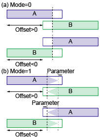

# *Part*s for ARPES analysis

This page briefly explains the *Part*s included in the Procedure files (listed below) in ```IAF_ARPES.ipf```.
You need to add the ```#include "IAF_ARPES"``` directive to load the Procedure files.

## For correction
- ```IAF_Concatenate.ipf```
- ```IAF_ConvertAngle.ipf```
- ```IAF_Corrections1D.ipf```
- ```IAF_Corrections2D.ipf```
- ```IAF_Corrections3D.ipf```
- ```IAF_CropWave.ipf```
- ```IAF_FermiEdgeFit.ipf```
- ```IAF_Integration.ipf```
- ```IAF_Invert.ipf```
- ```IAF_Scale.ipf```
- ```IAF_Smoothing.ipf```

See each Procedure file for the detailed description of input and output *Part*s.

# List of *Part*s
The *Part*s are sorted in the alphabetic order.

## For correction
| *Kind* | *Type* | Description | Procedure file |
| --- | --- | --- | --- |
| **Function** | [**CombineWave1D**](#combinewave1d-function) | Load 1D waves and combine them | ```IAF_LoadWave.ipf``` |

# IAF_Concatenate.ipf

<!-- 0 -->
## Concat2D (Module)
The **Concat2D** module combines two energy-angle maps with the angle offset.
The module assumes that the difference between two maps is the angle offset; the energy range and apparent angle range should be the same.

| Index | In/Out/Sock | *Type* | Role |
| --- | --- | --- | --- |
| 0 | Input | **Variable** | Concatenation mode (0 or 1) |
| 1 | Input | **Coordinate2D** | Socket to the map A |
| 2 | Input | **Coordinate2D** | Socket to the map B |
| 3 | Input | **Wave1D** | **InfoWave** of the 2nd axis (angle) of the map A |
| 4 | Input | **Variable** | Angle offset of the map B |
| 5 | Input | **Variable** | Calculation parameter |
| 6 | Socket | **Coordinate2D** | Waiting socket |

- If the concatenation mode is set to zero, the module split the angle axis into two; one is associated to the map A and the other is to the map B (**Figure 1(a)**). In this mode, the 5th argument is not used.
- If the concatenation mode is set to one, the module split the angle axis into three; one is associated to the map A, another is to the map B, and the other is calculated by the sum of the two maps (**Figure 1(b)**). In this mode, the 5th argument is the parameter to determine the unused areas near the edges of the data.



**Figure 1**: Schematics of two concatenation modes.

<!-- 1 -->
## Concat2D_F (Function)
The **Concat2D_F** function is the format function for the **Concat2D** *Module*.

| Index | In/Out/Sock | *Type* | Role |
| --- | --- | --- | --- |
| 0 | Input | **Wave1D** | **InfoWave** of the 1st axis (energy) |
| 1 | Input | **Wave1D** | **InfoWave** of the 2nd axis (angle) of the map A |
| 2 | Input | **Variable** | Angle offset of the map B |
| 3 | Output | **Wave1D** | **InfoWave** of the 1st axis of the combined data |
| 4 | Output | **Wave1D** | **InfoWave** of the 2nd axis of the combined data |

# IAF_ConvertAngle.ipf

<!-- 2 -->
## ConvAngle2D (Module)
The **ConvAngle2D** module converts the energy (eV)-angle (deg) map to the energy (eV)-momentum (1/Å) map.
The module assumes that the Fermi level correction is already performed, in other words, the energy is the binding energy.

| Index | In/Out/Sock | *Type* | Role |
| --- | --- | --- | --- |
| 0 | Input | **Variable** | The kinetic energy of the photoelectrons excited from the Fermi level (photon energy - work function) |
| 1 | Input | **Variable** | Angle offset |
| 2 | Input | **Coordinate2D** | Energy-angle socket |
| 3 | Socket | **Coordinate2D** | Waiting socket |

Here we represent the two parameters in the argument list by ```EphEf``` and ```theta0``` respectively.
When a point ```(E, theta)``` is given, the conversion equation becomes
```
(E, theta) -> (E, k)
Kph=E2kConstant*sqrt(E+EphEf)
k=Kph*sin(theta-theta0).
```
The ```E2kConstant``` consant is ```sqrt(2*m*e)/hbar ≒ 0.512``` in this unit system.

What the module actually do is the conversion from ```(E, k)``` to ```(E, theta)```, so the equation is
```
(E, k) -> (E, theta)
Kph=E2kConstant*sqrt(E+EphEf)
theta=theta0+asin(k/Kph).
```

<!-- 3 -->
## ConvAngle2D_F (Function)
The **ConvAngle2D_F** function is the format function for **ConvAngle2D** *Module*.

| Index | In/Out/Sock | *Type* | Role |
| --- | --- | --- | --- |
| 0 | Input | **Variable** | The kinetic energy of the photoelectrons excited from the Fermi level (photon energy - work function) |
| 1 | Input | **Variable** | Angle offset |
| 2 | Input | **Wave1D** | **InfoWave** of the 1st axis (energy) |
| 3 | Input | **Wave1D** | **InfoWave** of the 2nd axis (angle) |
| 4 | Output | **Wave1D** | **InfoWave** of the 1st axis (energy) |
| 5 | Output | **Wave1D** | **InfoWave** of the 2nd axis (momentum) |

In the function, the momentum range is determined to cover the whole range between the momentum minimum and maximum by the same number of data points.
Therefore, finer **InfoWave** may be better for the color map.

<!-- 4 -->
## ConvEAhn (Module)
The **ConvEAhn** *Module* converts the energy (eV)-angle (deg)-hn (eV) map to the energy (eV)-kx (1/Å)-kz(1/Å) map.
As the **ConvAngle2D** module does, the module assumes that the Fermi level correction is already performed, in other words, the energy is the binding energy.

| Index | In/Out/Sock | *Type* | Role |
| --- | --- | --- | --- |
| 0 | Input | **Variable** | Work function |
| 1 | Input | **Variable** | Inner potential |
| 2 | Input | **Variable** | Angle offset |
| 3 | Input | **Coordinate3D** | Energy-angle-hn socket |
| 4 | Socket | **Coordinate3D** | Waiting socket |

Here we represent the three parameters in the argument list by ```W```, ```V0```, and ```theta0```.
When a point ```(E, theta, hn)``` is given, the conversion equation becomes
```
(E, theta, hn) -> (E, kx, kz)
Eph=E+hn-W
Kph_v=E2kConstant*sqrt(Eph) // momentum in the vacuum
Kph_c=E2kConstant*sqrt(Eph+V0) // momentum in the crystal
kx=Kph_v*sin(theta-theta0)
kz=sqrt(Kph_c^2-kx^2).
```
Therefore, the inverted conversion process becomes
```
(E, kx, kz) -> (E, theta, hn)
Kph_c=sqrt(kx^2+kz^2)
Eph=(Kph_c/E2kConstant)^2-V0
hn=Eph-E+W
Kph_v=E2kConstant*sqrt(Eph) // momentum in the vacuum
theta=theta0+asin(kx/Kph_v).
```

<!-- 5 -->
## ConvEAhn2 (Module)
The **ConvEAhn2** *Module* converts the energy (eV)-kx (1/Å)-hn (eV) map to the energy (eV)-kx (1/Å)-kz(1/Å) map.
The module assumes that the Fermi level correction and the angle-to-momentum conversion are already performed.

Since the **ConvEAhn2** *Module* is similar to the **ConvEAhn** *Module*, We set the arrangement of the arguments the same as **ConvEAhn**.
Therefore, although the 2nd argument represents the angle offset, it is not used in the calculations.

| Index | In/Out/Sock | *Type* | Role |
| --- | --- | --- | --- |
| 0 | Input | **Variable** | Work function |
| 1 | Input | **Variable** | Inner potential |
| 2 | Input | **Variable** | (Angle offset) |
| 3 | Input | **Coordinate3D** | Energy-kx-hn socket |
| 4 | Socket | **Coordinate3D** | Waiting socket |

<!-- 6 -->
## ConvEAhn_F (Function)
The **ConvEAhn_F** *Function* is the format function for **ConvEAhn**.

| Index | In/Out/Sock | *Type* | Role |
| --- | --- | --- | --- |
| 0 | Input | **Variable** | Work function |
| 1 | Input | **Variable** | Inner potential |
| 2 | Input | **Variable** | Angle offset |
| 3 | Input | **Wave1D** | **InfoWave** for the 1st axis (energy) |
| 4 | Input | **Wave1D** | **InfoWave** for the 2nd axis (angle) |
| 5 | Input | **Wave1D** | **InfoWave** for the 3rd axis (hn) |
| 3 | Output | **Wave1D** | **InfoWave** for the 1st axis (energy) |
| 4 | Output | **Wave1D** | **InfoWave** for the 2nd axis (kx) |
| 5 | Output | **Wave1D** | **InfoWave** for the 3rd axis (kz) |

In the function, the momentum range is determined to cover the whole range between the momentum minimum and maximum by the same number of data points.
Therefore, finer **InfoWave** may be better for the color map.

<!-- 7 -->
## LoadkzMap (Module)
The **LoadkzMap** *Module* gives the values at the specified points ```(E, theta, hn)```.
The module has the list of energy-angle maps at several photon energies and load the appropriate map based on the given ```hn``` value.

| Index | In/Out/Sock | *Type* | Role |
| --- | --- | --- | --- |
| 0 | Input | **TextWave** | Path list of energy-angle maps |
| 1 | Input | **Variable** | Smoothing width along the energy direction |
| 2 | Input | **Variable** | Smoothing width along the angle direction |
| 3 | Socket | **Coordinate3D** | Waiting socket |

The module assumes that the 1st axis of the path list (0th argument) corresponds to the photon energy.
For the smoothing widths, see **Smoothing*X*D** *Module*s in **IAF_Smoothing.ipf**.

<!-- 8 -->
## LoadkzMap_F (Function)
The **LoadkzMap_F** *Function* is the format function for **LoadkzMap**.

| Index | In/Out/Sock | *Type* | Role |
| --- | --- | --- | --- |
| 0 | Input | **TextWave** | Path list of energy-angle maps |
| 1 | Input | **Variable** | Smoothing width along the energy direction |
| 2 | Input | **Variable** | Smoothing width along the angle direction |
| 3 | Output | **Wave1D** | **InfoWave** for the 1st axis (energy) |
| 4 | Output | **Wave1D** | **InfoWave** for the 2nd axis (angle) |
| 5 | Output | **Wave1D** | **InfoWave** for the 3rd axis (hn) |

<!-- 9 -->
## ConvPeaks (Function)
The **ConvPeaks** *Function* converts energy-hn points to energy-kz points.
The function assumes that the kx value is constant.

The function is intended to load the peak positions obtained from the EDCs and overlay the converted energy-kz points on the energy-kz map to highlight the peak positions.

| Index | In/Out/Sock | *Type* | Role |
| --- | --- | --- | --- |
| 0 | Input | **Variable** | Work function |
| 1 | Input | **Variable** | Inner potential |
| 2 | Input | **Wave2D** | List of ```(hn, E)``` |
| 3 | Input | **Variable** | kx value |
| 4 | Output | **Wave2D** | List of ```(E, kz)``` |


