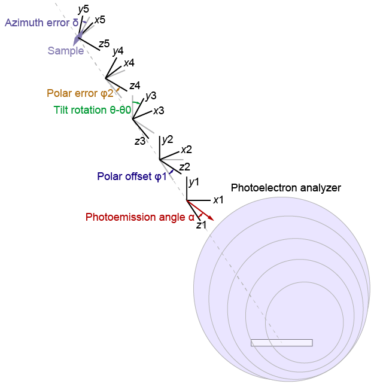
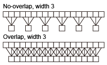
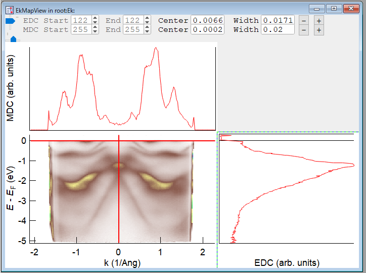
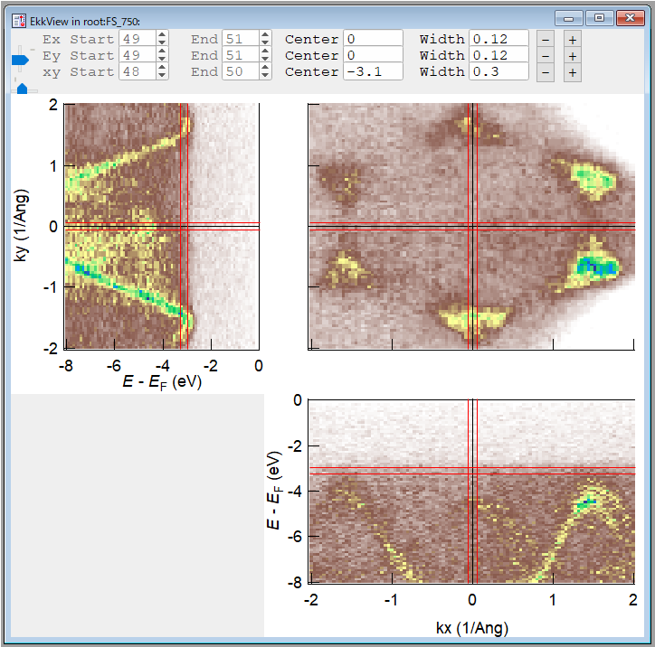
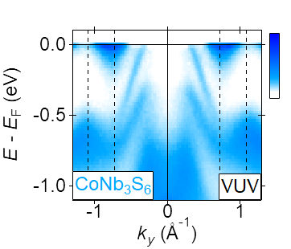
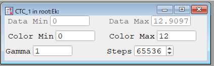
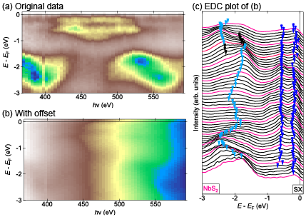
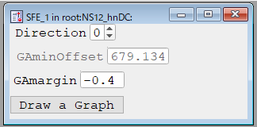

# *Part*s for ARPES analysis

This page briefly explains the *Part*s included in the Procedure files (listed below) in ```IAF_ARPES.ipf```.
You need to add the ```#include "IAF_ARPES"``` directive to load the Procedure files.

## For correction
- ```IAF_Concatenate.ipf```
- ```IAF_ConvertAngle.ipf```
- ```IAF_Corrections1D.ipf```
- ```IAF_Corrections2D.ipf```
- ```IAF_Corrections3D.ipf```
- ```IAF_CropWave.ipf```
- ```IAF_FermiEdgeFit.ipf```
- ```IAF_Integration.ipf```
- ```IAF_Invert.ipf```
- ```IAF_Resonant.ipf```
- ```IAF_Scale.ipf```
- ```IAF_Smoothing.ipf```

## Further analysis
- ```IAF_Average.ipf```
- ```IAF_DivideWave.ipf```
- ```IAF_SecondDeriv.ipf```

## View
- ```IAF_2DViewer.ipf```
- ```IAF_3DViewer.ipf```
- ```IAF_4DViewer.ipf```
- ```IAF_ColorTable.ipf```
- ```IAF_SliceFigure.ipf```
- [IAF_Viewer.ipf](#iaf_vieweripf) (This Procedure is a bit different from the others)

See each Procedure file for the detailed description of input and output *Part*s.

# List of *Part*s
The *Part*s are sorted in the alphabetic order.

## For correction
| *Kind* | *Type* | Description | Procedure file |
| --- | --- | --- | --- |
| **Function** | [AveragedInt](#averagedint-function) | Normalization of the 2D wave | ```IAF_Corrections2D.ipf``` |
| **Function** | [AveragedMDC](#averagedmdc-function) | Calculate the normalized MDC | ```IAF_Corrections2D.ipf``` |
| **Function** | [CompositeEhn](#compositeehn-function) | Make the (E-Ef, hn) map from EDCs | ```IAF_Corrections2D.ipf``` |
| **Module** | [Concat2D](#concat2d-module) | Combine two energy-angle maps with an offset | ```IAF_Concatenate.ipf``` |
| **Function** | [Concat2D_F](#concat2d_f-function) | Format function for **Concat2D** | ```IAF_Concatenate.ipf``` |
| **Function** | [ConstantWave1D](#constantwave1d-function) | Make a constant 1D wave | ```IAF_Corrections2D.ipf``` |
| **Module** | [ConvAngle2D](#convangle2d-module) | Convert (E, theta) to (E, kx) | ```IAF_ConvertAngle.ipf``` |
| **Function** | [ConvAngle2D_F](#convangle2d_f-function) | Format function for **ConvAngle2D** | ```IAF_ConvertAngle.ipf``` |
| **Module** | [ConvAngle3D_D](#convangle3d_d-module) | Convert (E, thetax, thetay) to (E, kx, ky), deflector type | ```IAF_ConvertAngle.ipf``` |
| **Function** | [ConvAngle3D_D_F](#convangle3d_d_f-function) | Format function for **ConvAngle3D_D** | ```IAF_ConvertAngle.ipf``` |
| **Module** | [ConvAngle3D_M](#convangle3d_m-module) | Convert (E, thetax, thetay) to (E, kx, ky), manipulator type | ```IAF_ConvertAngle.ipf``` |
| **Function** | [ConvAngle3D_M_F](#convangle3d_m_f-function) | Format function for **ConvAngle3D_M** | ```IAF_ConvertAngle.ipf``` |
| **Module** | [ConvEAhn](#conveahn-module) | Convert (E, theta, hn) to (E, kx, kz) | ```IAF_ConvertAngle.ipf``` |
| **Function** | [ConvEAhn_F](#conveahn_f-function) | Format function for ConvEAhn | ```IAF_ConvertAngle.ipf``` |
| **Module** | [ConvEAhn2](#conveahn2-module) | Convert (E, kx, hn) to (E, kx, kz) | ```IAF_ConvertAngle.ipf``` |
| **Module** | [ConvertIndex2D](#convertindex2d-module) | Convert **Index2D** to **Coordinate2D** | ```IAF_Corrections2D.ipf``` |
| **Module** | [ConvertIndex3D](#convertindex3d-module) | Convert **Index3D** to **Coordinate3D** | ```IAF_Corrections3D.ipf``` |
| **Function** | [ConvPeaks](#convpeaks-function) | Convert (hn, E) to (E, kz) | ```IAF_ConvertAngle.ipf``` |
| **Function** | [CorrectEf1D](#correctef1d-function) | Fermi level correction of the 1D wave | ```IAF_Corrections1D.ipf``` |
| **Module** | [CorrectEf2D](#correctef2d-module) | Set the Fermi level to zero | ```IAF_Corrections2D.ipf``` |
| **Function** | [CorrectEf2D_F](#correctef2d_f-function) | Format function for CorrectEf2D | ```IAF_Corrections2D.ipf``` |
| **Module** | [CorrectEf3D](#correctef3d-module) | Set the Fermi level to zero (one-dimensional angle dependence) | ```IAF_Corrections3D.ipf``` |
| **Function** | [CorrectEf3D_F](#correctef3d_f-function) | Format function for CorrectEf3D | ```IAF_Corrections3D.ipf``` |
| **Module** | [CorrectEf3D2](#correctef3d2-module) | Set the Fermi level to zero (two-dimensional angle dependence) | ```IAF_Corrections3D.ipf``` |
| **Function** | [CorrectEf3D2_F](#correctef3d2_f-function) | Format function for CorrectEf3D2 | ```IAF_Corrections3D.ipf``` |
| **Module** | [CorrectInt_fx2D](#correctint_fx2d-module) | Intensity correction in the fixed mode | ```IAF_Corrections2D.ipf``` |
| **Module** | [CorrectInt_fx3D](#correctint_fx3d-module) | Intensity correction in the fixed mode | ```IAF_Corrections3D.ipf``` |
| **Module** | [CorrectInt_sw2D](#correctint_sw2d-module) | Intensity correction in the swept mode | ```IAF_Corrections2D.ipf``` |
| **Module** | [CorrectInt_sw2t](#correctint_sw2t-module) | Intensity correction in the swept mode, with the threshold | ```IAF_Corrections2D.ipf``` |
| **Module** | [CorrectInt_sw3D](#correctint_sw3d-module) | Intensity correction in the swept mode | ```IAF_Corrections3D.ipf``` |
| **Module** | [CorrectInt_sw3t](#correctint_sw3t-module) | Intensity correction in the swept mode, with the threshold | ```IAF_Corrections3D.ipf``` |
| **Function** | [CropWave2D](#cropwave2d-function) | Crop the 2D wave | ```IAF_CropWave.ipf``` |
| **Function** | [FermiEdgeFit](#fermiedgefit-function) | Fit the input wave by the Fermi distribution function | ```IAF_FermiEdgeFit.ipf``` |
| **Function** | [Integrate1D](#integrate1d-function) | Integrate surrounding several data point in the 1D wave | ```IAF_Integration.ipf``` |
| **Module** | [Invert2D](#invert2d-module) | Invert axes of the Coordinate2D-type points | ```IAF_Invert.ipf``` |
| **Function** | [Invert2D_F](#invert2d_f-function) | Format function for **Invert2D** | ```IAF_Invert.ipf``` |
| **Module** | [LoadkzMap](#loadkzmap-module) | Return values from kz maps | ```IAF_ConvertAngle.ipf``` |
| **Function** | [LoadkzMap_F](#loadkzmap_f-function) | Format function for **LoadkzMap** | ```IAF_ConvertAngle.ipf``` |
| **Function** | [Make2D_Coord](#make2d_coord-function) | Make the 2D map using the **Coordinate2D** socket | ```IAF_Corrections2D.ipf``` |
| **Function** | [Make2D_Index](#make2d_index-function) | Make the 2D map using the **Index2D** socket | ```IAF_Corrections2D.ipf``` |
| **Function** | [Make3D_Coord](#make3d_coord-function) | Make the 3D map using the **Coordinate3D** socket | ```IAF_Corrections3D.ipf``` |
| **Function** | [Make3D_Index](#make3d_index-function) | Make the 3D map using the **Index3D** socket | ```IAF_Corrections3D.ipf``` |
| **Function** | [MakeEx_Coord](#makeex_coord-function) | Make the 2D map (E-x) using the **Coordinate3D** socket | ```IAF_Corrections3D.ipf``` |
| **Function** | [MakeEx_Index](#makeex_index-function) | Make the 2D map (E-x) using the **Index3D** socket | ```IAF_Corrections3D.ipf``` |
| **Function** | [MakeEy_Coord](#makeey_coord-function) | Make the 2D map (E-y) using the **Coordinate3D** socket | ```IAF_Corrections3D.ipf``` |
| **Function** | [MakeEy_Index](#makeey_index-function) | Make the 2D map (E-y) using the **Index3D** socket | ```IAF_Corrections3D.ipf``` |
| **Function** | [MakeResMap](#makeresmap-function) | Make the (E-Ef, hn) map from the XPS spectra | ```IAF_Resonant.ipf``` |
| **Function** | [Makexy_Coord](#makexy_coord-function) | Make the 2D map (x-y) using the **Coordinate3D** socket | ```IAF_Corrections3D.ipf``` |
| **Function** | [Makexy_Index](#makexy_index-function) | Make the 2D map (x-y) using the **Index3D** socket | ```IAF_Corrections3D.ipf``` |
| **Function** | [MCPHistogram](#mcphistogram-function) | Obtain the histogram of pixel intensities | ```IAF_Corrections2D.ipf``` |
| **Function** | [Normalize1D](#normalize1d-function) | Normalization of the 1D wave | ```IAF_Corrections1D.ipf``` |
| **Module** | [Read3D](#read3d-module) | Read raw data values without the intensity correction | ```IAF_Corrections3D.ipf``` |
| **Function** | [Scale2D](#scale2d-function) | Extend/shrink both axes | ```IAF_Scale.ipf``` |
| **Function** | [Scale2DX](#scale2dx-function) | Extend/shrink the x (1st) axis | ```IAF_Scale.ipf``` |
| **Function** | [Scale2DY](#scale2dy-function) | Extend/shrink the y (2nd) axis | ```IAF_Scale.ipf``` |
| **Function** | [SliceNormalize](#slicenormalize-function) | Divide the 2D wave by the normalization reference | ```IAF_Corrections3D.ipf``` |
| **Module** | [Smoothing2D](#smoothing2d-module) | Smoothing for the Index2D points | ```IAF_Smoothing.ipf``` |
| **Function** | [Smoothing2D_F](#smoothing2d_f-function) | Format function for **Smoothing2D** | ```IAF_Smoothing.ipf``` |
| **Module** | [Smoothing3D](#smoothing3d-function) | Smoothing for the Index3D points | ```IAF_Smoothing.ipf``` |
| **Function** | [Smoothing3D_F](#smoothing3d_f-function) | Format function for **Smoothing3D** | ```IAF_Smoothing.ipf``` |
| **Panel** | [SmoothingCtrl2D](#smoothingctrl2d-panel) | Control the smoothing widths and the overlap flag | ```IAF_Smoothing.ipf``` |
| **Panel** | [SmoothingCtrl3D](#smoothingctrl3d-panel) | Control the smoothing widths and the overlap flag | ```IAF_Smoothing.ipf``` |
| **Function** | [TotalIntensity](#totalintensity-function) | Integrate the intensity in the whole area | ```IAF_Corrections3D.ipf``` |

## Further analysis

| *Kind* | *Type* | Description | Procedure file |
| --- | --- | --- | --- |
| **Function** | [Average1D](#average1d-function) | Calculate the average of the sequentially named 1D waves | ```IAF_Average.ipf``` |
| **Function** | [Average2D](#average2d-function) | Calculate the average of the sequentially named 2D waves | ```IAF_Average.ipf``` |
| **Function** | [DivideByFD](#dividebyfd-function) | Divide the 1D wave by the Fermi-Dirac distribution | ```IAF_DivideWave.ipf``` |
| **Function** | [DivideByFDGauss](#dividebyfdgauss-function) | Divide the 1D wave by the convolution of FD and Gaussian | ```IAF_DivideWave.ipf``` |
| **Function** | [DivideWave21DX](#dividewave21dx-function) | Divide the 2D wave by the 1D wave | ```IAF_DivideWave.ipf``` |
| **Function** | [DivideWave21DY](#dividewave21dy-function) | Divide the 2D wave by the 1D wave | ```IAF_DivideWave.ipf``` |
| **Function** | [DivideWave2D](#dividewave2d-function) | Divide the 2D wave by the 2D wave | ```IAF_DivideWave.ipf``` |
| **Function** | [SecondDeriv2D_E](#secondderiv2d_e-function) | Calculate the second derivatie along the energy direction | ```IAF_SecondDeriv.ipf``` |

## View

| *Kind* | *Type* | Description | Procedure file |
| --- | --- | --- | --- |
| **Panel** | [2DViewer](#2dviewer-panel) | Show 2D wave, EDC, and MDC | ```IAF_2DViewer.ipf``` |
| **Template** | [2DViewer](#2dviewer-tempate) | View 2D wave, EDC and, MDC | ```IAF_2DViewer.ipf``` |
| **Panel** | [3DViewer](#3dviewer-panel) | Show energy-x, energy-y, and xy cuts | ```IAF_3DViewer.ipf``` |
| **Template** | [3DViewer](#3dviewer-template) | View energy-x, energy-y, and xy (constant-energy) cuts | ```IAF_3DViewer.ipf``` |
| **Panel** | [4DViewer](#4dviewer-panel) | Show energy-angle, real-space maps | ```IAF_4DViewer.ipf``` |
| **Template** | [4DViewer](#4dviewer-template) | View energy-angle, real-space maps | ```IAF_4DViewer.ipf``` |
| **Function** | [CalcMinOffset_E](#calcminoffset_e-function) | Obtain the minimum offset for the EDC plot | ```IAF_SliceFigure.ipf``` |
| **Function** | [CalcMinOffset_k](#calcminoffset_k-function) | Obtain the minimum offset for the MDC plot | ```IAF_SliceFigure.ipf``` |
| **Function** | [ColorTable](#colortable-function) | Make the color index wave | ```IAF_ColorTable.ipf``` |
| **Panel** | [ColorTableCtrl](#colortablectrl-panel) | Control parameters for **ColorTable** | ```IAF_ColorTable.ipf``` |
| **Function** | [CutLines2D](#cutlines2d-function) | Visualize EDC and MDC cut positions | ```IAF_2DViewer.ipf``` |
| **Function** | [CutLines3D](#cutlines3d-function) | Visualize cut positions | ```IAF_3DViewer.ipf``` |
| **Function** | [CutRects](#cutrects-function) | Visualize energy-angle, real-space map positions | ```IAF_4DViewer.ipf``` |
| **Function** | [DeltaChange](#deltachange-function) | Change the value by the plus or minus delta | ```IAF_2DViewer.ipf``` |
| **Function** | [EAMap](#eamap-function) | Calculate the energy-angle (or momentum) map | ```IAF_4DViewer.ipf``` |
| **Function** | [EDC](#edc-function) | Calculate the EDC | ```IAF_2DViewer.ipf``` |
| **Function** | [ExCut](#excut-function) | Calculate the energy-x cut | ```IAF_3DViewer.ipf``` |
| **Function** | [EyCut](#eycut-function) | Calculate the energy-y cut | ```IAF_3DViewer.ipf``` |
| **Function** | [IntRange2D](#intrange2d-function) | Obtain the minimum and maximum of the data | ```IAF_ColorTable.ipf``` |
| **Function** | [MDC](#mdc-function) | Calculate the MDC | ```IAF_2DViewer.ipf``` |
| **Function** | [OffsetFigure_E](#offsetfigure_e-function) | Add the sequentially increasing offset to EDCs | ```IAF_SliceFigure.ipf``` |
| **Function** | [OffsetFigure_k](#offsetfigure_k-function) | Add the sequentially increasing offset to MDCs | ```IAF_SliceFigure.ipf``` |
| **Panel** | [SliceFigure_E](#slicefigure_e-panel) | Control parameters for **OffsetFigure_E** and make the EDC plot | ```IAF_SliceFigure.ipf``` |
| **Panel** | [SliceFigure_k](#slicefigure_k-panel) | Control parameters for **OffsetFigure_k** and make the MDC plot | ```IAF_SliceFigure.ipf``` |
| **Function** | [Value2Index](#value2index-function) | Convert the range (center, width) to the index (min, max) | ```IAF_2DViewer.ipf``` |
| **Function** | [xyCut](#xycut-function) | Calculate the xy (constant-energy) cut | ```IAF_3DViewer.ipf``` |
| **Function** | [xyMap](#xymap-function) | Calculate the real-space map | ```IAF_4DViewer.ipf``` |


# IAF_Concatenate.ipf

<!-- 0 -->
## Concat2D (Module)
The **Concat2D** module combines two energy-angle maps with the angle offset.
The module assumes that the difference between two maps is the angle offset; the energy range and apparent angle range should be the same.

| Index | In/Out/Sock | *Type* | Role |
| --- | --- | --- | --- |
| 0 | Input | **Variable** | Concatenation mode (0 or 1) |
| 1 | Input | **Coordinate2D** | Socket to the map A |
| 2 | Input | **Coordinate2D** | Socket to the map B |
| 3 | Input | **Wave1D** | **InfoWave** of the 2nd axis (angle) of the map A |
| 4 | Input | **Variable** | Angle offset of the map B |
| 5 | Input | **Variable** | Calculation parameter |
| 6 | Socket | **Coordinate2D** | Waiting socket |

- If the concatenation mode is set to zero, the module split the angle axis into two; one is associated to the map A and the other is to the map B (**Figure 1(a)**). In this mode, the 5th argument is not used.
- If the concatenation mode is set to one, the module split the angle axis into three; one is associated to the map A, another is to the map B, and the other is calculated by the sum of the two maps (**Figure 1(b)**). In this mode, the 5th argument is the parameter to determine the unused areas near the edges of the data.


**Figure 1**: Schematics of two concatenation modes.

<!-- 1 -->
## Concat2D_F (Function)
The **Concat2D_F** function is the format function for the **Concat2D** *Module*.

| Index | In/Out/Sock | *Type* | Role |
| --- | --- | --- | --- |
| 0 | Input | **Wave1D** | **InfoWave** of the 1st axis (energy) |
| 1 | Input | **Wave1D** | **InfoWave** of the 2nd axis (angle) of the map A |
| 2 | Input | **Variable** | Angle offset of the map B |
| 3 | Output | **Wave1D** | **InfoWave** of the 1st axis of the combined data |
| 4 | Output | **Wave1D** | **InfoWave** of the 2nd axis of the combined data |

# IAF_ConvertAngle.ipf

<!-- 2 -->
## ConvAngle2D (Module)
The **ConvAngle2D** module converts the ```(energy (eV), angle (deg))``` map to the ```(energy (eV), momentum (1/Å))``` map.
The module assumes that the Fermi level correction is already performed, in other words, the energy is E-Ef.

| Index | In/Out/Sock | *Type* | Role |
| --- | --- | --- | --- |
| 0 | Input | **Variable** | The kinetic energy of the photoelectrons excited from the Fermi level (photon energy - work function) |
| 1 | Input | **Variable** | Angle offset |
| 2 | Input | **Coordinate2D** | ```(energy, angle) socket |
| 3 | Socket | **Coordinate2D** | Waiting socket |

Here we represent the two parameters in the argument list by ```EphEf``` and ```theta0``` respectively.
When a point ```(E, theta)``` is given, the conversion equation becomes
```
(E, theta) -> (E, k)
Kph=E2kConstant*sqrt(E+EphEf)
k=Kph*sin(theta-theta0).
```
The ```E2kConstant``` consant is ```sqrt(2*m*e)/hbar ≒ 0.512``` in this unit system.

What the module actually do is the conversion from ```(E, k)``` to ```(E, theta)```, so the equation is
```
(E, k) -> (E, theta)
Kph=E2kConstant*sqrt(E+EphEf)
theta=theta0+asin(k/Kph).
```

<!-- 3 -->
## ConvAngle2D_F (Function)
The **ConvAngle2D_F** function is the format function for **ConvAngle2D** *Module*.

| Index | In/Out/Sock | *Type* | Role |
| --- | --- | --- | --- |
| 0 | Input | **Variable** | The kinetic energy of the photoelectrons excited from the Fermi level (photon energy - work function) |
| 1 | Input | **Variable** | Angle offset |
| 2 | Input | **Wave1D** | **InfoWave** of the 1st axis (energy) |
| 3 | Input | **Wave1D** | **InfoWave** of the 2nd axis (angle) |
| 4 | Output | **Wave1D** | **InfoWave** of the 1st axis (energy) |
| 5 | Output | **Wave1D** | **InfoWave** of the 2nd axis (momentum) |

In the function, the momentum range is determined to cover the whole range between the momentum minimum and maximum by the same number of data points.
Therefore, finer **InfoWave** may be better for the color map.

<!-- 4 -->
## ConvEAhn (Module)
The **ConvEAhn** *Module* converts the ```(energy (eV), angle (deg), hn (eV))``` map to the ```(energy (eV), kx (1/Å), kz(1/Å))``` map.
As the **ConvAngle2D** module does, the module assumes that the Fermi level correction is already performed, in other words, the energy is E-Ef.

| Index | In/Out/Sock | *Type* | Role |
| --- | --- | --- | --- |
| 0 | Input | **Variable** | Work function |
| 1 | Input | **Variable** | Inner potential |
| 2 | Input | **Variable** | Angle offset |
| 3 | Input | **Coordinate3D** | ```(Energy, angle, hn)``` socket |
| 4 | Socket | **Coordinate3D** | Waiting socket |

Here we represent the three parameters in the argument list by ```W```, ```V0```, and ```theta0```.
When a point ```(E, theta, hn)``` is given, the conversion equation becomes
```
(E, theta, hn) -> (E, kx, kz)
Eph=E+hn-W
Kph_v=E2kConstant*sqrt(Eph) // momentum in the vacuum
Kph_c=E2kConstant*sqrt(Eph+V0) // momentum in the crystal
kx=Kph_v*sin(theta-theta0)
kz=sqrt(Kph_c^2-kx^2).
```
Therefore, the inverted conversion process becomes
```
(E, kx, kz) -> (E, theta, hn)
Kph_c=sqrt(kx^2+kz^2)
Eph=(Kph_c/E2kConstant)^2-V0
hn=Eph-E+W
Kph_v=E2kConstant*sqrt(Eph) // momentum in the vacuum
theta=theta0+asin(kx/Kph_v).
```

<!-- 5 -->
## ConvEAhn2 (Module)
The **ConvEAhn2** *Module* converts the ```(energy (eV), kx (1/Å), hn (eV))``` map to the ```(energy (eV), kx (1/Å), kz(1/Å))``` map.
The module assumes that the Fermi level correction and the angle-to-momentum conversion are already performed.

Since the **ConvEAhn2** *Module* is similar to the **ConvEAhn** *Module*, We set the arrangement of the arguments the same as **ConvEAhn**.
Therefore, although the 2nd argument represents the angle offset, it is not used in the calculations.

| Index | In/Out/Sock | *Type* | Role |
| --- | --- | --- | --- |
| 0 | Input | **Variable** | Work function |
| 1 | Input | **Variable** | Inner potential |
| 2 | Input | **Variable** | (Angle offset) |
| 3 | Input | **Coordinate3D** | ```(Energy, kx, hn)``` socket |
| 4 | Socket | **Coordinate3D** | Waiting socket |

<!-- 6 -->
## ConvEAhn_F (Function)
The **ConvEAhn_F** *Function* is the format function for **ConvEAhn**.

| Index | In/Out/Sock | *Type* | Role |
| --- | --- | --- | --- |
| 0 | Input | **Variable** | Work function |
| 1 | Input | **Variable** | Inner potential |
| 2 | Input | **Variable** | Angle offset |
| 3 | Input | **Wave1D** | **InfoWave** for the 1st axis (energy) |
| 4 | Input | **Wave1D** | **InfoWave** for the 2nd axis (angle) |
| 5 | Input | **Wave1D** | **InfoWave** for the 3rd axis (hn) |
| 3 | Output | **Wave1D** | **InfoWave** for the 1st axis (energy) |
| 4 | Output | **Wave1D** | **InfoWave** for the 2nd axis (kx) |
| 5 | Output | **Wave1D** | **InfoWave** for the 3rd axis (kz) |

In the function, the momentum range is determined to cover the whole range between the momentum minimum and maximum by the same number of data points.
Therefore, finer **InfoWave** may be better for the color map.

<!-- 7 -->
## LoadkzMap (Module)
The **LoadkzMap** *Module* gives the values at the specified points ```(E, theta, hn)```.
The module has the list of energy-angle maps at several photon energies and load the appropriate map based on the given ```hn``` value.

| Index | In/Out/Sock | *Type* | Role |
| --- | --- | --- | --- |
| 0 | Input | **TextWave** | Path list of ```(energy, angle)``` maps |
| 1 | Input | **Variable** | Smoothing width along the energy direction |
| 2 | Input | **Variable** | Smoothing width along the angle direction |
| 3 | Socket | **Coordinate3D** | Waiting socket |

The module assumes that the 1st axis of the path list (0th argument) corresponds to the photon energy.
For the smoothing widths, see **Smoothing*X*D** *Module*s in **IAF_Smoothing.ipf**.

<!-- 8 -->
## LoadkzMap_F (Function)
The **LoadkzMap_F** *Function* is the format function for **LoadkzMap**.

| Index | In/Out/Sock | *Type* | Role |
| --- | --- | --- | --- |
| 0 | Input | **TextWave** | Path list of ```(energy, angle)``` maps |
| 1 | Input | **Variable** | Smoothing width along the energy direction |
| 2 | Input | **Variable** | Smoothing width along the angle direction |
| 3 | Output | **Wave1D** | **InfoWave** for the 1st axis (energy) |
| 4 | Output | **Wave1D** | **InfoWave** for the 2nd axis (angle) |
| 5 | Output | **Wave1D** | **InfoWave** for the 3rd axis (hn) |

<!-- 9 -->
## ConvPeaks (Function)
The **ConvPeaks** *Function* converts ```(energy, hn)``` points to ```(energy, kz)``` points.
The function assumes that the kx value is constant.

The function is intended to load the peak positions obtained from the EDCs and overlay the converted energy-kz points on the energy-kz map to highlight the peak positions.

| Index | In/Out/Sock | *Type* | Role |
| --- | --- | --- | --- |
| 0 | Input | **Variable** | Work function |
| 1 | Input | **Variable** | Inner potential |
| 2 | Input | **Wave2D** | List of ```(hn, E)``` |
| 3 | Input | **Variable** | kx value |
| 4 | Output | **Wave2D** | List of ```(E, kz)``` |

<!-- 10 -->
## ConvAngle3D_M (Module)
The **ConvAngle3D_M** *Module* converts the energy-angle-angle map to the energy-kx-ky map.
The module assumes that the second angle axis is related to the manipulator rotation, not the deflector of the photoelectron analyzer.
As the other conversion *Module*s do, the module assumes that the Fermi level correction is already performed.

The conversion process is based on the [paper by Ishida and Shin](https://aip.scitation.org/doi/10.1063/1.5007226), although some definitions of angles are different.

| Index | In/Out/Sock | *Type* | Role |
| --- | --- | --- | --- |
| 0 | Input | **Variable** | The kinetic energy of the photoelectrons excited from the Fermi level (photon energy - work function) |
| 1 | Input | **Variable** | Polar offset angle |
| 2 | Input | **Variable** | Tilt offset angle |
| 3 | Input | **Variable** | Polar error angle |
| 4 | Input | **Variable** | Azimuth error angle |
| 5 | Input | **Variable** | Whether the tilt angle is inverted; if so, the value should be greater than 0 |
| 6 | Input | **Variable** | Whether the photoemission angle is inverted; if so, the value should be greater than 0 |
| 7 | Input | **Coordinate3D** | ```(Energy, angle, angle)``` socket |
| 8 | Socket | **Coordinate3D** | Waiting socket |


Here we represent the variables in the argument list by ```EphEf```, ```φ1```, ```θ0```, ```φ2```, ```δ``` and the angles along the first and second axes by ```α``` and ```θ```, respectively.
These angles are defined in **Figure 2**.
In **Figure 2**, the analyzer slit is in the center bottom.
Since the sign of the photoemission angle ```α``` is determined to correspond to this analyzer orientation, you may need to invert the sign if the orientation is different.



**Figure 2**: Coordinate systems used in the **ConvAngle3D_M** *Module*.

The photoemission wavevector k is ```(k*sin(α), 0, k*cos(α))``` in the x1y1z1 coordinate system.
The representation of the same vector in the x2y2z2 coordinate system is obtained by multiplying the 3×3 transformation matrix to the vector.
Multiplying these transformation matrix sequentially, we can get the values in the x5y5z5 coordinate system.

What the module do is reversed.
When we get the vector ```(kx, ky, kz)``` in the x5y5z5 system, we convert it to the x3y3z3 coordinate system.
Then we calculate the rotation angle ```θ``` so that the y2 component (in the x2y2z2 coordinate system) becomes zero.
After that, we convert the representation to the x1y1z1 coordinate system and obtain ```α```.

The difference between the error angles (```φ2``` and ```δ```) and polar offset ```φ1``` is that the former is to remove the experimental error and the latter is to take into account the experimental setup.
Therefore, the polar offset ```φ1``` should be zero unless you intentionally rotate the manipulator.
The tilt offset ```θ0``` includes both roles.

<!-- 11 -->
## ConvAngle3D_M_F (Function)
The **ConvAngle3D_M_F** *Function* is the format function for **ConvAngle3D_M**.

| Index | In/Out/Sock | *Type* | Role |
| --- | --- | --- | --- |
| 0 | Input | **Variable** | The kinetic energy of the photoelectrons excited from the Fermi level (photon energy - work function) |
| 1 | Input | **Variable** | Polar offset angle |
| 2 | Input | **Variable** | Tilt offset angle |
| 3 | Input | **Variable** | Polar error angle |
| 4 | Input | **Variable** | Azimuth error angle |
| 5 | Input | **Variable** | Whether the tilt angle is inverted; if so, the value should be greater than 0 |
| 6 | Input | **Variable** | Whether the photoemission angle is inverted; if so, the value should be greater than 0 |
| 7 | Input | **Wave1D** | **InfoWave** for the first axis (energy) |
| 8 | Input | **Wave1D** | **InfoWave** for the second axis (angle ```α```) |
| 9 | Input | **Wave1D** | **InfoWave** for the third axis (angle ```θ```) |
| 10 | Output | **Wave1D** | **InfoWave** for the first axis (energy) |
| 11 | Output | **Wave1D** | **InfoWave** for the second axis (kx) |
| 12 | Output | **Wave1D** | **InfoWave** for the thrid axis (ky) |


<!-- 12 -->
## ConvAngle3D_D (Module)
The **ConvAngle3D_D** *Module* converts the energy-angle-angle map to the energy-kx-ky map.
The module assumes that the second angle axis is related to the deflector of the photoelectron analyzer, not th manipulator rotation.
As the other conversion *Module*s do, the module assumes that the Fermi level correction is already performed.

The conversion process is based on the [paper by Ishida and Shin](https://aip.scitation.org/doi/10.1063/1.5007226), although some definitions of angles are different.

| Index | In/Out/Sock | *Type* | Role |
| --- | --- | --- | --- |
| 0 | Input | **Variable** | The kinetic energy of the photoelectrons excited from the Fermi level (photon energy - work function) |
| 1 | Input | **Variable** | Polar offset angle |
| 2 | Input | **Variable** | Tilt offset angle |
| 3 | Input | **Variable** | Polar error angle |
| 4 | Input | **Variable** | Tilt error angle |
| 5 | Input | **Variable** | Azimuth error angle |
| 6 | Input | **Coordinate3D** | ```(Energy, angle, angle)``` socket |
| 7 | Socket | **Coordinate3D** | Waiting socket |


Here we represent the variables in the argument list by ```EphEf```, ```φ1```, ```θ1```, ```φ2```, ```θ2```, ```δ``` and the angles along the first and second axes by ```α``` and ```β```, respectively.
These angles are defined in **Figure 3**.
In **Figure 3**, the analyzer slit is in the center bottom.
Since the sign of the photoemission angles ```α``` and ```β``` is determined to correspond to this analyzer orientation, you may need to invert the sign if the orientation is different.


**Figure 3**: Coordinate systems used in the **ConvAngle3D_D** *Module*.

The photoemission wavevector k is ```(k*α*sin(η)/η, k*β*sin(η)/η, k*cos(η))``` (from the [paper by Ishida and Shin](https://aip.scitation.org/doi/10.1063/1.5007226)) in the x1y1z1 coordinate system, where only in this equation the angle unit is radian and ```η=sqrt(α^2+β^2)```.
The transformation can be performed in the similar way as **ConvAngle3D_M**.

What the module do is reversed.
When we get the vector ```(kx, ky, kz)``` in the x6y6z6 system, we convert it to the x1y1z1 coordinate system ```(kx1, ky1, kz1)```.
Then we obtain ```α``` and ```β``` from the following equation.
```
η=acos(kz1/k)
α=kx1/k*η/sin(η)
β=ky1/k*η/sin(η)
```

The difference between the error angles (```φ2```, ```θ2```, and ```δ```) and offset angles (```φ1``` and ```θ1```) is that the former is to remove the experimental error and the latter is to take into account the experimental setup.
Therefore, the offset angles should be zero unless you intentionally rotate the manipulator and at least one of the offset angles will be zero in most experimental setups.

<!-- 13 -->
## ConvAngle3D_D_F (Function)
The **ConvAngle3D_D_F** *Function* is the format function for **ConvAngle3D_D**.

| Index | In/Out/Sock | *Type* | Role |
| --- | --- | --- | --- |
| 0 | Input | **Variable** | The kinetic energy of the photoelectrons excited from the Fermi level (photon energy - work function) |
| 1 | Input | **Variable** | Polar offset angle |
| 2 | Input | **Variable** | Tilt offset angle |
| 3 | Input | **Variable** | Polar error angle |
| 4 | Input | **Variable** | Tilt error angle |
| 5 | Input | **Variable** | Azimuth error angle |
| 6 | Input | **Wave1D** | **InfoWave** for the first axis (energy) |
| 7 | Input | **Wave1D** | **InfoWave** for the second axis (angle ```α```) |
| 8 | Input | **Wave1D** | **InfoWave** for the third axis (angle ```β```) |
| 9 | Output | **Wave1D** | **InfoWave** for the first axis (energy) |
| 10 | Output | **Wave1D** | **InfoWave** for the second axis (kx) |
| 11 | Output | **Wave1D** | **InfoWave** for the thrid axis (ky) |

# Corrections1D.ipf

<!-- 14 -->
## CorrectEf1D (Function)
The **CorrectEf1D** *Function* performs the Fermi level correction.
Since the Fermi level is constant, the correction process can be described by the *Function*; the function just modifies the offset of the data.

| Index | In/Out/Sock | *Type* | Role |
| --- | --- | --- | --- |
| 0 | Input | **Wave1D** | Target wave |
| 1 | Input | **Variable** | Fermi level energy |
| 2 | Output | **Wave1D** | Fermi level corrected wave |

<!-- 15 -->
## Normalize1D (Function)
The **Normalize1D** *Function* performs the normalization so that the average of data points becomes 1.

| Index | In/Out/Sock | *Type* | Role |
| --- | --- | --- | --- |
| 0 | Input | **Wave1D** | Target wave | 
| 1 | Output | **Wave1D** | Normalized wave |

# Corrections2D.ipf

<!-- 16 -->
## AveragedMDC (Function)
The **AveragedMDC** *Function* calculates the normalized MDC.
The function assumes the reference data such as Au polycrystal is given and the output is used to remove the MCP inhomogenity.
In the MDC calculations is performed within the indices satisfying ```(start index) <= i <= (end index)```.
We note that both edges are included in the calculations.

| Index | In/Out/Sock | *Type* | Role |
| --- | --- | --- | --- |
| 0 | Input | **Wave2D** | Measurement data |
| 1 | Input | **Variable** | Start index to calculate the MDC |
| 2 | Input | **Variable** | End index to calculate the MDC |
| 3 | Output | **Wave1D** | Normalized MDC |

<!-- 17 -->
## MCPHistogram (Function)
The **MCPHistogram** *Function* gives the histogram of the pixel intensities.
The histogram is used to determine invalid (too strong or too weak) data points and neglect them in the further analysis of measurement data obtained by the fixed mode.


| Index | In/Out/Sock | *Type* | Role |
| --- | --- | --- | --- |
| 0 | Input | **Wave2D** | Measurement data (fixed mode) |
| 1 | Input | **Variable** | Number of bins |
| 2 | Output | **Wave1D** | Histogram |


<!-- 18 -->
## AveragedInt (Function)
The **AveragedInt** *Funciton* performes the normalization of the 2D wave so that the average becomes 1.
The function neglects invalid data points and the values at these points are set to -1.
The function assumes that the reference data such as Au polycrystal measured by the fixed mode is given and the output is used to remove the MCP inhomogenity.

| Index | In/Out/Sock | *Type* | Role |
| --- | --- | --- | --- |
| 0 | Input | **Wave2D** | Measurement data (fixed mode) |
| 1 | Input | **Variable** | Minimum of the valid range |
| 2 | Input | **Variable** | Maximum of the valid range |
| 3 | Output | **Wave2D** | Normalized data |

<!-- 19 -->
## CorrectInt_sw2D (Module)
The **CorrectInt_sw2D** *Module* performs the intensity correction of the data obtained by the swept mode; therefore, the reference is given as the MDC from the **AveragedMDC** *Fucntion*.
Since the correction is performed on each data points, the socket should be **Index2D**, not **Coordinate2D**.

| Index | In/Out/Sock | *Type* | Role |
| --- | --- | --- | --- |
| 0 | Input | **Wave2D** | Raw data (swept mode) |
| 1 | Input | **Wave1D** | Reference MDC |
| 2 | Socket | **Index2D** | Waiting socket |

<!-- 20 -->
## CorrectInt_sw2t (Module)
The **CorrectInt_sw2t** *Module* performs the intensity correction of the data obtained by the swept mode; therefore, the reference is given as the MDC from the **AveragedMDC** *Fucntion*.
In addition to the **CorrectInt_sw2D** *Module*, the module has the threshold.
If the reference value is smaller than the threshold, the normalization is not performed and the value becomes 0.
Since the correction is performed on each data points, the socket should be **Index2D**, not **Coordinate2D**.

| Index | In/Out/Sock | *Type* | Role |
| --- | --- | --- | --- |
| 0 | Input | **Wave2D** | Raw data (swept mode) |
| 1 | Input | **Wave1D** | Reference MDC |
| 2 | Input | **Variable** | Threshold |
| 3 | Socket | **Index2D** | Waiting socket |

<!-- 21 -->
## CorrectInt_fx2D (Module)
The **CorrectInt_fx2D** *Module* performes the intensity correction of the data obtained by the fixed mode; therefore, the reference is given as the 2D map from the **AveragedInt** *Function*.
The module assumes that the invalid data points has the negative reference intensity; the output data from the **AverageInt** *Function* satisfies the assumption.
If the data point is invalid, the returned value is set to 0.

| Index | In/Out/Sock | *Type* | Role |
| --- | --- | --- | --- |
| 0 | Input | **Wave2D** | Raw data (fixed mode) |
| 1 | Input | **Wave2D** | Reference 2D map |
| 2 | Socket | **Index2D** | Waiting socket |

<!-- 22 -->
## ConstantWave1D (Function)
The **ConstantWave1D** *Function* makes a constant 1D wave.
The output wave can be used as the constant reference (no intensity correction) and the flat Fermi level.

| Index | In/Out/Sock | *Type* | Role |
| --- | --- | --- | --- |
| 0 | Input | **Variable** | Constant value |
| 1 | Input | **Wave1D** | **InfoWave** |
| 2 | Output | **Wave1D** | Generated wave |

<!-- 23 -->
## ConvertIndex2D (Module)
The **ConvertIndex2D** *Module* receives the list or coordinates ```(x, y)``` and returns the values at these points.
However, the corresponding indices ```(p, q)``` can be non-integer.
The module has two ways to calculate the values at ```(x, y)```.

- In the nearest mode (mode=0), the value at ```(x, y)``` is obtained as the value at the nearest point ```(p0, q0), p0=round(p), q0=round(q)```.
- In the interpolation mode (mode=1), the value at ```(x, y)``` is obtained from the surrounding four points ```(p0, q0), (p0, q0+1), (p0+1, q0), (p0+1, q01), p0<p<p0+1, q0<q<q0+1```.

The effect of the convert mode difference on the resultant color map is desribed in [Example 3 of Getting Started](GettingStarted.md#example-3-module).

The module assumes that the 3rd argument is **CorrectInt_sw2D**, **CorrectInt_sw2t**, **CorrectInt_fx2D**, or **Smoothing2D**.
In the arguments, **InfoWave**s should be those for the raw data because they are used to convert the coordinate to the index.
They should not be the result of **Smoothing2D_F**.

| Index | In/Out/Sock | *Type* | Role |
| --- | --- | --- | --- |
| 0 | Input | **Variable** | Convert mode (0 or 1) |
| 1 | Input | **Wave1D** | **InfoWave** for the 1st axis |
| 2 | Input | **Wave1D** | **InfoWave** for the 2nd axis |
| 3 | Input | **Index2D** | ```(p, q)``` socket |
| 4 | Socket | **Coordinate2D** | Waiting socket |

<!-- 24 -->
## CorrectEf2D (Module)
The **CorrectEf2D** *Module* sets the Fermi energy to zero.
The module assumes that the 2nd argument is **ConvertIndex2D** receiving ```(kinetic energy, angle)``` data, and the socket of the module receives ```(E-Ef, angle)``` data.

Although the 0th argument can specify the Fermi level calculation mode, the difference is negligible.

| Index | In/Out/Sock | *Type* | Role |
| --- | --- | --- | --- |
| 0 | Input | **Variable** | Fermi level calculation mode (0: nearest or 1: interpolation) |
| 1 | Input | **Wave1D** | Fermi level at each angle |
| 2 | Input | **Coordinate2D** | ```(kinetic energy, angle)``` socket |
| 3 | Socket | **Coordinate2D** | Waiting socket |

<!-- 25 -->
## CorrectEf2D_F (Function)
The **CorrectEf2D_F** *Function* is the format function for **CorrectEf2D** *Module*.

| Index | In/Out/Sock | *Type* | Role |
| --- | --- | --- | --- |
| 0 | Input | **Wave1D** | **InfoWave** for the 1st index (kinetic energy) |
| 1 | Input | **Wave1D** | **InfoWave** for the 2nd index (angle) |
| 2 | Input | **Wave1D** | Fermi level at each angle |
| 3 | Output | **Wave1D** | **InfoWave** for the 1st index (E-Ef) |
| 4 | Output | **Wave1D** | **InfoWave** for the 2nd index (angle) |

<!-- 26 -->
## Make2D_Index (Function)
The **Make2D_Index** makes the 2D map using the **Index2D** socket.
Although two **InfoWave**s are given as the input, only the sizes are used to make the index list.
When we represent the sizes by ```size1``` and ```size2```, the list sent to the socket (2nd argument) includes
```
(0, 0)
(0, 1)
...
(0, size2-1)
...
(size1-1, size2-1).
```
The offsets and deltas are used in the ```SetScale/P``` process.

The module is less useful than **Make2D_Coord** in the real analysis.

| Index | In/Out/Sock | *Type* | Role |
| --- | --- | --- | --- |
| 0 | Input | **Wave1D** | **InfoWave** for the 1st axis |
| 1 | Input | **Wave1D** | **InfoWave** for the 2nd axis |
| 2 | Input | **Index2D** | ```(p, q)``` socket |
| 3 | Output | **Wave2D** | Generated map |

<!-- 27 -->
## Make2D_Coord (Function)
The **Make2D_Coord** makes the 2D map using the **Coordinate2D** socket.
When we represent the elements of the two **InfoWave**s by ```(offset1, delta1, size1)``` and ```(offset2, delta2, size2)```, the list sent to the socket (2nd argument) includes 
```
(offset1, offset2)
(offset1, offset2+delta2)
...
(offset1, offset2+delta2*(size2-1))
...
(offset1+delta1*(size1-1), offset2+delta2*(size2-1)).
```

| Index | In/Out/Sock | *Type* | Role |
| --- | --- | --- | --- |
| 0 | Input | **Wave1D** | **InfoWave** for the 1st axis |
| 1 | Input | **Wave1D** | **InfoWave** for the 2nd axis |
| 2 | Input | **Coordinate2D** | ```(x, y)``` socket |
| 3 | Output | **Wave2D** | Generated map |

<!-- 28 -->
## CompositeEhn (Function)
The **CompositeEhn** makes the ```(E-Ef, hn)``` map at certain k from the EDCs at each photon energy.
In the process, intensity normalization is also performed.
The 1st axis of the list (0th argument) should correspond to the photon energy.

The output is used not only for the color map of ```(E-Ef, hn)``` but for the input of the **OffsetFigure_E** *Function* to make the figure of aligned EDCs.

| Index | In/Out/Sock | *Type* | Role |
| --- | --- | --- | --- |
| 0 | Input | **TextWave** | List of EDCs |
| 1 | Input | **Variable** | Minimum of the normalization range |
| 2 | Input | **Variable** | Maximum of the normalization range |
| 3 | Output | **Wave2D** | Generated ```(E-Ef, hn)``` map |

# Corrections3D.ipf

<!-- 29 -->
## CorrectInt_fx3D (Module)
The **CorrectInt_fx3D** *Module* performs the intensity correction for the 3D data obtained by the fixed mode.
The 1st angle axis is along the photoelectron analyzer slit and the 2nd angle axis can be the manipulator angle or the deflector angle.

As **CorrectInt_fx2D** does, the *Module* returns 0 if the data point is invalid (reference intensity is negative).

| Index | In/Out/Sock | *Type* | Role |
| --- | --- | --- | --- |
| 0 | Input | **Wave3D** | Raw data obtained by the fixed mode |
| 1 | Input | **Wave2D** | Normalization reference |
| 2 | Socket | **Index3D** | Waiting socket |

<!-- 30 -->
## CorrectInt_sw3D (Module)
The **CorrectInt_sw3D** *Module* performs the intensity correction for the 3D data obtained by the swept mode.
The module assumes that the 1st angle axis is along the photoelectron analyzer slit.

| Index | In/Out/Sock | *Type* | Role |
| --- | --- | --- | --- |
| 0 | Input | **Wave3D** | Raw data obtained by the swept mode |
| 1 | Input | **Wave1D** | Normalization reference |
| 2 | Socket | **Index3D** | Waiting socket |

<!-- 31 -->
## CorrectInt_sw3t (Module)
The **CorrectInt_sw3t** *Module* performs the intensity correction for the 3D data obtained by the swept mode.
The module assumes that the 1st angle axis is along the photoelectron analyzer slit.
The module has the threshold value; if the reference intensity is smaller than the threshold, the point is determined to be invalid and the value is 0.

| Index | In/Out/Sock | *Type* | Role |
| --- | --- | --- | --- |
| 0 | Input | **Wave3D** | Raw data obtained by the swept mode |
| 1 | Input | **Wave1D** | Normalization reference |
| 2 | Input | **Variable** | Threshold |
| 3 | Socket | **Index3D** | Waiting socket |

<!-- 32 -->
## Read3D (Module)
The **Read3D** *Module* returns the value of the raw data without the intensity correction.
Since the three-dimensional data analysis is frequently heavy, you can use the module to skip the intensity correction process.

| Index | In/Out/Sock | *Type* | Role |
| --- | --- | --- | --- |
| 0 | Input | **Wave3D** | Raw data |
| 1 | Socket | **Index3D** | Waiting socket |

<!-- 33 -->
## TotalIntensity (Function)
The **TotalIntensity** *Function* calculates the intensity integrated in the whole area in the 2D wave.
The output can be utilized for the normalization reference in the **SliceNormalize** *Function*.

| Index | In/Out/Sock | *Type* | Role |
| --- | --- | --- | --- |
| 0 | Input | **Wave2D** | Target wave |
| 1 | Output | **Variable** | Integrated intensity |

<!-- 34 -->
## SliceNormalize (Function)
The **SliceNormalize** *Function* divide the 2D wave by a constant.
The constant is obtained from the reference 1D wave and the index.

The output is to be gathered into the 3D wave using the **StoreWave23D** *Function*.

| Index | In/Out/Sock | *Type* | Role |
| --- | --- | --- | --- |
| 0 | Input | **Wave2D** | Target wave |
| 1 | Input | **Wave1D** | Intensity reference wave |
| 2 | Input | **Variable** | Index in the reference wave |
| 3 | Output | **Wave2D** | Normalized wave |

<!-- 35 -->
## ConvertIndex3D (Module)
The **ConvertIndex3D** *Module* receives the list or coordinates ```(x, y, z)``` and returns the values at these points.
However, the corresponding indices ```(p, q, r)``` can be non-integer.
The module has two ways to calculate the values at ```(x, y, z)```.

- In the nearest mode (mode=0), the value at ```(x, y, z)``` is obtained as the value at the nearest point ```(p0, q0, r0), p0=round(p), q0=round(q), r0=round(r)```.
- In the interpolation mode (mode=1), the value at ```(x, y, z)``` is obtained from the surrounding eight points ```({p0 or p0+1}, {q0 or q0+1}, {r0 or r0+1}), p0<p<p0+1, q0<q<q0+1, r0<r<r0+1```.

The effect of the convert mode difference on the resultant color map is desribed in [Example 3 of Getting Started](GettingStarted.md#example-3-module) for the 2D case.

The module assumes that the 3rd argument is **CorrectInt_sw3D**, **CorrectInt_sw3t**, **CorrectInt_fx3D**, **Read3D**, or **Smoothing3D**.
In the arguments, **InfoWave**s should be those for the raw data because they are used to convert the coordinate to the index.
They should not be the result of **Smoothing3D_F**.

| Index | In/Out/Sock | *Type* | Role |
| --- | --- | --- | --- |
| 0 | Input | **Variable** | Convert mode (0 or 1) |
| 1 | Input | **Wave1D** | **InfoWave** for the 1st axis |
| 2 | Input | **Wave1D** | **InfoWave** for the 2nd axis |
| 2 | Input | **Wave1D** | **InfoWave** for the 3rd axis |
| 3 | Input | **Index2D** | ```(p, q, r)``` socket |
| 4 | Socket | **Coordinate2D** | Waiting socket |

<!-- 36 -->
## CorrectEf3D (Module)
The **CorrectEf3D** *Module* sets the Fermi energy to zero.
The module assumes that the 2nd argument is **ConvertIndex3D** receiving ```(kinetic energy, angle, angle)``` data, and the socket of the module receives ```(E-Ef, angle, angle)``` data.
Also the module assumes that the Fermi level depends only on the 1st axis angle and is independent of the 2nd axis angle.
If the Fermi level depends on the both angles, you need to use the **CorrectEf3D2** *Function* instead.

Although the 0th argument can specify the Fermi level calculation mode, the difference is negligible.

| Index | In/Out/Sock | *Type* | Role |
| --- | --- | --- | --- |
| 0 | Input | **Variable** | Fermi level calculation mode (0: nearest or 1: interpolation) |
| 1 | Input | **Wave1D** | Fermi level at each angle along the 1st angle axis |
| 2 | Input | **Coordinate3D** | ```(kinetic energy, angle, angle)``` socket |
| 3 | Socket | **Coordinate3D** | Waiting socket |

<!-- 37 -->
## CorrectEf3D2 (Module)
The **CorrectEf3D2** *Module* sets the Fermi energy to zero.
The module assumes that the 2nd argument is **ConvertIndex3D** receiving ```(kinetic energy, angle, angle)``` data, and the socket of the module receives ```(E-Ef, angle, angle)``` data.
Also the module assumes that the Fermi level depends on both the 1st and 2nd axis angles.
If the Fermi level depends only on the 1st angle, you need to use the **CorrectEf3D** *Function* instead.

Although the 0th argument can specify the Fermi level calculation mode, the difference is negligible.

| Index | In/Out/Sock | *Type* | Role |
| --- | --- | --- | --- |
| 0 | Input | **Variable** | Fermi level calculation mode (0: nearest or 1: interpolation) |
| 1 | Input | **Wave2D** | Fermi level at each angle |
| 2 | Input | **Coordinate3D** | ```(kinetic energy, angle, angle)``` socket |
| 3 | Socket | **Coordinate3D** | Waiting socket |

<!-- 38 -->
## CorrectEf3D_F (Function)
The **CorrectEf3D_F** *Function* is the format function for **CorrectEf3D** *Module*.

| Index | In/Out/Sock | *Type* | Role |
| --- | --- | --- | --- |
| 0 | Input | **Wave1D** | **InfoWave** for the 1st index (kinetic energy) |
| 1 | Input | **Wave1D** | **InfoWave** for the 2nd index (angle) |
| 2 | Input | **Wave1D** | **InfoWave** for the 3rd index (angle) |
| 3 | Input | **Wave1D** | Fermi level at each angle |
| 4 | Output | **Wave1D** | **InfoWave** for the 1st index (E-Ef) |
| 5 | Output | **Wave1D** | **InfoWave** for the 2nd index (angle) |
| 6 | Output | **Wave1D** | **InfoWave** for the 3rd index (angle) |

<!-- 39 -->
## CorrectEf3D2_F (Function)
The **CorrectEf3D2_F** *Function* is the format function for **CorrectEf3D2** *Module*.

| Index | In/Out/Sock | *Type* | Role |
| --- | --- | --- | --- |
| 0 | Input | **Wave1D** | **InfoWave** for the 1st index (kinetic energy) |
| 1 | Input | **Wave1D** | **InfoWave** for the 2nd index (angle) |
| 2 | Input | **Wave1D** | **InfoWave** for the 3rd index (angle) |
| 3 | Input | **Wave2D** | Fermi level at each angle |
| 4 | Output | **Wave1D** | **InfoWave** for the 1st index (E-Ef) |
| 5 | Output | **Wave1D** | **InfoWave** for the 2nd index (angle) |
| 6 | Output | **Wave1D** | **InfoWave** for the 3rd index (angle) |

<!-- 40 -->
## MakeEx_Index (Function)
The **MakeEx_Index** *Function* makes the 2D map along the energy (1st axis) and the x angle (2nd axis).
For the y angle (3rd axis), you need to specify the range to integrate the values.
Although three **InfoWave**s are given as the input, only the sizes are used to make the index list.
When we represent the sizes by ```size1``` and ```size2``` and the 3rd axis range by ```yStart, ..., yEnd```, the list sent to the socket (3rd argument) includes ```(E, x, y), 0<=E<size1, 0<=x<size2, yStart<=y<=yEnd```.
After the module receives the values at these points, it makes the 2D map ```(E, x)```, where the points with the same ```(E, x)``` index are summed up.

| Index | In/Out/Sock | *Type* | Role |
| --- | --- | --- | --- |
| 0 | Input | **Wave1D** | **InfoWave** for the 1st index (energy) |
| 1 | Input | **Wave1D** | **InfoWave** for the 2nd index (x) |
| 2 | Input | **Wave1D** | **InfoWave** for the 3rd index (y) |
| 3 | Input | **Variable** | Minimum of the y range |
| 4 | Input | **Variable** | Maximum of the y range |
| 5 | Input | **Index3D** | ```(E, x, y)``` socket |
| 6 | Output | **Wave2D** | Generated map |

<!-- 41 -->
## MakeEy_Index (Function)
The **MakeEy_Index** *Function* makes the 2D map along the energy (1st axis) and the y angle (3rd axis).
For the x angle (2nd axis), you need to specify the range to integrate the values.
Although three **InfoWave**s are given as the input, only the sizes are used to make the index list.
When we represent the sizes by ```size1``` and ```size3``` and the 2nd axis range by ```xStart, ..., xEnd```, the list sent to the socket (3rd argument) includes ```(E, x, y), 0<=E<size1, xStart<=x<=xEnd, 0<=y<size3```.
After the module receives the values at these points, it makes the 2D map ```(E, y)```, where the points with the same ```(E, y)``` index are summed up.

| Index | In/Out/Sock | *Type* | Role |
| --- | --- | --- | --- |
| 0 | Input | **Wave1D** | **InfoWave** for the 1st index (energy) |
| 1 | Input | **Wave1D** | **InfoWave** for the 2nd index (x) |
| 2 | Input | **Wave1D** | **InfoWave** for the 3rd index (y) |
| 3 | Input | **Variable** | Minimum of the x range |
| 4 | Input | **Variable** | Maximum of the x range |
| 5 | Input | **Index3D** | ```(E, x, y)``` socket |
| 6 | Output | **Wave2D** | Generated map |

<!-- 42 -->
## Makexy_Index (Function)
The **Makexy_Index** *Function* makes the 2D map along the x and y angles (2nd and 3rd axes).
For the energy (1st axis), you need to specify the range to integrate the values.
Although three **InfoWave**s are given as the input, only the sizes are used to make the index list.
When we represent the sizes by ```size2``` and ```size3``` and the 2nd axis range by ```EStart, ..., EEnd```, the list sent to the socket (3rd argument) includes ```(E, x, y), EStart<=E<=EEnd, 0<=x<size2, 0<=y<size3```.
After the module receives the values at these points, it makes the 2D map ```(x, y)```, where the points with the same ```(x, y)``` index are summed up.

| Index | In/Out/Sock | *Type* | Role |
| --- | --- | --- | --- |
| 0 | Input | **Wave1D** | **InfoWave** for the 1st index (energy) |
| 1 | Input | **Wave1D** | **InfoWave** for the 2nd index (x) |
| 2 | Input | **Wave1D** | **InfoWave** for the 3rd index (y) |
| 3 | Input | **Variable** | Minimum of the E range |
| 4 | Input | **Variable** | Maximum of the E range |
| 5 | Input | **Index3D** | ```(E, x, y)``` socket |
| 6 | Output | **Wave2D** | Generated map |

<!-- 43 -->
## Make3D_Index (Function)
The **Make3D_Index** *Function* makes the 3D map.
Although three **InfoWave**s are given as the input, only the sizes are used to make the index list.
When we represent the sizes by ```size1```, ```size2```, and ```size3```, the list sent to the socket (3rd argument) includes ```(E, x, y), 0<=E<size1, 0<=x<size2, 0<=y<size3```.

| Index | In/Out/Sock | *Type* | Role |
| --- | --- | --- | --- |
| 0 | Input | **Wave1D** | **InfoWave** for the 1st index (energy) |
| 1 | Input | **Wave1D** | **InfoWave** for the 2nd index (x) |
| 2 | Input | **Wave1D** | **InfoWave** for the 3rd index (y) |
| 3 | Input | **Index3D** | ```(E, x, y)``` socket |
| 4 | Output | **Wave3D** | Generated map |

<!-- 44 -->
## MakeEx_Coord (Function)
The **MakeEx_Coord** makes the 2D map along the energy (1st axis) and the x angle (2nd axis) using the **Coordinate3D** socket.
For the y angle (3rd axis), you need to specify the range to integrate the values by indices.
When we represent the elements of the three **InfoWave**s by ```(offset1, delta1, size1)```, ```(offset2, delta2, size2)```, and ```(offset3, delta3, size3)```, and the y index range by ```yStart, ..., yEnd``` the coordinate list sent to the socket (3rd argument) includes 
```
(offset1+p*delta1, offset2+q*delta2, offset3+r*delta3)
0<=p<size1, 0<=q<size2, yStart<=r<=yEnd.
```

| Index | In/Out/Sock | *Type* | Role |
| --- | --- | --- | --- |
| 0 | Input | **Wave1D** | **InfoWave** for the 1st axis |
| 1 | Input | **Wave1D** | **InfoWave** for the 2nd axis |
| 2 | Input | **Wave1D** | **InfoWave** for the 3rd axis |
| 3 | Input | **Variable** | Minimum of the y range (index) |
| 4 | Input | **Variable** | Maximum of the y range (index) |
| 2 | Input | **Coordinate3D** | ```(E, x, y)``` socket |
| 3 | Output | **Wave2D** | Generated map |

<!-- 45 -->
## MakeEy_Coord (Function)
The **MakeEy_Coord** makes the 2D map along the energy (1st axis) and the y angle (3rd axis) using the **Coordinate3D** socket.
For the x angle (2nd axis), you need to specify the range to integrate the values by indices.
When we represent the elements of the three **InfoWave**s by ```(offset1, delta1, size1)```, ```(offset2, delta2, size2)```, and ```(offset3, delta3, size3)```, and the x index range by ```xStart, ..., xEnd``` the coordinate list sent to the socket (3rd argument) includes 
```
(offset1+p*delta1, offset2+q*delta2, offset3+r*delta3)
0<=p<size1, xStart<=q<=xEnd, 0<=r<=size3.
```

| Index | In/Out/Sock | *Type* | Role |
| --- | --- | --- | --- |
| 0 | Input | **Wave1D** | **InfoWave** for the 1st axis |
| 1 | Input | **Wave1D** | **InfoWave** for the 2nd axis |
| 2 | Input | **Wave1D** | **InfoWave** for the 3rd axis |
| 3 | Input | **Variable** | Minimum of the x range (index) |
| 4 | Input | **Variable** | Maximum of the x range (index) |
| 5 | Input | **Coordinate3D** | ```(E, x, y)``` socket |
| 6 | Output | **Wave2D** | Generated map |

<!-- 46 -->
## Makexy_Coord (Function)
The **Makexy_Coord** makes the 2D map along the x and y angles (2nd and 3rd axes) using the **Coordinate3D** socket.
For the energy (1st axis), you need to specify the range to integrate the values by indices.
When we represent the elements of the three **InfoWave**s by ```(offset1, delta1, size1)```, ```(offset2, delta2, size2)```, and ```(offset3, delta3, size3)```, and the energy index range by ```EStart, ..., EEnd``` the coordinate list sent to the socket (3rd argument) includes 
```
(offset1+p*delta1, offset2+q*delta2, offset3+r*delta3)
EStart<=p<=EEnd, 0<=q<=size2, 0<=r<=size3.
```

| Index | In/Out/Sock | *Type* | Role |
| --- | --- | --- | --- |
| 0 | Input | **Wave1D** | **InfoWave** for the 1st axis |
| 1 | Input | **Wave1D** | **InfoWave** for the 2nd axis |
| 2 | Input | **Wave1D** | **InfoWave** for the 3rd axis |
| 3 | Input | **Variable** | Minimum of the energy range (index) |
| 4 | Input | **Variable** | Maximum of the energy range (index) |
| 5 | Input | **Coordinate3D** | ```(E, x, y)``` socket |
| 6 | Output | **Wave2D** | Generated map |

<!-- 47 -->
## Make3D_Coord (Function)
The **Make3D_Coord** makes the 3D map using the **Coordinate3D** socket.
When we represent the elements of the three **InfoWave**s by ```(offset1, delta1, size1)```, ```(offset2, delta2, size2)```, and ```(offset3, delta3, size3)```, and the energy index range by ```EStart, ..., EEnd``` the coordinate list sent to the socket (3rd argument) includes 
```
(offset1+p*delta1, offset2+q*delta2, offset3+r*delta3)
0<=p<=size1, 0<=q<=size2, 0<=r<=size3.
```

| Index | In/Out/Sock | *Type* | Role |
| --- | --- | --- | --- |
| 0 | Input | **Wave1D** | **InfoWave** for the 1st axis |
| 1 | Input | **Wave1D** | **InfoWave** for the 2nd axis |
| 2 | Input | **Wave1D** | **InfoWave** for the 3rd axis |
| 3 | Input | **Coordinate3D** | ```(E, x, y)``` socket |
| 4 | Output | **Wave3D** | Generated map |

# IAF_CropWave.ipf

<!-- 48 -->
## CropWave2D (Function)
The **CropWave2D** *Function* crops the 2D wave.
The crop range is specified by indices (minima and maxima); both edges are included in the output result.

| Index | In/Out/Sock | *Type* | Role |
| --- | --- | --- | --- | 
| 0 | Input | **Wave2D** | Target wave |
| 1 | Input | **Variable** | Minimum of the 1st axis range |
| 2 | Input | **Variable** | Maximum of the 1st axis range |
| 3 | Input | **Variable** | Minimum of the 2nd axis range |
| 4 | Input | **Variable** | Maximum of the 2nd axis range |
| 5 | Output | **Wave2D** | Cropped wave |

# IAF_FermiEdgeFit.ipf

<!-- 49 -->
## FermiEdgeFit (Function)
The **FermiEdgeFit** *Function* fits the wave (assumed to be EDC) by the Fermi distribution function.
In more detail, the fitting function is 
```
p[0]*convolve((1+p[1]x)/(exp(beta(p[6])*x)+1), gaussian(p[5]))+p[2]+p[3]*x
x=energy-p[4]
p[0]: Intensity scale
p[1]: Intensity slope
p[2]: Background
p[3]: Background slope
p[4]: Fermi edge position
p[5]: Gaussian width (FWHM) -> energy resolution
p[6]: Temperature (K) <- input parameter
```

| Index | In/Out/Sock | *Type* | Role |
| --- | --- | --- | --- | 
| 0 | Input | **Wave1D** | Wave to be fitted |
| 1 | Input | **Variable** | Initial guess of the Fermi edge position |
| 2 | Input | **Variable** | Minimum of the fitting range (index) |
| 3 | Input | **Variable** | Maximum of the fitting range (index) |
| 4 | Input | **Variable** | Temperature (Kelvin) |
| 5 | Input | **String** | Flags specifying whether the fitting parameters are kept constant ("0") or not ("1"); the string is used as the ```/H``` flag in the ```FuncFit``` (or ```CurveFit```) function.
| 6 | Output | **Wave1D** | Fitting parameters |
| 7 | Output | **Wave1D** | Wave fitted to the input |

# IAF_Integration.ipf

<!-- 50 -->
## Integrate1D (Function)
The **Integrate1D** *Function* integrates several surrounding data points to remove noise.
When the integration is performed with the width ```w```, the delta becomes ```w``` times larger than the raw data.

| Index | In/Out/Sock | *Type* | Role |
| --- | --- | --- | --- |
| 0 | Input | **Wave1D** | Raw data |
| 1 | Input | **Variable** | Integration width |
| 2 | Input | **Variable** | Integration offset |
| 3 | Output | **Wave1D** | Integrated data |

# IAF_Invert.ipf

<!-- 51 -->
## Invert2D (Module)
The **Invert2D** *Module* inverts the 1st and/or the 2nd axes of the **Coordinate2D**-type data ```(x, y)```.

| Index | In/Out/Sock | *Type* | Role |
| --- | --- | --- | --- |
| 0 | Input | **Variable** | Whether the 1st axis is inverted (1) or not (0) |
| 1 | Input | **Variable** | Whether the 2nd axis is inverted (1) or not (0) |
| 2 | Input | **Coordinate2D** | ```(x, y)``` socket |
| 3 | Socket | **Coordinate2D** | Waiting socket |

<!-- 52 -->
## Invert2D_F (Function)
The **Invert2D_F** *Function* is the format function for the **Invert2D** *Module*.

| Index | In/Out/Sock | *Type* | Role |
| --- | --- | --- | --- |
| 0 | Input | **Variable** | Whether the 1st axis is inverted (1) or not (0) |
| 1 | Input | **Variable** | Whether the 2nd axis is inverted (1) or not (0) |
| 2 | Input | **Wave1D** | **InfoWave** for the 1st axis |
| 3 | Input | **Wave1D** | **InfoWave** for the 2nd axis |
| 4 | Output | **Wave1D** | **InfoWave** for the 1st axis |
| 5 | Output | **Wave1D** | **InfoWave** for the 2nd axis |

# IAF_Resonant.ipf
<!-- 53 -->
## MakeResMap (Function)
The **MakeResMap** *Function* loads the list of the XPS spectra and make the ```(E-Ef, hn)``` map.
The function assumes that the XPS spectra are without the Fermi level correction; the Fermi level correction process is included in the function.
The axis of the EDC list (**TextWave**) should correspond to the photon energies.

| Index | In/Out/Sock | *Type* | Role |
| --- | --- | --- | --- |
| 0 | Input | **TextWave** | List of XPS spectra |
| 1 | Input | **Wave1D** | List of The Fermi levels |
| 2 | Output | **Wave2D** | ```(E-Ef, hn)``` map |

# IAF_Scale.ipf

<!-- 54 -->
## Scale2D (Function)
The **Scale2D** *Function* shrinks/extends both axes equally.

| Index | In/Out/Sock | *Type* | Role |
| --- | --- | --- | --- |
| 0 | Input | **Wave2D** | Target wave |
| 1 | Input | **Variable** | Scale |
| 2 | Output | **Wave2D** | Scaled result |

<!-- 55 -->
## Scale2DX (Function)
The **Scale2DX** *Function* shrinks/extends the x (1st) axis.

| Index | In/Out/Sock | *Type* | Role |
| --- | --- | --- | --- |
| 0 | Input | **Wave2D** | Target wave |
| 1 | Input | **Variable** | Scale |
| 2 | Output | **Wave2D** | Scaled result |

<!-- 56 -->
## Scale2DY (Function)
The **Scale2DY** *Function* shrinks/extends the y (2nd) axis.

| Index | In/Out/Sock | *Type* | Role |
| --- | --- | --- | --- |
| 0 | Input | **Wave2D** | Target wave |
| 1 | Input | **Variable** | Scale |
| 2 | Output | **Wave2D** | Scaled result |

# IAF_Smoothing.ipf
Currently the box smoothing is available.

## Smoothing rule for the box smoothing
The box smoothing replace the value at the specified point (index ```i```) by the sum (or average) of the point itself and surrounding several points.
The following *Module*s and *Function*s follow the following rule to determine the summation range.
- If the width ```w``` is an odd number, the summation range is ```i-(w-1)/2, ..., i, ..., i+(w-1)/2```.
- If the width ```w``` is an even number, the summation range is ```i-w/2, ..., i, ..., i+w/2-1```.


<!-- 57 -->
## Smoothing2D (Module)
The **Smoothing2D** *Module* performs the smoothing for the **Index2D** points.
See also [the rule for the box smoothing](#smoothing-rule-for-the-box-smoothing).

| Index | In/Out/Sock | *Type* | Role |
| --- | --- | --- | --- |
| 0 | Input | **Variable** | Smoothing type, 0 (box) is available |
| 1 | Input | **Variable** | Smoothing width along the 1st axis |
| 2 | Input | **Variable** | Smoothing width along the 2nd axis |
| 3 | Input | **Index2D** | ```(p, q)``` socket |
| 4 | Socket | **Index2D** | Waiting socket |

<!-- 58 -->
## Smoothing2D_F (Function)
The **Smoothing2D_F** *Function* is the format function for the **Smoothing2D** *Module*.

| Index | In/Out/Sock | *Type* | Role |
| --- | --- | --- | --- |
| 0 | Input | **Variable** | Smoothing type, 0 (box) is available |
| 1 | Input | **Variable** | Smoothing width along the 1st axis |
| 2 | Input | **Variable** | Smoothing width along the 2nd axis |
| 3 | Input | **Wave1D** | **InfoWave** along the 1st axis |
| 4 | Input | **Wave1D** | **InfoWave** along the 2nd axis |
| 5 | Input | **Variable** | No-overlap mode (1) or overlap mode (0) |
| 6 | Output | **Wave1D** | **InfoWave** along the 1st axis |
| 7 | Output | **Wave1D** | **InfoWave** along the 2nd axis |

**Figure 4** represents the difference of the no-overlap mode and the overlap mode.



**Figure 4**: Output **InfoWave** in the no-overlap mode and the overlap mode. In the schematic, the smoothing width is set to 3.

<!-- 59 -->
## SmoothingCtrl2D (Panel)
The **SmoothingCtrl2D** *Panel* can edit the width parameters and the overlap flag.

| Index | In/Out/Sock | *Type* | Role |
| --- | --- | --- | --- |
| 0 | Input | **Variable** | Smoothing width along the 1st axis |
| 1 | Input | **Variable** | Smoothing width along the 2nd axis |
| 2 | Input | **Variable** | No-overlap mode (1) or overlap mode (0) |

<!-- 60 -->
## Smoothing3D (Module)
The **Smoothing3D** *Module* performs the smoothing for the **Index3D** points.
See also [the rule for the box smoothing](#smoothing-rule-for-the-box-smoothing).

| Index | In/Out/Sock | *Type* | Role |
| --- | --- | --- | --- |
| 0 | Input | **Variable** | Smoothing type, 0 (box) is available |
| 1 | Input | **Variable** | Smoothing width along the 1st axis |
| 2 | Input | **Variable** | Smoothing width along the 2nd axis |
| 3 | Input | **Variable** | Smoothing width along the 3rd axis |
| 4 | Input | **Index3D** | ```(p, q, r)``` socket |
| 5 | Socket | **Index3D** | Waiting socket |

<!-- 61 -->
## Smoothing3D_F (Function)
The **Smoothing3D_F** *Function* is the format function for the **Smoothing3D** *Module*.

| Index | In/Out/Sock | *Type* | Role |
| --- | --- | --- | --- |
| 0 | Input | **Variable** | Smoothing type, 0 (box) is available |
| 1 | Input | **Variable** | Smoothing width along the 1st axis |
| 2 | Input | **Variable** | Smoothing width along the 2nd axis |
| 3 | Input | **Variable** | Smoothing width along the 3rd axis |
| 4 | Input | **Wave1D** | **InfoWave** along the 1st axis |
| 5 | Input | **Wave1D** | **InfoWave** along the 2nd axis |
| 6 | Input | **Wave1D** | **InfoWave** along the 3rd axis |
| 7 | Input | **Variable** | No-overlap mode (1) or overlap mode (0) |
| 8 | Output | **Wave1D** | **InfoWave** along the 1st axis |
| 9 | Output | **Wave1D** | **InfoWave** along the 2nd axis |
| 10 | Output | **Wave1D** | **InfoWave** along the 3rd axis |

See **Figure 4** for the no-overlap mode and the overlap mode.

<!-- 62 -->
## SmoothingCtrl3D (Panel)
The **SmoothingCtrl3D** *Panel* can edit the width parameters and the overlap flag.

| Index | In/Out/Sock | *Type* | Role |
| --- | --- | --- | --- |
| 0 | Input | **Variable** | Smoothing width along the 1st axis |
| 1 | Input | **Variable** | Smoothing width along the 2nd axis |
| 2 | Input | **Variable** | Smoothing width along the 3rd axis |
| 3 | Input | **Variable** | No-overlap mode (1) or overlap mode (0) |

# IAF_Average.ipf

<!-- 63 -->
## Average1D (Function)
The **Average1D** *Function* loads the sequentially named waves and calculates the average and the standard deviation.
When we represent the prefix (0th argument) as ```Prefix``` and the index range by ```minIndex, ..., maxIndex```, the waves loaded by the function have the paths ```Prefix+num2str(minIndex), ..., Prefix+num2str(maxIndex)```.
The module assumes that these waves have the same size (, offset, and delta) and calculates the average and the standard deviation for each data point.

| Index | In/Out/Sock | *Type* | Role |
| --- | --- | --- | --- |
| 0 | Input | **String** | Prefix of the waves |
| 1 | Input | **Variable** | Minimum of indices |
| 2 | Input | **Variable** | Maximum of indices |
| 3 | Output | **Wave1D** | Average of data |
| 4 | Output | **Wave1D** | Standard deviation data |

<!-- 64 -->
## Average2D (Function)
The **Average2D** *Function* loads the sequentially named waves and calculates the average and the standard deviation.
See [Average1D](#average1d-function) for the rule of the wave paths.

| Index | In/Out/Sock | *Type* | Role |
| --- | --- | --- | --- |
| 0 | Input | **String** | Prefix of the waves |
| 1 | Input | **Variable** | Minimum of indices |
| 2 | Input | **Variable** | Maximum of indices |
| 3 | Output | **Wave2D** | Average of data |
| 4 | Output | **Wave2D** | Standard deviation data |

# IAF_DivideWave.ipf

<!-- 65 -->
## DivideWave2D (Function)
The **DivideWave2D** *Function* divides the values of the 2D wave by the corresponding values of the other 2D wave.
To avoid the division by zero, the returned value becomes 0 if the divisor value is smaller than the threshold.
The dividend wave and the divisor wave should have the same size.

| Index | In/Out/Sock | *Type* | Role |
| --- | --- | --- | --- |
| 0 | Input | **Wave2D** | Dividend wave ```a[][]``` |
| 1 | Input | **Wave2D** | Divisor wave ```b[][]``` |
| 2 | Input | **Variable** | Threshold value for the divisor |
| 3 | Output | **Wave2D** | Division result ```a[p][q]/b[p][q]``` |

<!-- 66 -->
## DivideWave21DX (Function)
The **DivideWave21DX** *Function* divides the values of the 2D wave by the corresponding values of the 1D wave.
The x (1st) axis of the dividend wave and the divisor wave should have the same size.

| Index | In/Out/Sock | *Type* | Role |
| --- | --- | --- | --- |
| 0 | Input | **Wave2D** | Dividend wave ```a[][]``` |
| 1 | Input | **Wave1D** | Divisor wave ```b[]``` |
| 2 | Output | **Wave2D** | Division result ```a[p][q]/b[p]``` |

<!-- 67 -->
## DivideWave21DY (Function)
The **DivideWave21DY** *Function* divides the values of the 2D wave by the corresponding values of the 1D wave.
The y (2nd) axis of the dividend wave and the divisor wave should have the same size.

| Index | In/Out/Sock | *Type* | Role |
| --- | --- | --- | --- |
| 0 | Input | **Wave2D** | Dividend wave ```a[][]``` |
| 1 | Input | **Wave1D** | Divisor wave ```b[]``` |
| 2 | Output | **Wave2D** | Division result ```a[p][q]/b[q]``` |

<!-- 68 -->
## DivideByFD (Function)
The **DivideByFD** *Function* divides the 1D wave (probably EDC) by the Fermi-Dirac distribution ```1/(exp(β(E-Ef))+1)```.
The function assumes that the axis of the 1D wave is E-Ef.

| Index | In/Out/Sock | *Type* | Role |
| --- | --- | --- | --- |
| 0 | Input | **Wave1D** | Target wave |
| 1 | Input | **Variable** | Temperature (K) |
| 2 | Output | **Wave1D** | Divided result |

<!-- 69 -->
## DivideByFDGauss (Function)
The **DivideByFDGauss** *Function* divides the 1D wave (probably EDC) by the Fermi-Dirac distribution ```1/(exp(β(E-Ef))+1)``` convolved with the Gauss function representing the energy resolution of measurements.
The function assumes that the axis of the 1D wave is E-Ef.

| Index | In/Out/Sock | *Type* | Role |
| --- | --- | --- | --- |
| 0 | Input | **Wave1D** | Target wave |
| 1 | Input | **Variable** | Temperature (K) |
| 2 | Input | **Variable** | Gauss function width (FWHM, eV) |
| 3 | Output | **Wave1D** | Divided result |

# IAF_SecondDeriv.ipf

<!-- 70 -->
## SecondDeriv2D_E (Function)
The **SecondDeriv2D_E** *Function* calculates the second derivative of the 2D wave along the energy (1st axis) direction.
Since the second derivative analysis is very weak to noises, the function performs the smoothing before the derivative calculations.
When the width parameter ```w``` is given, the smoothing calculation is performed within ```-w, ..., w```.

| Index | In/Out/Sock | *Type* | Role |
| --- | --- | --- | --- |
| 0 | Input | **Wave2D** | Target wave |
| 1 | Input | **Variable** | Smoothing width |
| 2 | Output | **Wave2D** | Wave of (-1)*(second derivative) |

# IAF_2DViewer.ipf

<!-- 71 -->
## 2DViewer (Tempate)
The **2DViewer** *Template* prepares the diagram for the **2DViewer** *Panel*.
The following table describes the arguments which are entered in the ```List of arguments``` textbox of the **LoadTemplate** menu.
The arguments are separated by ```;``` (semicolon), as is the standard separator in Igor Pro.

Before selecting **LoadTemplate**, you need to prepare *Part*s corresponding to the 1st and the 2nd arguments in the diagram.

| Index | Description |
| --- | --- |
| 0 | Name of the **2DViewer** *Panel* |
| 1 | **Wave2D** to show |
| 2 | **String** *Variable* used as the label of the x (angle or momentum) axis |

**Figure 5** is the example of the **2DViewer** *Panel*.

- The left bottom panel is the color map of the specified 2D wave.
- The right bottom panel is the EDC of the 2D wave at the red vertical lines.
- The left top panel is the MDC of the 2D wave at the red horizontal lines.
- The red lines can be controlled by the **cursor keys**.
- The ```Center``` textboxes represent and control the position of the red lines.
- The ```Width``` textboxes represent and control the summation widths of the EDC and MDC.
- The ```+``` and ```-``` bottons control the summation widths of the EDC and MDC.
- The summation ranges (index) of the EDC and MDC are represented in the ```Start``` and ```End``` boxes, although they are only to show the values. You cannot control them.



**Figure 5**: The **2DViewer** *Panel*.

<!-- 72 -->
## EDC (Function)
The **EDC** *Function* calculates the EDC of the 2D wave.
The function assumes that the 1st axis is the energy and the 2nd axis is the angle or the momentum.
The calculation range is specified by the index and both edges of the calculation range are included in the EDC spectrum.

| Index | In/Out/Sock | *Type* | Role |
| --- | --- | --- | --- |
| 0 | Input | **Wave2D** | Target wave |
| 1 | Input | **Variable** | Minimum of the calculation range |
| 2 | Input | **Variable** | Maximum of the calculation range |
| 3 | Output | **Wave1D** | Calculated EDC |

<!-- 73 -->
## MDC (Function)
The **MDC** *Function* calculates the MDC of the 2D wave.
The function assumes that the 1st axis is the energy and the 2nd axis is the angle or the momentum.
The calculation range is specified by the index and both edges of the calculation range are included in the MDC spectrum.

| Index | In/Out/Sock | *Type* | Role |
| --- | --- | --- | --- |
| 0 | Input | **Wave2D** | Target wave |
| 1 | Input | **Variable** | Minimum of the calculation range |
| 2 | Input | **Variable** | Maximum of the calculation range |
| 3 | Output | **Wave1D** | Calculated MDC |

<!-- 74 -->
## CutLines2D (Function)
The **CutLines2D** *Function* make the waves corresponding to the red lines in the **2DViewer** *Panel*.
The function seems to be useful only in the **2DViewer** *Panel*.

| Index | In/Out/Sock | *Type* | Role |
| --- | --- | --- | --- |
| 0 | Input | **Wave2D** | Target wave |
| 1 | Input | **Variable** | Minimum of the EDC calculation range |
| 2 | Input | **Variable** | Maximum of the EDC calculation range |
| 3 | Input | **Variable** | Minimum of the MDC calculation range |
| 4 | Input | **Variable** | Maximum of the MDC calculation range |
| 5 | Input | **Wave2D** | EDC cut position |
| 6 | Input | **Wave2D** | MDC cut position |

<!-- 75 -->
## Value2Index (Function)
The **Value2Index** *Function* converts the range represented by the center and the width values to one represented by the minimum and maximum indices.
After the execution, the center and width values may be changed so that the indices are integers.

| Index | In/Out/Sock | *Type* | Role |
| --- | --- | --- | --- |
| 0 | Input | **Wave1D** | **Infowave** for the target axis |
| 1 | Input | **Variable** | Center position (coordinate) |
| 2 | Input | **Variable** | Width (coordinate) |
| 3 | Output | **Variable** | Minimum of the range (index) |
| 4 | Output | **Variable** | Maximum of the range (index) |

<!-- 76 -->
## DeltaChange (Function)
The **DeltaChange** *Function* changes the value by the plus or minus delta.

After the execution, the flag (1st argument) is set to zero to avoid bugs.

| Index | In/Out/Sock | *Type* | Role |
| --- | --- | --- | --- |
| 0 | Input | **Wave1D** | **InfoWave** for the target axis |
| 1 | Input | **Variable** | Increase (```1```) or decrease (```-1```) flag |
| 2 | Output | **Variable** | Value to be controlled |

<!-- 77 -->
## 2DViewer (Panel)
The **2DViewer** *Panel* shows the color map of the 2D wave, EDC, and MDC, and controls the EDC and MDC cut configurations.

| Index | In/Out/Sock | *Type* | Role |
| --- | --- | --- | --- |
| 0 | Input | **Wave2D** | Map to show |
| 1 | Input | **Wave1D** | EDC |
| 2 | Input | **Wave1D** | MDC |
| 3 | Input | **Variable** | Minimum of the EDC range |
| 4 | Input | **Variable** | Maximum of the EDC range |
| 5 | Input | **Variable** | Minimum of the MDC range |
| 6 | Input | **Variable** | Maximum of the MDC range |
| 7 | Input | **Variable** | Center of the EDC range |
| 8 | Input | **Variable** | Width of the EDC range |
| 9 | Input | **Variable** | Center of the MDC range |
| 10 | Input | **Variable** | Width of the MDC range |
| 11 | Input | **String** | x axis (angle or momentum) label |
| 12 | Input | **Wave2D** | EDC cut position (output of **CutLines2D**) |
| 13 | Input | **Wave2D** | MDC cut position (output of **CutLines2D**) |
| 14 | Input | **Variable** | Increase or decrease flag of the EDC center |
| 15 | Input | **Variable** | Increase or decrease flag of the MDC center |
| 16 | Input | **Variable** | Increase or decrease flag of the EDC width |
| 17 | Input | **Variable** | Increase or decrease flag of the MDC width |

# IAF_3DViewer.ipf

<!-- 78 -->
## 3DViewer (Template)
The **3DViewer** *Template* prepares the diagram for the **3DViewer** *Panel*.
The following table describes the arguments which are entered in the ```List of arguments``` textbox of the **LoadTemplate** menu.
The arguments are separated by ```;``` (semicolon), as is the standard separator in Igor Pro.

Before selecting **LoadTemplate**, you need to prepare *Part*s corresponding to the 1st, 2nd, and 3rd arguments in the diagram.

| Index | Description |
| --- | --- |
| 0 | Name of the **3DViewer** *Panel* |
| 1 | **Wave3D** to show |
| 2 | **String** *Variable* used as the label of the x (angle or momentum) axis |
| 2 | **String** *Variable* used as the label of the y (angle or momentum) axis |

**Figure 6** is the example of the **3DViewer** *Panel*.

- The right top panel is the constant-energy (xy) cut.
- The right bottom panel is the energy-x cut.
- The left top panel is the energy-y cut.
- The red lines represent the cut positions and can be controlled by the **cursor keys**. You need to focus on each panel by single-clicking it before using the cursor keys.
- The ```Center``` textboxes represent and control the position of the red lines.
- The ```Width``` textboxes represent and control the summation widths of the cuts.
- The ```+``` and ```-``` bottons control the summation widths of the cuts.
- The summation ranges (index) of the cuts are represented in the ```Start``` and ```End``` boxes, although they are only to show the values. You cannot control them.



**Figure 6**: The **3DViewer** *Panel*.

<!-- 79 -->
## ExCut (Function)
The **ExCut** *Function* calculates the energy-x cut of the 3D wave.
The function assumes that the 1st axis is the energy and the 2nd and 3rd axes are the angles or the momenta.
The calculation range is specified by the index and both edges of the calculation range are included in the energy-x cut.

| Index | In/Out/Sock | *Type* | Role |
| --- | --- | --- | --- |
| 0 | Input | **Wave3D** | Target wave |
| 1 | Input | **Variable** | Minimum of the calculation range |
| 2 | Input | **Variable** | Maximum of the calculation range |
| 3 | Output | **Wave2D** | Calculated energy-x cut |

<!-- 80 -->
## EyCut (Function)
The **EyCut** *Function* calculates the energy-y cut of the 3D wave.
The function assumes that the 1st axis is the energy and the 2nd and 3rd axes are the angles or the momenta.
The calculation range is specified by the index and both edges of the calculation range are included in the energy-y cut.

| Index | In/Out/Sock | *Type* | Role |
| --- | --- | --- | --- |
| 0 | Input | **Wave3D** | Target wave |
| 1 | Input | **Variable** | Minimum of the calculation range |
| 2 | Input | **Variable** | Maximum of the calculation range |
| 3 | Output | **Wave2D** | Calculated energy-y cut |

<!-- 81 -->
## xyCut (Function)
The **xyCut** *Function* calculates the xy (constant-energy) cut of the 3D wave.
The function assumes that the 1st axis is the energy and the 2nd and 3rd axes are the angles or the momenta.
The calculation range is specified by the index and both edges of the calculation range are included in the energy-y cut.

| Index | In/Out/Sock | *Type* | Role |
| --- | --- | --- | --- |
| 0 | Input | **Wave3D** | Target wave |
| 1 | Input | **Variable** | Minimum of the calculation range |
| 2 | Input | **Variable** | Maximum of the calculation range |
| 3 | Output | **Wave2D** | Calculated constant-energy cut |

<!-- 82 -->
## CutLines3D (Function)
The **CutLines3D** *Function* make the waves corresponding to the red lines in the **3DViewer** *Panel*.
The function seems to be useful only in the **3DViewer** *Panel*.

| Index | In/Out/Sock | *Type* | Role |
| --- | --- | --- | --- |
| 0 | Input | **Wave2D** | Target wave |
| 1 | Input | **Variable** | Minimum of the xy cut calculation range |
| 2 | Input | **Variable** | Maximum of the xy cut tcalculation range |
| 3 | Input | **Variable** | Minimum of the Ey cut calculation range |
| 4 | Input | **Variable** | Maximum of the Ey cut calculation range |
| 5 | Input | **Variable** | Minimum of the Ex cut calculation range |
| 6 | Input | **Variable** | Maximum of the Ex cut calculation range |
| 7 | Input | **Wave2D** | Energy cut position |
| 8 | Input | **Wave2D** | x cut position |
| 9 | Input | **Wave2D** | y cut position |

<!-- 83 -->
## 3DViewer (Panel)
The **3DViewer** *Panel* shows the energy-x, energy-y, and xy (constant-energy) maps of the 3D wave, and control the cut configurations.

| Index | In/Out/Sock | *Type* | Role |
| --- | --- | --- | --- |
| 0 | Input | **Wave2D** | Energy-x cut |
| 1 | Input | **Wave2D** | Energy-y cut |
| 2 | Input | **Wave2D** | Constant-energy cut |
| 3 | Input | **Variable** | Minimum of the Ex cut range (along y) |
| 4 | Input | **Variable** | Maximum of the Ex cut range (along y) |
| 5 | Input | **Variable** | Minimum of the Ey cut range (along x) |
| 6 | Input | **Variable** | Maximum of the Ey cut range (along x) |
| 7 | Input | **Variable** | Minimum of the xy cut range (along E) |
| 8 | Input | **Variable** | Maximum of the xy cut range (along E) |
| 9 | Input | **Variable** | Center of the Ex cut range (along y) |
| 10 | Input | **Variable** | Width of the Ex cut range (along y) |
| 11 | Input | **Variable** | Center of the Ey cut range (along x) |
| 12 | Input | **Variable** | Width of the Ey cut range (along x) |
| 13 | Input | **Variable** | Center of the xy cut range (along E) |
| 14 | Input | **Variable** | Width of the xy cut range (along E) |
| 15 | Input | **String** | x axis (angle or momentum) label |
| 16 | Input | **String** | y axis (angle or momentum) label |
| 17 | Input | **Wave2D** | Energy cut position (output of **CutLines3D**) |
| 18 | Input | **Wave2D** | x cut position (output of **CutLines3D**) |
| 19 | Input | **Wave2D** | y cut position (output of **CutLines3D**) |
| 20 | Input | **Variable** | Increase or decrease flag of the Ex cut center |
| 21 | Input | **Variable** | Increase or decrease flag of the Ey cut center |
| 22 | Input | **Variable** | Increase or decrease flag of the xy cut center |
| 23 | Input | **Variable** | Increase or decrease flag of the Ex cut width |
| 24 | Input | **Variable** | Increase or decrease flag of the Ey cut width |
| 25 | Input | **Variable** | Increase or decrease flag of the xy cut width |

# IAF_4DViewer.ipf

<!-- 84 -->
## 4DViewer (Template)
The **4DViewer** *Template* prepares the diagram for the **4DViewer** *Panel*.
The following table describes the arguments which are entered in the ```List of arguments``` textbox of the **LoadTemplate** menu.
The arguments are separated by ```;``` (semicolon), as is the standard separator in Igor Pro.

Before selecting **LoadTemplate**, you need to prepare *Part*s corresponding to the 1st, to 4th arguments in the diagram.

| Index | Description |
| --- | --- |
| 0 | Name of the **3DViewer** *Panel* |
| 1 | **Wave4D** to show |
| 2 | **String** *Variable* used as the label of the 2nd (angle or momentum) axis |
| 3 | **String** *Variable* used as the label of the 3rd (position x) axis |
| 4 | **String** *Variable* used as the label of the 4th (position y) axis |

**Figure 7** is the example of the **4DViewer** *Panel*.

- The right panel is the real-space map.
- The left panel is the energy-angle (or momentum) map.
- The red rectangles represent the summation areas and can be moved by the **cursor keys**. You need to focus on each panel by single-clicking it before using the cursor keys.
- The ```Center``` textboxes represent and control the position of the red rectangles.
- The ```Width``` textboxes represent and control the summation widths of the maps.
- The ```+``` and ```-``` bottons control the summation widths of the maps.
- The summation ranges (index) of the maps are represented in the ```Start``` and ```End``` boxes, although they are only to show the values. You cannot control them.


**Figure 7**: The **4DViewer** *Panel*.

<!-- 85 -->
## EAMap (Function)
The **EAMap** *Function* calculates the energy-angle (or momentum) map of the 4D wave.
The function assumes that the four axes are energy, angle (or momentum), real space x, and real space y, in this order.
The calculation range is specified by the indices and both edges of the calculation range are included in the energy-angle map.

| Index | In/Out/Sock | *Type* | Role |
| --- | --- | --- | --- |
| 0 | Input | **Wave4D** | Target wave |
| 1 | Input | **Variable** | Minimum of the calculation range along x (3rd axis) |
| 2 | Input | **Variable** | Maximum of the calculation range along x (3rd axis) |
| 3 | Input | **Variable** | Minimum of the calculation range along y (4th axis) |
| 4 | Input | **Variable** | Maximum of the calculation range along y (4th axis) |
| 5 | Output | **Wave2D** | Calculated real-space map |

<!-- 86 -->
## xyMap (Function)
The **EAMap** *Function* calculates the real-space map of the 4D wave.
The function assumes that the four axes are energy, angle (or momentum), real space x, and real space y, in this order.
The calculation range is specified by the indices and both edges of the calculation range are included in the energy-angle map.

| Index | In/Out/Sock | *Type* | Role |
| --- | --- | --- | --- |
| 0 | Input | **Wave4D** | Target wave |
| 1 | Input | **Variable** | Minimum of the calculation range along energy (1st axis) |
| 2 | Input | **Variable** | Maximum of the calculation range along energy (1st axis) |
| 3 | Input | **Variable** | Minimum of the calculation range along angle (2nd axis) |
| 4 | Input | **Variable** | Maximum of the calculation range along angle (2nd axis) |
| 5 | Output | **Wave2D** | Calculated real-space map |

<!-- 87 -->
## CutRects (Function)
The **CutRects** *Function* make the waves corresponding to the red rectangles in the **4DViewer** *Panel*.
The function seems to be useful only in the **4DViewer** *Panel*.

| Index | In/Out/Sock | *Type* | Role |
| --- | --- | --- | --- |
| 0 | Input | **Wave4D** | Target wave |
| 1 | Input | **Variable** | Minimum of the energy range in the real-space map |
| 2 | Input | **Variable** | Maximum of the energy range in the real-space map |
| 3 | Input | **Variable** | Minimum of the angle range in the real-space map |
| 4 | Input | **Variable** | Maximum of the angle range in the real-space map |
| 5 | Input | **Variable** | Minimum of the x range in the energy-momentum map |
| 6 | Input | **Variable** | Maximum of the x range in the energy-momentum map |
| 7 | Input | **Variable** | Minimum of the y range in the energy-momentum map |
| 8 | Input | **Variable** | Maximum of the y range in the energy-momentum map |
| 9 | Input | **Wave2D** | energy-angle range |
| 10 | Input | **Wave2D** | xy range |

<!-- 88 -->
## 4DViewer (Panel)
The **4DViewer** *Panel* shows the energy-angle and xy maps of the 3D wave, and control the cut configurations.

| Index | In/Out/Sock | *Type* | Role |
| --- | --- | --- | --- |
| 0 | Input | **Wave2D** | Energy-angle map |
| 1 | Input | **Wave2D** | xy map |
| 2 | Input | **Variable** | Minimum of the energy range |
| 3 | Input | **Variable** | Maximum of the energy range |
| 4 | Input | **Variable** | Minimum of the angle range |
| 5 | Input | **Variable** | Maximum of the angle range |
| 6 | Input | **Variable** | Minimum of the x range |
| 7 | Input | **Variable** | Maximum of the x range |
| 8 | Input | **Variable** | Minimum of the y range |
| 9 | Input | **Variable** | Maximum of the y range |
| 10 | Input | **Variable** | Center of the energy range |
| 11 | Input | **Variable** | Width of the energy range |
| 12 | Input | **Variable** | Center of the angle range |
| 13 | Input | **Variable** | Width of the angle range |
| 14 | Input | **Variable** | Center of the x range |
| 15 | Input | **Variable** | Width of the x range |
| 16 | Input | **Variable** | Center of the y range |
| 17 | Input | **Variable** | Width of the y range |
| 18 | Input | **String** | angle axis label |
| 19 | Input | **String** | x axis label |
| 20 | Input | **String** | y axis label |
| 21 | Input | **Wave2D** | Energy-angle map position (output of **CutRect**) |
| 22 | Input | **Wave2D** | real-space map position (output of **CutRect**) |
| 23 | Input | **Variable** | Increase or decrease flag of the energy range center |
| 24 | Input | **Variable** | Increase or decrease flag of the angle range center |
| 25 | Input | **Variable** | Increase or decrease flag of the x range center |
| 26 | Input | **Variable** | Increase or decrease flag of the y range center |
| 27 | Input | **Variable** | Increase or decrease flag of the energy range width |
| 28 | Input | **Variable** | Increase or decrease flag of the angle range width |
| 29 | Input | **Variable** | Increase or decrease flag of the x range width |
| 30 | Input | **Variable** | Increase or decrease flag of the y range width |

# IAF_ColorTable.ipf

<!-- 89 -->
## ColorTable (Function)
The **ColorTable** *Function* makes the color index wave, which can be used even in Igor Pro 6.
The color index wave is two-dimensional with three columns corresponding to red, green, blue values (up to 65535).
The 1st axis determines which color should be used to color each points.

| Index | In/Out/Sock | *Type* | Role |
| --- | --- | --- | --- |
| 0 | Input | **Wave2D** | Gradation wave |
| 1 | Input | **Variable** | Minimum of the color scale |
| 2 | Input | **Variable** | Maximum of the color scale |
| 3 | Input | **Variable** | The ```γ``` value |
| 4 | Input | **Variable** | Number of steps |
| 5 | Output | **Wave2D** | Color index wave |

The gradation wave (0th argument) consists of four columns.
The first column represents the relative position of the color and the other three columns represent the color (RGB).
For example, the table below corresponds to the gradation from white to blue.
The ```γ``` value make the gradation nonlinear; the color in the relative position ```x (0<x<1)``` in the color index wave becomes one in the relative position ```x^γ``` in the gradation.

**Figure 8** uses the color index wave generated by the **ColorTable** *Function*.

| 0: position | 1: R | 2: G | 3: B |
| --- | --- | --- | --- |
| 0 | 65535 | 65535 | 65535 |
| 0.1 | 65535 | 65535 | 65535 |
| 0.3 | 0 | 43520 | 65535 |
| 1 | 0 | 0 | 65535 |



**Figure 8**: ARPES band dispersion displayed using the color index wave.
The figure is adapted from [Hiroaki Tanaka, Shota Okazaki *et al.*, Physical Review B **105**, L121102 (2022)](https://journals.aps.org/prb/abstract/10.1103/PhysRevB.105.L121102). &copy;2022 American Physical Society

<!-- 90 -->
## IntRange2D (Function)
The **IntRange2D** *Function* obtaines the minimum and maximum values in the 2D wave.
These values are useful to determine the color scale range.

| Index | In/Out/Sock | *Type* | Role |
| --- | --- | --- | --- |
| 0 | Input | **Wave2D** | Target wave |
| 1 | Output | **Variable** | Minimum value |
| 2 | Output | **Variable** | Maximum value |

<!-- 91 -->
## ColorTableCtrl (Panel)
The **ColorTableCtrl** *Panel* controls the parameters for the **ColorTable** *Function*.
The function can not edit the gradation wave.

| Index | In/Out/Sock | *Type* | Role |
| --- | --- | --- | --- |
| 0 | Input | **Variable** | Minimum value in the data (as reference) |
| 1 | Input | **Variable** | Maximum value in the data (as reference) |
| 2 | Input | **Variable** | Minimum value of the color scale |
| 3 | Input | **Variable** | Maximum value of the color scale |
| 4 | Input | **Variable** | The ```γ``` value |
| 5 | Input | **Variable** | Number of steps |

**Figure 9** is the example of the **ColorTableCtrl** *Panel*.
The textboxes in the first column shows the 0th and 1st arguments and can not be edited.



**Figure 9** The **ColorTableCtrl** *Panel*.

# IAF_SliceFigure.ipf

<!-- 92 -->
## CalcMinOffset_E (Function)
The **CalcMinOffset_E** *Function* calculates the minimum offset so that EDCs are not overlapped each other.
The function assumes that the 1st axis of the given 2D wave is energy, and the 2nd axis is momentum (, angle, or hn).

The direction ```0``` means that the EDC at the smaller momentum (, angle, or hn) is below, the EDC at the larger momentum is above.
The direction ```1``` is opposite.

| Index | In/Out/Sock | *Type* | Role |
| --- | --- | --- | --- |
| 0 | Input | **Wave2D** | Target wave |
| 1 | Input | **Variable** | Offset direction (0 or 1) |
| 2 | Output | **Variable** | Minimum offset |

<!-- 93 -->
## OffsetFigure_E (Function)
The **OffsetFigure_E** *Function* adds the sequentially increasing offset to each EDC.
The function assumes that the 2nd argument is the output of the **CalcMinOffset_E** *Function*.
The actual offset is determined by ```Offset*(1+Margin factor)```.

**Figure 10** represents the analysis process by the **OffsetFigure_E** *Function*.
The EDCs in the offset added map are aligned sequentially like **Figure 10(c)**.
You don't need to set the appropriate offset in the ```Modify Trace Appearnce``` menu.

| Index | In/Out/Sock | *Type* | Role |
| --- | --- | --- | --- |
| 0 | Input | **Wave2D** | Target wave |
| 1 | Input | **Variable** | Offset direction (0 or 1) |
| 2 | Input | **Variable** | Offset |
| 3 | Input | **Variable** | Margin factor |
| 4 | Output | **Wave2D** | Manipulated output |



**Figure 10**: Example of the offset plot. (a) Original data of energy-hn map. (b) Offset added map generated by **OffsetFigure_E**. (c) EDC plot of (b). The arrows indicate peak positions, which are added after the analysis. Panel (c) is adapted from [Hiroaki Tanaka, Shota Okazaki *et al.*, Physical Review B **105**, L121102 (2022)](https://journals.aps.org/prb/abstract/10.1103/PhysRevB.105.L121102). &copy;2022 American Physical Society

<!-- 94 -->
## SliceFigure_E (Panel)
The **SliceFigure_E** *Panel* controls the parameters for the **OffsetFigure_E** *Function* and make the EDC plot.

| Index | In/Out/Sock | *Type* | Role |
| --- | --- | --- | --- |
| 0 | Input | **Variable** | Offset direction |
| 1 | Input | **Variable** | Minimum offset (as reference) |
| 2 | Input | **Variable** | Margin factor |
| 3 | Input | **Wave2D** | Offset added map |

**Figure 11** is the example of the **SliceFigure_E** *Panel*.
When you click the ```Draw a Graph``` panel, another panel displaying all EDCs will appear.
Even after displaying EDCs, you can control the margin and/or direction paramters.



**Figure 11** The **SliceFigure_E** *Panel*.

<!-- 95 -->
## CalcMinOffset_k (Function)
The **CalcMinOffset_k** *Function* calculates the minimum offset so that MDCs are not overlapped each other.
The function assumes that the 1st axis of the given 2D wave is energy, and the 2nd axis is momentum (, angle, or hn).

The direction ```0``` means that the MDC at the smaller momentum (, angle, or hn) is below, the MDC at the larger momentum is above.
The direction ```1``` is opposite.

| Index | In/Out/Sock | *Type* | Role |
| --- | --- | --- | --- |
| 0 | Input | **Wave2D** | Target wave |
| 1 | Input | **Variable** | Offset direction (0 or 1) |
| 2 | Output | **Variable** | Minimum offset |

<!-- 96 -->
## OffsetFigure_k (Function)
The **OffsetFigure_k** *Function* adds the sequentially increasing offset to each MDC.
The function assumes that the 2nd argument is the output of the **CalcMinOffset_k** *Function*.
The actual offset is determined by ```Offset*(1+Margin factor)```.

**Figure 10** is useful to understand the analysis process

| Index | In/Out/Sock | *Type* | Role |
| --- | --- | --- | --- |
| 0 | Input | **Wave2D** | Target wave |
| 1 | Input | **Variable** | Offset direction (0 or 1) |
| 2 | Input | **Variable** | Offset |
| 3 | Input | **Variable** | Margin factor |
| 4 | Output | **Wave2D** | Manipulated output |

<!-- 97 -->
## SliceFigure_k (Panel)
The **SliceFigure_k** *Panel* controls the parameters for the **OffsetFigure_k** *Function* and make the MDC plot.

| Index | In/Out/Sock | *Type* | Role |
| --- | --- | --- | --- |
| 0 | Input | **Variable** | Offset direction |
| 1 | Input | **Variable** | Minimum offset (as reference) |
| 2 | Input | **Variable** | Margin factor |
| 3 | Input | **Wave2D** | Offset added map |

The **SliceFigure_k** *Panel* is almost similar to the **SliceFigure_E** *Panel* (**Figure 11**).

# IAF_Viewer.ipf

The Procedure file makes two submenus ```View it``` and ```Update it``` in the newly created ```IAF_Viewer``` menu.

When you select a wave in the Data Browser and select ```View it```, the software makes the ```Viewer0``` folder (if alreay exists ```Viewer1```, ```Viewer2```, ...) and construct the diagram to see the target wave by the ```2DViewer```, ```3DViewer```, or ```4DViewer``` *Template*.

When you select the ```Update it``` menu with the focus on the viewer panel, the software reloads the wave from the specified path to update the contents.

These functions are useful in the *in situ* analysis just to check the dispersion.
