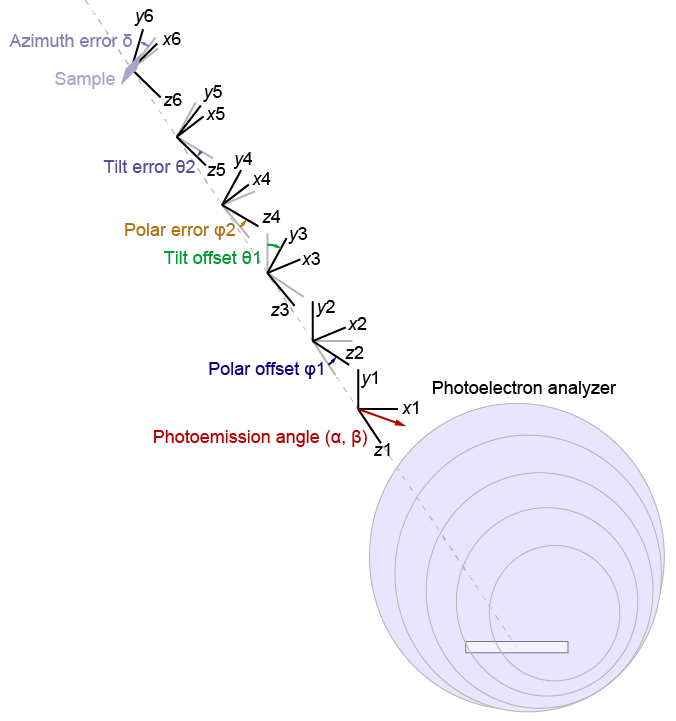

# *Part*s for ARPES analysis

This page briefly explains the *Part*s included in the Procedure files (listed below) in ```IAF_ARPES.ipf```.
You need to add the ```#include "IAF_ARPES"``` directive to load the Procedure files.

## For correction
- ```IAF_Concatenate.ipf```
- ```IAF_ConvertAngle.ipf```
- ```IAF_Corrections1D.ipf```
- ```IAF_Corrections2D.ipf```
- ```IAF_Corrections3D.ipf```
- ```IAF_CropWave.ipf```
- ```IAF_FermiEdgeFit.ipf```
- ```IAF_Integration.ipf```
- ```IAF_Invert.ipf```
- ```IAF_Scale.ipf```
- ```IAF_Smoothing.ipf```

See each Procedure file for the detailed description of input and output *Part*s.

# List of *Part*s
The *Part*s are sorted in the alphabetic order.

## For correction
| *Kind* | *Type* | Description | Procedure file |
| --- | --- | --- | --- |
| **Function** | [**CombineWave1D**](#combinewave1d-function) | Load 1D waves and combine them | ```IAF_LoadWave.ipf``` |

# IAF_Concatenate.ipf

<!-- 0 -->
## Concat2D (Module)
The **Concat2D** module combines two energy-angle maps with the angle offset.
The module assumes that the difference between two maps is the angle offset; the energy range and apparent angle range should be the same.

| Index | In/Out/Sock | *Type* | Role |
| --- | --- | --- | --- |
| 0 | Input | **Variable** | Concatenation mode (0 or 1) |
| 1 | Input | **Coordinate2D** | Socket to the map A |
| 2 | Input | **Coordinate2D** | Socket to the map B |
| 3 | Input | **Wave1D** | **InfoWave** of the 2nd axis (angle) of the map A |
| 4 | Input | **Variable** | Angle offset of the map B |
| 5 | Input | **Variable** | Calculation parameter |
| 6 | Socket | **Coordinate2D** | Waiting socket |

- If the concatenation mode is set to zero, the module split the angle axis into two; one is associated to the map A and the other is to the map B (**Figure 1(a)**). In this mode, the 5th argument is not used.
- If the concatenation mode is set to one, the module split the angle axis into three; one is associated to the map A, another is to the map B, and the other is calculated by the sum of the two maps (**Figure 1(b)**). In this mode, the 5th argument is the parameter to determine the unused areas near the edges of the data.


**Figure 1**: Schematics of two concatenation modes.

<!-- 1 -->
## Concat2D_F (Function)
The **Concat2D_F** function is the format function for the **Concat2D** *Module*.

| Index | In/Out/Sock | *Type* | Role |
| --- | --- | --- | --- |
| 0 | Input | **Wave1D** | **InfoWave** of the 1st axis (energy) |
| 1 | Input | **Wave1D** | **InfoWave** of the 2nd axis (angle) of the map A |
| 2 | Input | **Variable** | Angle offset of the map B |
| 3 | Output | **Wave1D** | **InfoWave** of the 1st axis of the combined data |
| 4 | Output | **Wave1D** | **InfoWave** of the 2nd axis of the combined data |

# IAF_ConvertAngle.ipf

<!-- 2 -->
## ConvAngle2D (Module)
The **ConvAngle2D** module converts the ```(energy (eV), angle (deg))``` map to the ```(energy (eV), momentum (1/Å))``` map.
The module assumes that the Fermi level correction is already performed, in other words, the energy is E-Ef.

| Index | In/Out/Sock | *Type* | Role |
| --- | --- | --- | --- |
| 0 | Input | **Variable** | The kinetic energy of the photoelectrons excited from the Fermi level (photon energy - work function) |
| 1 | Input | **Variable** | Angle offset |
| 2 | Input | **Coordinate2D** | ```(energy, angle) socket |
| 3 | Socket | **Coordinate2D** | Waiting socket |

Here we represent the two parameters in the argument list by ```EphEf``` and ```theta0``` respectively.
When a point ```(E, theta)``` is given, the conversion equation becomes
```
(E, theta) -> (E, k)
Kph=E2kConstant*sqrt(E+EphEf)
k=Kph*sin(theta-theta0).
```
The ```E2kConstant``` consant is ```sqrt(2*m*e)/hbar ≒ 0.512``` in this unit system.

What the module actually do is the conversion from ```(E, k)``` to ```(E, theta)```, so the equation is
```
(E, k) -> (E, theta)
Kph=E2kConstant*sqrt(E+EphEf)
theta=theta0+asin(k/Kph).
```

<!-- 3 -->
## ConvAngle2D_F (Function)
The **ConvAngle2D_F** function is the format function for **ConvAngle2D** *Module*.

| Index | In/Out/Sock | *Type* | Role |
| --- | --- | --- | --- |
| 0 | Input | **Variable** | The kinetic energy of the photoelectrons excited from the Fermi level (photon energy - work function) |
| 1 | Input | **Variable** | Angle offset |
| 2 | Input | **Wave1D** | **InfoWave** of the 1st axis (energy) |
| 3 | Input | **Wave1D** | **InfoWave** of the 2nd axis (angle) |
| 4 | Output | **Wave1D** | **InfoWave** of the 1st axis (energy) |
| 5 | Output | **Wave1D** | **InfoWave** of the 2nd axis (momentum) |

In the function, the momentum range is determined to cover the whole range between the momentum minimum and maximum by the same number of data points.
Therefore, finer **InfoWave** may be better for the color map.

<!-- 4 -->
## ConvEAhn (Module)
The **ConvEAhn** *Module* converts the ```(energy (eV), angle (deg), hn (eV))``` map to the ```(energy (eV), kx (1/Å), kz(1/Å))``` map.
As the **ConvAngle2D** module does, the module assumes that the Fermi level correction is already performed, in other words, the energy is E-Ef.

| Index | In/Out/Sock | *Type* | Role |
| --- | --- | --- | --- |
| 0 | Input | **Variable** | Work function |
| 1 | Input | **Variable** | Inner potential |
| 2 | Input | **Variable** | Angle offset |
| 3 | Input | **Coordinate3D** | ```(Energy, angle, hn)``` socket |
| 4 | Socket | **Coordinate3D** | Waiting socket |

Here we represent the three parameters in the argument list by ```W```, ```V0```, and ```theta0```.
When a point ```(E, theta, hn)``` is given, the conversion equation becomes
```
(E, theta, hn) -> (E, kx, kz)
Eph=E+hn-W
Kph_v=E2kConstant*sqrt(Eph) // momentum in the vacuum
Kph_c=E2kConstant*sqrt(Eph+V0) // momentum in the crystal
kx=Kph_v*sin(theta-theta0)
kz=sqrt(Kph_c^2-kx^2).
```
Therefore, the inverted conversion process becomes
```
(E, kx, kz) -> (E, theta, hn)
Kph_c=sqrt(kx^2+kz^2)
Eph=(Kph_c/E2kConstant)^2-V0
hn=Eph-E+W
Kph_v=E2kConstant*sqrt(Eph) // momentum in the vacuum
theta=theta0+asin(kx/Kph_v).
```

<!-- 5 -->
## ConvEAhn2 (Module)
The **ConvEAhn2** *Module* converts the ```(energy (eV), kx (1/Å), hn (eV))``` map to the ```(energy (eV), kx (1/Å), kz(1/Å))``` map.
The module assumes that the Fermi level correction and the angle-to-momentum conversion are already performed.

Since the **ConvEAhn2** *Module* is similar to the **ConvEAhn** *Module*, We set the arrangement of the arguments the same as **ConvEAhn**.
Therefore, although the 2nd argument represents the angle offset, it is not used in the calculations.

| Index | In/Out/Sock | *Type* | Role |
| --- | --- | --- | --- |
| 0 | Input | **Variable** | Work function |
| 1 | Input | **Variable** | Inner potential |
| 2 | Input | **Variable** | (Angle offset) |
| 3 | Input | **Coordinate3D** | ```(Energy, kx, hn)``` socket |
| 4 | Socket | **Coordinate3D** | Waiting socket |

<!-- 6 -->
## ConvEAhn_F (Function)
The **ConvEAhn_F** *Function* is the format function for **ConvEAhn**.

| Index | In/Out/Sock | *Type* | Role |
| --- | --- | --- | --- |
| 0 | Input | **Variable** | Work function |
| 1 | Input | **Variable** | Inner potential |
| 2 | Input | **Variable** | Angle offset |
| 3 | Input | **Wave1D** | **InfoWave** for the 1st axis (energy) |
| 4 | Input | **Wave1D** | **InfoWave** for the 2nd axis (angle) |
| 5 | Input | **Wave1D** | **InfoWave** for the 3rd axis (hn) |
| 3 | Output | **Wave1D** | **InfoWave** for the 1st axis (energy) |
| 4 | Output | **Wave1D** | **InfoWave** for the 2nd axis (kx) |
| 5 | Output | **Wave1D** | **InfoWave** for the 3rd axis (kz) |

In the function, the momentum range is determined to cover the whole range between the momentum minimum and maximum by the same number of data points.
Therefore, finer **InfoWave** may be better for the color map.

<!-- 7 -->
## LoadkzMap (Module)
The **LoadkzMap** *Module* gives the values at the specified points ```(E, theta, hn)```.
The module has the list of energy-angle maps at several photon energies and load the appropriate map based on the given ```hn``` value.

| Index | In/Out/Sock | *Type* | Role |
| --- | --- | --- | --- |
| 0 | Input | **TextWave** | Path list of ```(energy, angle)``` maps |
| 1 | Input | **Variable** | Smoothing width along the energy direction |
| 2 | Input | **Variable** | Smoothing width along the angle direction |
| 3 | Socket | **Coordinate3D** | Waiting socket |

The module assumes that the 1st axis of the path list (0th argument) corresponds to the photon energy.
For the smoothing widths, see **Smoothing*X*D** *Module*s in **IAF_Smoothing.ipf**.

<!-- 8 -->
## LoadkzMap_F (Function)
The **LoadkzMap_F** *Function* is the format function for **LoadkzMap**.

| Index | In/Out/Sock | *Type* | Role |
| --- | --- | --- | --- |
| 0 | Input | **TextWave** | Path list of ```(energy, angle)``` maps |
| 1 | Input | **Variable** | Smoothing width along the energy direction |
| 2 | Input | **Variable** | Smoothing width along the angle direction |
| 3 | Output | **Wave1D** | **InfoWave** for the 1st axis (energy) |
| 4 | Output | **Wave1D** | **InfoWave** for the 2nd axis (angle) |
| 5 | Output | **Wave1D** | **InfoWave** for the 3rd axis (hn) |

<!-- 9 -->
## ConvPeaks (Function)
The **ConvPeaks** *Function* converts ```(energy, hn)``` points to ```(energy, kz)``` points.
The function assumes that the kx value is constant.

The function is intended to load the peak positions obtained from the EDCs and overlay the converted energy-kz points on the energy-kz map to highlight the peak positions.

| Index | In/Out/Sock | *Type* | Role |
| --- | --- | --- | --- |
| 0 | Input | **Variable** | Work function |
| 1 | Input | **Variable** | Inner potential |
| 2 | Input | **Wave2D** | List of ```(hn, E)``` |
| 3 | Input | **Variable** | kx value |
| 4 | Output | **Wave2D** | List of ```(E, kz)``` |

<!-- 10 -->
## ConvAngle3D_M (Module)
The **ConvAngle3D_M** *Module* converts the energy-angle-angle map to the energy-kx-ky map.
The module assumes that the second angle axis is related to the manipulator rotation, not the deflector of the photoelectron analyzer.
As the other conversion *Module*s do, the module assumes that the Fermi level correction is already performed.

The conversion process is based on the [paper by Ishida and Shin](https://aip.scitation.org/doi/10.1063/1.5007226), although some definitions of angles are different.

| Index | In/Out/Sock | *Type* | Role |
| --- | --- | --- | --- |
| 0 | Input | **Variable** | The kinetic energy of the photoelectrons excited from the Fermi level (photon energy - work function) |
| 1 | Input | **Variable** | Polar offset angle |
| 2 | Input | **Variable** | Tilt offset angle |
| 3 | Input | **Variable** | Polar error angle |
| 4 | Input | **Variable** | Azimuth error angle |
| 5 | Input | **Variable** | Whether the tilt angle is inverted; if so, the value should be greater than 0 |
| 6 | Input | **Variable** | Whether the photoemission angle is inverted; if so, the value should be greater than 0 |
| 7 | Input | **Coordinate3D** | ```(Energy, angle, angle)``` socket |
| 8 | Socket | **Coordinate3D** | Waiting socket |


Here we represent the variables in the argument list by ```EphEf```, ```φ1```, ```θ0```, ```φ2```, ```δ``` and the angles along the first and second axes by ```α``` and ```θ```, respectively.
These angles are defined in **Figure 2**.
In **Figure 2**, the analyzer slit is in the center bottom.
Since the sign of the photoemission angle ```α``` is determined to correspond to this analyzer orientation, you may need to invert the sign if the orientation is different.


**Figure 2**: Coordinate systems used in the **ConvAngle3D_M** *Module*.

The photoemission wavevector k is ```(k*sin(α), 0, k*cos(α))``` in the x1y1z1 coordinate system.
The representation of the same vector in the x2y2z2 coordinate system is obtained by multiplying the 3×3 transformation matrix to the vector.
Multiplying these transformation matrix sequentially, we can get the values in the x5y5z5 coordinate system.

What the module do is reversed.
When we get the vector ```(kx, ky, kz)``` in the x5y5z5 system, we convert it to the x3y3z3 coordinate system.
Then we calculate the rotation angle ```θ``` so that the y2 component (in the x2y2z2 coordinate system) becomes zero.
After that, we convert the representation to the x1y1z1 coordinate system and obtain ```α```.

The difference between the error angles (```φ2``` and ```δ```) and polar offset ```φ1``` is that the former is to remove the experimental error and the latter is to take into account the experimental setup.
Therefore, the polar offset ```φ1``` should be zero unless you intentionally rotate the manipulator.
The tilt offset ```θ0``` includes both roles.

<!-- 11 -->
## ConvAngle3D_M_F (Function)
The **ConvAngle3D_M_F** *Function* is the format function for **ConvAngle3D_M**.

| Index | In/Out/Sock | *Type* | Role |
| --- | --- | --- | --- |
| 0 | Input | **Variable** | The kinetic energy of the photoelectrons excited from the Fermi level (photon energy - work function) |
| 1 | Input | **Variable** | Polar offset angle |
| 2 | Input | **Variable** | Tilt offset angle |
| 3 | Input | **Variable** | Polar error angle |
| 4 | Input | **Variable** | Azimuth error angle |
| 5 | Input | **Variable** | Whether the tilt angle is inverted; if so, the value should be greater than 0 |
| 6 | Input | **Variable** | Whether the photoemission angle is inverted; if so, the value should be greater than 0 |
| 7 | Input | **Wave1D** | **InfoWave** for the first axis (energy) |
| 8 | Input | **Wave1D** | **InfoWave** for the second axis (angle ```α```) |
| 9 | Input | **Wave1D** | **InfoWave** for the third axis (angle ```θ```) |
| 10 | Output | **Wave1D** | **InfoWave** for the first axis (energy) |
| 11 | Output | **Wave1D** | **InfoWave** for the second axis (kx) |
| 12 | Output | **Wave1D** | **InfoWave** for the thrid axis (ky) |


<!-- 12 -->
## ConvAngle3D_D (Module)
The **ConvAngle3D_D** *Module* converts the energy-angle-angle map to the energy-kx-ky map.
The module assumes that the second angle axis is related to the deflector of the photoelectron analyzer, not th manipulator rotation.
As the other conversion *Module*s do, the module assumes that the Fermi level correction is already performed.

The conversion process is based on the [paper by Ishida and Shin](https://aip.scitation.org/doi/10.1063/1.5007226), although some definitions of angles are different.

| Index | In/Out/Sock | *Type* | Role |
| --- | --- | --- | --- |
| 0 | Input | **Variable** | The kinetic energy of the photoelectrons excited from the Fermi level (photon energy - work function) |
| 1 | Input | **Variable** | Polar offset angle |
| 2 | Input | **Variable** | Tilt offset angle |
| 3 | Input | **Variable** | Polar error angle |
| 4 | Input | **Variable** | Tilt error angle |
| 5 | Input | **Variable** | Azimuth error angle |
| 6 | Input | **Coordinate3D** | ```(Energy, angle, angle)``` socket |
| 7 | Socket | **Coordinate3D** | Waiting socket |


Here we represent the variables in the argument list by ```EphEf```, ```φ1```, ```θ1```, ```φ2```, ```θ2```, ```δ``` and the angles along the first and second axes by ```α``` and ```β```, respectively.
These angles are defined in **Figure 3**.
In **Figure 3**, the analyzer slit is in the center bottom.
Since the sign of the photoemission angles ```α``` and ```β``` is determined to correspond to this analyzer orientation, you may need to invert the sign if the orientation is different.



**Figure 3**: Coordinate systems used in the **ConvAngle3D_D** *Module*.

The photoemission wavevector k is ```(k*α*sin(η)/η, k*β*sin(η)/η, k*cos(η))``` (from the [paper by Ishida and Shin](https://aip.scitation.org/doi/10.1063/1.5007226)) in the x1y1z1 coordinate system, where only in this equation the angle unit is radian and ```η=sqrt(α^2+β^2)```.
The transformation can be performed in the similar way as **ConvAngle3D_M**.

What the module do is reversed.
When we get the vector ```(kx, ky, kz)``` in the x6y6z6 system, we convert it to the x1y1z1 coordinate system ```(kx1, ky1, kz1)```.
Then we obtain ```α``` and ```β``` from the following equation.
```
η=acos(kz1/k)
α=kx1/k*η/sin(η)
β=ky1/k*η/sin(η)
```

The difference between the error angles (```φ2```, ```θ2```, and ```δ```) and offset angles (```φ1``` and ```θ1```) is that the former is to remove the experimental error and the latter is to take into account the experimental setup.
Therefore, the offset angles should be zero unless you intentionally rotate the manipulator and at least one of the offset angles will be zero in most experimental setups.

<!-- 13 -->
## ConvAngle3D_D_F (Function)
The **ConvAngle3D_D_F** *Function* is the format function for **ConvAngle3D_D**.

| Index | In/Out/Sock | *Type* | Role |
| --- | --- | --- | --- |
| 0 | Input | **Variable** | The kinetic energy of the photoelectrons excited from the Fermi level (photon energy - work function) |
| 1 | Input | **Variable** | Polar offset angle |
| 2 | Input | **Variable** | Tilt offset angle |
| 3 | Input | **Variable** | Polar error angle |
| 4 | Input | **Variable** | Tilt error angle |
| 5 | Input | **Variable** | Azimuth error angle |
| 6 | Input | **Wave1D** | **InfoWave** for the first axis (energy) |
| 7 | Input | **Wave1D** | **InfoWave** for the second axis (angle ```α```) |
| 8 | Input | **Wave1D** | **InfoWave** for the third axis (angle ```β```) |
| 9 | Output | **Wave1D** | **InfoWave** for the first axis (energy) |
| 10 | Output | **Wave1D** | **InfoWave** for the second axis (kx) |
| 11 | Output | **Wave1D** | **InfoWave** for the thrid axis (ky) |

# Corrections1D.ipf

<!-- 14 -->
## CorrectEf1D (Function)
The **CorrectEf1D** *Function* performs the Fermi level correction.
Since the Fermi level is constant, the correction process can be described by the *Function*; the function just modifies the offset of the data.

| Index | In/Out/Sock | *Type* | Role |
| --- | --- | --- | --- |
| 0 | Input | **Wave1D** | Target wave |
| 1 | Input | **Variable** | Fermi level energy |
| 2 | Output | **Wave1D** | Fermi level corrected wave |

<!-- 15 -->
## Normalize1D (Function)
The **Normalize1D** *Function* performs the normalization so that the average of data points becomes 1.

| Index | In/Out/Sock | *Type* | Role |
| --- | --- | --- | --- |
| 0 | Input | **Wave1D** | Target wave | 
| 1 | Output | **Wave1D** | Normalized wave |

# Corrections2D.ipf

<!-- 16 -->
## AveragedMDC (Function)
The **AveragedMDC** *Function* calculates the normalized MDC.
The function assumes the reference data such as Au polycrystal is given and the output is used to remove the MCP inhomogenity.
In the MDC calculations is performed within the indices satisfying ```(start index) <= i <= (end index)```.
We note that both edges are included in the calculations.

| Index | In/Out/Sock | *Type* | Role |
| --- | --- | --- | --- |
| 0 | Input | **Wave2D** | Measurement data |
| 1 | Input | **Variable** | Start index to calculate the MDC |
| 2 | Input | **Variable** | End index to calculate the MDC |
| 3 | Output | **Wave1D** | Normalized MDC |

<!-- 17 -->
## MCPHistogram (Function)
The **MCPHistogram** *Function* gives the histogram of the pixel intensities.
The histogram is used to determine invalid (too strong or too weak) data points and neglect them in the further analysis of measurement data obtained by the fixed mode.


| Index | In/Out/Sock | *Type* | Role |
| --- | --- | --- | --- |
| 0 | Input | **Wave2D** | Measurement data (fixed mode) |
| 1 | Input | **Variable** | Number of bins |
| 2 | Output | **Wave1D** | Histogram |


<!-- 18 -->
## AveragedInt (Function)
The **AveragedInt** *Funciton* performes the normalization of the 2D wave so that the average becomes 1.
The function neglects invalid data points and the values at these points are set to -1.
The function assumes that the reference data such as Au polycrystal measured by the fixed mode is given and the output is used to remove the MCP inhomogenity.

| Index | In/Out/Sock | *Type* | Role |
| --- | --- | --- | --- |
| 0 | Input | **Wave2D** | Measurement data (fixed mode) |
| 1 | Input | **Variable** | Minimum of the valid range |
| 2 | Input | **Variable** | Maximum of the valid range |
| 3 | Output | **Wave2D** | Normalized data |

<!-- 19 -->
## CorrectInt_sw2D (Module)
The **CorrectInt_sw2D** *Module* performs the intensity correction of the data obtained by the swept mode; therefore, the reference is given as the MDC from the **AveragedMDC** *Fucntion*.
Since the correction is performed on each data points, the socket should be **Index2D**, not **Coordinate2D**.

| Index | In/Out/Sock | *Type* | Role |
| --- | --- | --- | --- |
| 0 | Input | **Wave2D** | Raw data (swept mode) |
| 1 | Input | **Wave1D** | Reference MDC |
| 2 | Socket | **Index2D** | Waiting socket |

<!-- 20 -->
## CorrectInt_sw2t (Module)
The **CorrectInt_sw2t** *Module* performs the intensity correction of the data obtained by the swept mode; therefore, the reference is given as the MDC from the **AveragedMDC** *Fucntion*.
In addition to the **CorrectInt_sw2D** *Module*, the module has the threshold.
If the reference value is smaller than the threshold, the normalization is not performed and the value becomes 0.
Since the correction is performed on each data points, the socket should be **Index2D**, not **Coordinate2D**.

| Index | In/Out/Sock | *Type* | Role |
| --- | --- | --- | --- |
| 0 | Input | **Wave2D** | Raw data (swept mode) |
| 1 | Input | **Wave1D** | Reference MDC |
| 2 | Input | **Variable** | Threshold |
| 3 | Socket | **Index2D** | Waiting socket |

<!-- 21 -->
## CorrectInt_fx2D (Module)
The **CorrectInt_fx2D** *Module* performed the intensity correction of the data obtained by the fixed mode; therefore, the reference is given as the 2D map from the **AveragedInt** *Function*.
The module assumes that the invalid data points has the negative reference intensity; the output data from the **AverageInt** *Function* satisfies the assumption.
If the data point is invalid, the returned value is set to 0.

| Index | In/Out/Sock | *Type* | Role |
| --- | --- | --- | --- |
| 0 | Input | **Wave2D** | Raw data (fixed mode) |
| 1 | Input | **Wave2D** | Reference 2D map |
| 2 | Socket | **Index2D** | Waiting socket |

<!-- 22 -->
## ConstantWave1D (Function)
The **ConstantWave1D** *Function* makes a constant 1D wave.
The output wave can be used as the constant reference (no intensity correction) and the flat Fermi level.

| Index | In/Out/Sock | *Type* | Role |
| --- | --- | --- | --- |
| 0 | Input | **Variable** | Constant value |
| 1 | Input | **Wave1D** | **InfoWave** |
| 2 | Output | **Wave1D** | Generated wave |

<!-- 23 -->
## ConvertIndex2D (Module)
The **ConvertIndex2D** *Module* receives the list or coordinates ```(x, y)``` and returns the values at these points.
However, the corresponding indices ```(p, q)``` can be non-integer.
The module has two ways to calculate the values at ```(x, y)```.

- In the nearest mode (mode=0), the value at ```(x, y)``` is obtained as the value at the nearest point ```(p0, q0), p0=round(p), q0=round(q)```.
- In the interpolation mode (mode=1), the value at ```(x, y)``` is obtained from the surrounding four points ```(p0, q0), (p0, q0+1), (p0+1, q0), (p0+1, q01), p0<p<p0+1, q0<q<q0+1```.

The effect of the convert mode difference on the resultant color map is desribed in [Example 3 of Getting Started](GettingStarted.md#example-3-module).

The module assumes that the 3rd argument is **CorrectInt_sw2D**, **CorrectInt_sw2Dt**, **CorrectInt_fx2D**, or **Smoothing2D**.
In the arguments, **InfoWave**s should be those for the raw data because they are used to convert the coordinate to the index.
They should not be the result of **Smoothing2D_F**.

| Index | In/Out/Sock | *Type* | Role |
| --- | --- | --- | --- |
| 0 | Input | **Variable** | Convert mode (0 or 1) |
| 1 | Input | **Wave1D** | **InfoWave** for the 1st axis |
| 2 | Input | **Wave1D** | **InfoWave** for the 2nd axis |
| 3 | Input | **Index2D** | ```(p, q)``` socket |
| 4 | Socket | **Coordinate2D** | Waiting socket |

<!-- 24 -->
## CorrectEf2D (Module)
The **CorrectEf2D** *Module* sets the Fermi energy to zero.
The module assumes that the 2nd argument is **ConvertIndex2D** receiving ```(kinetic energy, angle)``` data, and the socket of the module receives ```(E-Ef, angle)``` data.

Although the 0th argument can specify the Fermi level calculation mode, the difference is negligible.

| Index | In/Out/Sock | *Type* | Role |
| --- | --- | --- | --- |
| 0 | Input | **Variable** | Fermi level calculation mode (0: nearest or 1: interpolation) |
| 1 | Input | **Wave1D** | Fermi level at each angle |
| 2 | Input | **Coordinate2D** | ```(kinetic energy, angle)``` socket |
| 3 | Socket | **Coordinate2D** | Waiting socket |

<!-- 25 -->
## CorrectEf2D_F (Function)
The **CorrectEf2D_F** *Function* is the format function for **CorrectEf2D** *Module*.

| Index | In/Out/Sock | *Type* | Role |
| --- | --- | --- | --- |
| 0 | Input | **Wave1D** | **InfoWave** for the 1st index (kinetic energy) |
| 1 | Input | **Wave1D** | **InfoWave** for the 2nd index (angle) |
| 2 | Input | **Wave1D** | Fermi level at each angle |
| 3 | Output | **Wave1D** | **InfoWave** for the 1st index (E-Ef) |
| 4 | Output | **Wave1D** | **InfoWave** for the 2nd index (angle) |

<!-- 26 -->
## Make2D_Index (Function)
The **Make2D_Index** makes the 2D map using the **Index2D** socket.
Although two **InfoWave**s are given as the input, only the sizes are used to make the index list.
When we represent the sizes by ```size1``` and ```size2```, the list sent to the socket (2nd argument) includes
```
(0, 0)
(0, 1)
...
(0, size2-1)
...
(size1-1, size2-1).
```
The offsets and deltas are used in the ```SetScale/P``` process.

The module is less useful than **Make2D_Coord** in the real analysis.

| Index | In/Out/Sock | *Type* | Role |
| --- | --- | --- | --- |
| 0 | Input | **Wave1D** | **InfoWave** for the 1st axis |
| 1 | Input | **Wave1D** | **InfoWave** for the 2nd axis |
| 2 | Input | **Index2D** | ```(p, q)``` socket |
| 3 | Output | **Wave2D** | Generated map |

<!-- 27 -->
## Make2D_Coord (Function)
The **Make2D_Coord** makes the 2D map using the **Coordinate2D** socket.
When we represent the elements of the two **InfoWave**s by ```(offset1, delta1, size1)``` and ```(offset2, delta2, size2)```, the list sent to the socket (2nd argument) includes 
```
(offset1, offset2)
(offset1, offset2+delta2)
...
(offset1, offset2+delta2*(size2-1))
...
(offset1+delta1*(size1-1), offset2+delta2*(size2-1)).
```

| Index | In/Out/Sock | *Type* | Role |
| --- | --- | --- | --- |
| 0 | Input | **Wave1D** | **InfoWave** for the 1st axis |
| 1 | Input | **Wave1D** | **InfoWave** for the 2nd axis |
| 2 | Input | **Coordinate2D** | ```(x, y)``` socket |
| 3 | Output | **Wave2D** | Generated map |

<!-- 28 -->
## CompositeEhn (Function)
The **CompositeEhn** makes the ```(E-Ef, hn)``` map at certain k from the EDCs at each photon energy.
In the process, intensity normalization is also performed.
The 1st axis of the list (0th argument) should correspond to the photon energy.

The output is used not only for the color map of ```(E-Ef, hn)``` but for the input of the **OffsetFigure_E** *Function* to make the figure of aligned EDCs.

| Index | In/Out/Sock | *Type* | Role |
| --- | --- | --- | --- |
| 0 | Input | **TextWave** | List of EDCs |
| 1 | Input | **Variable** | Minimum of the normalization range |
| 2 | Input | **Variable** | Maximum of the normalization range |
| 3 | Output | **Wave2D** | Generated ```(E-Ef, hn)``` map |

