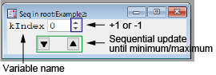

# Fundamental *Part*s

This page briefly explains the *Part*s included in the Procedure files (listed below) in ```IAF_Fundamental.ipf```.
```IAF_Fundamental.ipf``` is automatically loaded because ```IAF.ipf``` has the ```#include "IAF_Fundamental"``` directive.

- ```IAF_GaussFit.ipf```
- ```IAF_LoadWave.ipf```
- ```IAF_PolyFit.ipf```
- ```IAF_Sequence.ipf```

See each Procedure file for the detailed description of input and output *Part*s.

# List of *Part*s
The *Part*s are sorted in alphabetic order.

| *Kind* | *Type* | Description | Procedure file |
| --- | --- | --- | --- |
| *Function* | [**CombineWave1D**](#combinewave1d-function) | Load the 1D waves and combine them | ```IAF_LoadWave.ipf``` |
| *Function* | [**CombineWave2D**](#combinewave2d-function) | Load the 2D waves and combine them | ```IAF_LoadWave.ipf``` |
| *Function* | [**CombineWave3D**](#combinewave3d-function) | Load the 3D waves and combine them | ```IAF_LoadWave.ipf``` |
| *Function* | [**ExtractString**](#extractstring-function) | Extract the string from the 1D text wave | ```IAF_Sequence.ipf``` |
| *Function* | [**ExtractVariable**](#extractvariable-function) | Extract the variable from the 1D wave | ```IAF_Sequence.ipf``` |
| *Function* | [**ExtractWave1DX**](#extractwave1dx-function) | Extract the 1D wave from the 2D wave | ```IAF_Sequence.ipf``` |
| *Function* | [**ExtractWave1DY**](#extractwave1dy-function) | Extract the 1D wave from the 2D wave | ```IAF_Sequence.ipf``` |
| *Function* | [**FullRange**](#fullrange-function) | Return the first and last indices | ```IAF_LoadWave.ipf``` |
| *Function* | [**GaussFit**](#gaussfit-function) | Fit the wave with multiple Gauss functions | ```IAF_GaussFit.ipf``` |
| *Function* | [**LoadTextWave**](#loadtextwave-function) | Load the 1D text wave | ```IAF_LoadWave.ipf``` |
| *Function* | [**LoadWave1D**](#loadwave1d-function) | Load the 1D wave | ```IAF_LoadWave.ipf``` |
| *Function* | [**LoadWave2D**](#loadwave2d-function) | Load the 2D wave | ```IAF_LoadWave.ipf``` |
| *Function* | [**LoadWave3D**](#loadwave3d-function) | Load the 3D wave | ```IAF_LoadWave.ipf``` |
| *Function* | [**LoadWave4D**](#loadwave4d-function) | Load the 4D wave | ```IAF_LoadWave.ipf``` |
| *Function* | [**Mod**](#mod-function) | Calculate the remainder | ```IAF_Sequence.ipf``` |
| *Function* | [**PolyCurve**](#polycurve-function) | Calculate the polynomial function | ```IAF_PolyFit.ipf``` |
| *Function* | [**PolyFit**](#polyfit-function) | Fit the wave with a polynomial | ```IAF_PolyFit.ipf``` |
| *Function* | [**PolyFit2**](#polyfit2-function) | Fit the wave with a polynomial | ```IAF_PolyFit.ipf``` |
| *Function* | [**Quotient**](#quotient-function) | Calculate the quotient | ```IAF_Sequence.ipf``` |
| *Panel* | [**Sequence**](#sequence-panel) | Control the Variable Part | ```IAF_Sequence.ipf``` |
| *Function* | [**StoreVariable**](#storevariable-function) | Store the variable in the 1D wave | ```IAF_Sequence.ipf``` |
| *Function* | [**StoreVariable2D**](#storevariable2d-function) | Store the variable in the 2D wave | ```IAF_Sequence.ipf``` |
| *Function* | [**StoreWave12D**](#storewave12d-function) | Store the 1D wave in the 2D wave | ```IAF_Sequence.ipf``` |
| *Function* | [**StoreWave13D**](#storewave13d-function) | Store the 1D wave in the 3D wave | ```IAF_Sequence.ipf``` |
| *Function* | [**StoreWave1D**](#storewave1d-function) | Store the 1D wave outside of the Data folder | ```IAF_LoadWave.ipf``` |
| *Function* | [**StoreWave23D**](#storewave23d-function) | Store the 2D wave in the 3D wave | ```IAF_Sequence.ipf``` |
| *Function* | [**StoreWave2D**](#storewave2d-function) | Store the 2D wave outside of the Data folder | ```IAF_LoadWave.ipf``` |
| *Function* | [**StoreWave3D**](#storewave3d-function) | Store the 3D wave outside of the Data folder | ```IAF_LoadWave.ipf``` |
| *Function* | [**ValidPoints1D**](#validpoints1d-function) | Extract valid points | ```IAF_PolyFit.ipf``` |
| *Function* | [**WaveInfo1D**](#waveinfo1d-function) | Export the InfoWave from Wave1D | ```IAF_LoadWave.ipf``` |
| *Function* | [**WaveInfo2D**](#waveinfo2d-function) | Export the InfoWave from Wave2D | ```IAF_LoadWave.ipf``` |
| *Function* | [**WaveInfo3D**](#waveinfo3d-function) | Export the InfoWave from Wave3D | ```IAF_LoadWave.ipf``` |
| *Function* | [**WaveInfo4D**](#waveinfo4d-function) | Export the InfoWave from Wave4D | ```IAF_LoadWave.ipf``` |
| *Function* | [**WaveInfoText**](#waveinfotext-function) | Export the InfoWave from TextWave | ```IAF_LoadWave.ipf``` |

# IAF_GaussFit.ipf

<!-- 0 -->
## GaussFit (Function)
The *GaussFit Function* fits the input wave with the sum of multiple Gauss functions and linear background.
Here the Gauss functions are assumed to have the same σ.

| Index | Input/Output | *Type* | Role |
| --- | --- | --- | --- |
| 0 | Input | *Wave1D* | Wave to be fitted |
| 1 | Input | *Variable* | Lower end of the fitting range (index) |
| 2 | Input | *Variable* | Upper end of the fitting range (index) |
| 3 | Input | *Wave1D* | Initial guess of the Gauss functions |
| 4 | Input | *Variable* | Initial guess of the σ of the Gauss functions |
| 5 | Input | *String* | Flags for which coefficients to be hold constant, which corresponds to the ```/H``` flags in the ```FuncFit``` (or ```CurveFit```) functions |
| 6 | Output | *Wave1D* | Fitting parameters |
| 7 | Output | *Wave1D* | Wave fitted to the input |

The format of the 3rd input (initial guess) is as follows.
- The 0th and 1st parameters specify the initial center and height of the Gauss function 1.
- The 2nd and 3rd parameters specify those of the Gauss function 2.
- The above rule is applied until the end of the wave.
- If the height is smaller than zero, the pair is neglected.

The format of the 6th output (fitting parameters) is as follows.
- The 0th parameter is the constant part of the background.
- The 1st parameter is the slope of the background.
- The 2nd parameter is the σ of the Gauss functions.
- The 3rd and 4th parameters specify the center and height of the Gauss function 1.
- The 5th and 6th parameters specify those of the Gauss function 2.
- The description of the Gauss functions continues until the end of the wave.

# IAF_LoadWave.ipf

<!-- 1 -->
## LoadWave1D (Function)
The *LoadWave1D Function* loads the 1D wave from the specified path.
The path is relative to the current folder, which should include the ```Configurations```, ```Data```, ```Diagrams```, and ```TempData``` folders.
For example, if you want to load the wave ```WaveName1``` in the current folder, the path is simply ```WaveName1```.
If you want to load the wave ```WaveName2``` in the ```Folder1``` folder in the current folder, the path becomes ```Folder1:WaveName2```.

| Index | Input/Output | *Type* | Role |
| --- | --- | --- | --- |
| 0 | Input | *String* | Relative wave path from the current folder |
| 1 | Output | *Wave1D* | Loaded wave |

<!-- 2 -->
## WaveInfo1D (Function)
The **WaveInfo1D Function* exports the *InfoWave*, containing the offset, delta, and size, from the *Wave1D* input.

| Index | Input/Output | *Type* | Role |
| --- | --- | --- | --- |
| 0 | Input | *Wave1D* | Target wave |
| 1 | Output | *Wave1D* | *InfoWave* of the target |

<!-- 3 -->
## LoadWave2D (Function)
The *LoadWave2D Function* loads the 2D wave from the specified path.
See [**LoadWave1D**](#loadwave1d-function) for the rule of the path.

| Index | Input/Output | *Type* | Role |
| --- | --- | --- | --- |
| 0 | Input | *String* | Relative wave path from the current folder |
| 1 | Output | *Wave2D* | Loaded wave |

<!-- 4 -->
## WaveInfo2D (Function)
The *WaveInfo2D Function* exports the *InfoWave*s, containing the offset, delta, and size, from the *Wave2D* input.

| Index | Input/Output | *Type* | Role |
| --- | --- | --- | --- |
| 0 | Input | *Wave2D* | Target wave |
| 1 | Output | *Wave1D* | *InfoWave* of the target along the x axis |
| 2 | Output | *Wave1D* | *InfoWave* of the target along the y axis |

<!-- 5 -->
## LoadWave3D (Function)
The *LoadWave3D Function* loads the 3D wave from the specified path.
See [**LoadWave1D**](#loadwave1d-function) for the rule of the path.

| Index | Input/Output | *Type* | Role |
| --- | --- | --- | --- |
| 0 | Input | *String* | Relative wave path from the current folder |
| 1 | Output | *Wave3D* | Loaded wave |

<!-- 6 -->
## WaveInfo3D (Function)
The *WaveInfo3D Function* exports the *InfoWave*s, containing the offset, delta, and size, from the *Wave3D* input.

| Index | Input/Output | *Type* | Role |
| --- | --- | --- | --- |
| 0 | Input | *Wave3D* | Target wave |
| 1 | Output | *Wave1D* | *InfoWave* of the target along the x axis |
| 2 | Output | *Wave1D* | *InfoWave* of the target along the y axis |
| 3 | Output | *Wave1D* | *InfoWave* of the target along the z axis |

<!-- 7 -->
## LoadWave4D (Function)
The *LoadWave4D Function* loads the 4D wave from the specified path.
See [**LoadWave1D**](#loadwave1d-function) for the rule of the path.

| Index | Input/Output | *Type* | Role |
| --- | --- | --- | --- |
| 0 | Input | *String* | Relative wave path from the current folder |
| 1 | Output | *Wave4D* | Loaded wave |

<!-- 8 -->
## WaveInfo4D (Function)
The *WaveInfo4D Function* exports the *InfoWave*s, containing the offset, delta, and size, from the *Wave4D* input.

| Index | Input/Output | *Type* | Role |
| --- | --- | --- | --- |
| 0 | Input | *Wave4D* | Target wave |
| 1 | Output | *Wave1D* | *InfoWave* of the target along the x axis |
| 2 | Output | *Wave1D* | *InfoWave* of the target along the y axis |
| 3 | Output | *Wave1D* | *InfoWave* of the target along the z axis |
| 4 | Output | *Wave1D* | *InfoWave* of the target along the t axis |

<!-- 9 -->
## LoadTextWave (Function)
The *LoadTextWave Function* loads the 1D text wave from the specified path.
See [**LoadWave1D**](#loadwave1d-function) for the rule of the path.

| Index | Input/Output | *Type* | Role |
| --- | --- | --- | --- |
| 0 | Input | *String* | Relative wave path from the current folder |
| 1 | Output | *TextWave* | Loaded wave |

<!-- 10 -->
## WaveInfoText (Function)
The *WaveInfoText Function* exports the *InfoWave*, containing the offset, delta, and size, from the *TextWave* input.

| Index | Input/Output | *Type* | Role |
| --- | --- | --- | --- |
| 0 | Input | *TextWave* | Target wave |
| 1 | Output | *Wave1D* | *InfoWave* of the target along the x axis |

<!-- 11 -->
## FullRange (Function)
The *FullRange Function* returns the first and last indices from *InfoWave*.
This function is useful when you want to perform a sequential analysis for the whole range of the input.

| Index | Input/Output | *Type* | Role |
| --- | --- | --- | --- |
| 0 | Input | *Wave1D* | *InfoWave* |
| 1 | Output | *Variable* | The first index (always zero) |
| 2 | Output | *Variable* | The last index (size-1) |

<!-- 12 -->
## StoreWave1D (Function)
The *StoreWave1D Function* copies the input *Wave1D* to the specified path.
The rule for the path is the same as the *LoadWaveXD Function*s.

| Index | Input/Output | *Type* | Role |
| --- | --- | --- | --- |
| 0 | Input | *Wave1D* | Target wave |
| 1 | Input | *String* | Path where the wave to be stored |

<!-- 13 -->
## StoreWave2D (Function)
The *StoreWave2D Function* copies the input *Wave2D* to the specified path.
The rule for the path is the same as the *LoadWaveXD Function*s.

| Index | Input/Output | *Type* | Role |
| --- | --- | --- | --- |
| 0 | Input | *Wave2D* | Target wave |
| 1 | Input | *String* | Path where the wave to be stored |

<!-- 14 -->
## StoreWave3D (Function)
The *StoreWave3D Function* copies the input *Wave3D* to the specified path.
The rule for the path is the same as the *LoadWaveXD Function*s.

| Index | Input/Output | *Type* | Role |
| --- | --- | --- | --- |
| 0 | Input | *Wave3D* | Target wave |
| 1 | Input | *String* | Path where the wave to be stored |

<!-- 15 -->
## CombineWave1D (Function)
The *CombineWave1D Function* loads the 1D waves from the paths listed in the input and sums them up.
The functions raises an error if the 1D waves does not have the same number of points.

| Index | Input/Output | *Type* | Role |
| --- | --- | --- | --- |
| 0 | Input | *TextWave* | List of paths |
| 1 | Output | *Wave1D* | Combined result |

<!-- 16 -->
## CombineWave2D (Function)
The *CombineWave2D Function* loads the 2D waves from the paths listed in the input and sums them up.
The functions raises an error if the 2D waves does not have the same number of points.

| Index | Input/Output | *Type* | Role |
| --- | --- | --- | --- |
| 0 | Input | *TextWave* | List of paths |
| 1 | Output | *Wave2D* | Combined result |

<!-- 17 -->
## CombineWave3D (Function)
The *CombineWave3D Function* loads the 3D waves from the paths listed in the input and sums them up.
The functions raises an error if the 3D waves does not have the same number of points.

| Index | Input/Output | *Type* | Role |
| --- | --- | --- | --- |
| 0 | Input | *TextWave* | List of paths |
| 1 | Output | *Wave3D* | Combined result |

<!-- 18 -->
## PolyFit (Function)
The *PolyFit Function* fits the input wave with a polynomial function f(x)=k0+k1\*x+k2\*x^2+....

| Index | Input/Output | *Type* | Role |
| --- | --- | --- | --- |
| 0 | Input | *Wave1D* | Wave to be fitted |
| 1 | Input | *Variable* | Dimension of the polynomial |
| 2 | Output | *Wave1D* | Fitting parameters k0, k1, k2, ... |
| 3 | Output | *Wave1D* | Wave fitted to the input |

<!-- 19 -->
## PolyFit2 (Function)
The *PolyFit2 Function* fits the input wave with a polynomial function.
The function can be used when the x coordinates of data points are not equally separated, in other words, can not be calculated from the offset and delta of the input wave.

| Index | Input/Output | *Type* | Role |
| --- | --- | --- | --- |
| 0 | Input | *Wave1D* | y values |
| 1 | Input | *Wave1D* | x values |
| 2 | Input | *Variable* | Dimension of the polynomial |
| 3 | Output | *Wave1D* | Fitting parameters k0, k1, k2, ... |
| 4 | Output | *Wave1D* | y values of the fitted polynomial at x points |

<!-- 20 -->
## ValidPoints1D (Function)
The **ValidPoints1D** *Function* extracts valid points from the input.
If the value at the point is larger than zero, the points is valid.
This function is used to generate the input waves for the *PolyFit2 Function*.

| Index | Input/Output | *Type* | Role |
| --- | --- | --- | --- |
| 0 | Input | *Wave1D* | Target wave |
| 1 | Output | *Wave1D* | x coordinates of the valid points in the input |
| 2 | Output | *Wave1D* | Values of the valid points in the input |

<!-- 21 -->
## PolyCurve (Function)
The *PolyCurve Function* calculates the fitted curve along the specified *InfoWave*.

| Index | Input/Output | *Type* | Role |
| --- | --- | --- | --- |
| 0 | Input | *Wave1D* | *InfoWave* for the output |
| 1 | Input | *Wave1D* | Polynomial coefficients, obtained from *PolyFit* or *PolyFit2* |
| 2 | Output | *Wave1D* | Calculated polynomial function |

# IAF_Sequence.ipf

<!-- 22 -->
## Sequence (Panel)
The *Sequence Panel* controls the *Variable Part* within the specified range.

| Index | Input/Output | *Type* | Role |
| --- | --- | --- | --- |
| 0 | Input | *Variable* | The *Variable* *Part* to be controlled |
| 1 | Input | *Variable* | Minimum of the *Variable* in control |
| 2 | Input | *Variable* | Maximum of the *Variable* in control |

When you call the *Sequence Panel*, a new window like **Figure 1** will appear.
The window can change the value of the *Variable*.
When you change the value, the update of the analysis (```IAFc_Update```) is automatically executed.



**Figure 1**: The *Sequence Panel*.

<!-- 23 -->
## ExtractVariable (Function)
The *ExtractVariable Function* gets the value of the 1D wave in the specified index.

| Index | Input/Output | *Type* | Role |
| --- | --- | --- | --- |
| 0 | Input | *Wave1D* | Source wave |
| 1 | Input | *Variable* | Index |
| 2 | Output | *Variable* | Extracted value |

<!-- 24 -->
## ExtractWave1DX (Function)
The *ExtractWave1DX Function* gets the 1D wave from the 2D wave.
The **X** label means that the index is along the x direction (1st axis).

| Index | Input/Output | *Type* | Role |
| --- | --- | --- | --- |
| 0 | Input | *Wave2D* | Source wave |
| 1 | Input | *Variable* | Index along the x direction |
| 2 | Output | *Wave1D* | Extracted data |

<!-- 25 -->
## ExtractWave1DY (Function)
The *ExtractWave1DY Function* gets the 1D wave from the 2D wave.
The **Y** label means that the index is along the y direction (2nd axis).

| Index | Input/Output | *Type* | Role |
| --- | --- | --- | --- |
| 0 | Input | *Wave2D* | Source wave |
| 1 | Input | *Variable* | Index along the y direction |
| 2 | Output | *Wave1D* | Extracted data |

<!-- 26 -->
## StoreVariable (Function)
The *StoreVariable Function* saves the value in the 1D wave.

| Index | Input/Output | *Type* | Role |
| --- | --- | --- | --- |
| 0 | Input | *Wave1D* | *InfoWave* of the storage wave |
| 1 | Input | *Variable* | Index at which the value is to be stored |
| 2 | Input | *Variable* | The value to be stored |
| 3 | Output | *Wave1D* | Storage wave |

<!-- 27 -->
## StoreVariable2D (Function)
The *StoreVariable2D Function* saves the value in the 2D wave.

| Index | Input/Output | *Type* | Role |
| --- | --- | --- | --- |
| 0 | Input | *Wave1D* | *InfoWave* of the storage wave along the x direction (1st axis) |
| 1 | Input | *Wave1D* | *InfoWave* of the storage wave along the y direction (2nd axis) |
| 2 | Input | *Variable* | 1st axis index at which the value is to be stored |
| 3 | Input | *Variable* | 2nd axis index at which the value is to be stored |
| 4 | Input | *Variable* | The value to be stored |
| 5 | Output | *Wave2D* | Storage wave |

<!-- 28 -->
## ExtractString (Function)
The *ExtractString Function* gets the value of the 1D text wave in the specified index.

| Index | Input/Output | *Type* | Role |
| --- | --- | --- | --- |
| 0 | Input | *TextWave* | Source wave |
| 1 | Input | *Variable* | Index |
| 2 | Output | *String* | Extracted value |

<!-- 29 -->
## StoreWave13D (Function)
The *StoreWave13D Function* saves the 1D wave in the 3D wave.
We assume that the 1D wave is along the x direction (1st axis), so you need to specify the 2nd and 3rd axis indices.

| Index | Input/Output | *Type* | Role |
| --- | --- | --- | --- |
| 0 | Input | *Wave1D* | *InfoWave* of the storage wave along the x direction (1st axis) |
| 1 | Input | *Wave1D* | *InfoWave* of the storage wave along the y direction (2nd axis) |
| 2 | Input | *Wave1D* | *InfoWave* of the storage wave along the z direction (3rd axis) |
| 3 | Input | *Variable* | 2nd axis index at which the wave is to be stored |
| 4 | Input | *Variable* | 3rd axis index at which the wave is to be stored |
| 5 | Input | *Wave1D* | The wave to be stored |
| 6 | Output | *Wave3D* | Storage wave |

<!-- 30 -->
## Mod (Function)
The *Mod Function* returns the remainder when the 1st variable is divided by the 2nd variable.
The function and the *Quotient Function* can be used to perform the 2D sequential analysis.

| Index | Input/Output | *Type* | Role |
| --- | --- | --- | --- |
| 0 | Input | *Variable* | *a* |
| 1 | Input | *Variable* | *b* |
| 2 | Output | *Variable* | The remainder *a*%*b* |

<!-- 31 -->
## Quotient (Function)
The *Quotient Function* returns the quotient when the 1st variable is divided by the 2nd variable.
The function and the *Mod Function* can be used to perform the 2D sequential analysis.

| Index | Input/Output | *Type* | Role |
| --- | --- | --- | --- |
| 0 | Input | *Variable* | *a* |
| 1 | Input | *Variable* | *b* |
| 2 | Output | *Variable* | The quotient *a*/*b* |

<!-- 32 -->
## StoreWave12D (Function)
The *StoreWave12D Function* saves the 1D wave in the 2D wave.
We assume that the 1D wave is along the x direction (1st axis), so you need to specify the 2nd axis index.

| Index | Input/Output | *Type* | Role |
| --- | --- | --- | --- |
| 0 | Input | *Wave1D* | *InfoWave* of the storage wave along the x direction (1st axis) |
| 1 | Input | *Wave1D* | *InfoWave* of the storage wave along the y direction (2nd axis) |
| 2 | Input | *Variable* | 2nd axis index at which the wave is to be stored |
| 3 | Input | *Wave1D* | The wave to be stored |
| 4 | Output | *Wave2D* | Storage wave |

<!-- 33 -->
## StoreWave23D (Function)
The *StoreWave23D Function* saves the 1D wave in the 2D wave.
We assume that the 2D wave is along the x and y directions (1st and 2nd axes), so you need to specify the 3rd axis index.

| Index | Input/Output | *Type* | Role |
| --- | --- | --- | --- |
| 0 | Input | *Wave1D* | *InfoWave* of the storage wave along the x direction (1st axis) |
| 1 | Input | *Wave1D* | *InfoWave* of the storage wave along the y direction (2nd axis) |
| 2 | Input | *Wave1D* | *InfoWave* of the storage wave along the z direction (2nd axis) |
| 3 | Input | *Variable* | 3rd axis index at which the wave is to be stored |
| 4 | Input | *Wave2D* | The wave to be stored |
| 5 | Output | *Wave3D* | Storage wave |

