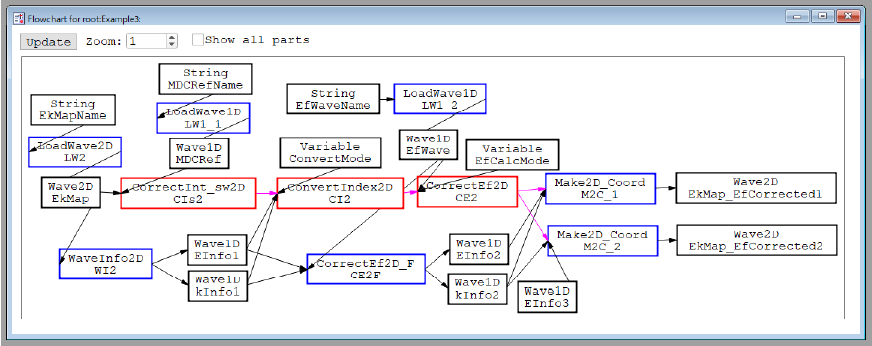
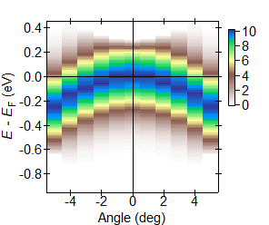

# Getting Started

In this introduction, we describe how to use the software using a sample 2D wave of a hole band.
The same data is available from **docs/Sample_data/EkMapSample.ibw**.
The following figure is the color map of the sample wave.


We note that the first axis is vertical (energy), and the second axis is horizontal (angle).
*Part*s for ARPES analysis assume that the first axis of multidimensional waves is always **energy** (kinetic energy or binding energy), and the other axes are **angle**, **momentum**, or **position**.

# Example 1: Load a wave
In Example 1, we load a 2D sample wave to the ```Data``` folder as a practice.

## Prepare the diagram wave
**Table 1** is the **diagram wave** for Example 1.
After setting up the folder on Igor Pro, copy the table without the header row to a **diagram wave**.
Since there is a wave named ```Diagram0``` in the ```Diagrams``` folder, you can paste the table on this wave.

**Table 1**: Diagram wave for Example 1.
| 0: *Kind* | 1: *Type* | 2: *Name* | 3: arguments | 4 | 5 |
| --- | --- | --- | --- | --- | --- |
| Data | String | EkMapName |||
| Data | Wave2D | EkMap	|||
| Function | LoadWave2D | LW2 | EkMapName | EkMap |
| Data | Wave1D | EInfo |||
| Data | Wave1D | kInfo	|||
| Function | WaveInfo2D | WI2 | EkMap | EInfo | kInfo |

When you select the ```ConfigureDependency``` and ```CreateData``` submenus in this order, the global string ```EkMapName``` will appear in the ```Data``` folder (green rectangle in **Figure 1**).
You may need to check ```Waves```, ```Variables```, and ```Strings``` checkboxes in the left column of Data Browser (blue circles in **Figure 1**) to display everything.


**Figure 1:** Example 1, after ```CreateData```.

## See the flowchart
If you want to see the flowchart of the diagram, you select ```ConfigureChart``` and ```CallChart```.
Another window will appear, showing the flowchart (**Figure 2**).
Although all *Part*s are put at the same position when you first call the chart, you can move them by dragging.

In the flowchart, *Data Part*s are represented by black rectangles, and *Function*s are by blue rectangles.


**Figure 2:** Flowchart for Example 1.

In Figure 2, a large gray rectangle is the **frame** corresponding to one **diagram wave**.
When you click the inside of the frame and outside of all *Part*s, you can move all *Part*s in the frame.

## Set parameters
Before selecting the ```ExecuteAll``` command, you need to set the appropriate value in ```EkMapName```.
Double-click ```EkMapName``` in Data Browser and specify the **relative path of the target wave from the current data folder**.
In the case of **Figure 1**, the value is ```EkMapSample```.
If the wave is in the folder named ```folder1```, the value is ```folder1:EkMapSample```.

## Perform analysis
After setting the parameter, you select ```ExecuteAll``` to perform the analysis.
Three new waves named ```EkMap```, ```EInfo```, and ```kInfo``` will appear in the ```Data``` folder.
We note that the execution order is determined to be *LoadWave2D* -> *WaveInfo2D* due to the dependency relation.

```EkMap``` is the output of *LoadWave2D* using ```EkMapName``` as the input.
*LoadWave2D* is defined in ```IAF_LoadWave.ipf```.
The function loads a 2D wave from the path; therefore, ```EkMap``` is identical to ```EkMapSample```.

```EInfo``` and ```kInfo``` are the output of *WaveInfo2D* using ```EkMap``` as the input.
*WaveInfo2D* is also defined in ```IAF_LoadWave.ipf```.
The function exports *InfoWave*s (offset, delta, and size) from a 2D wave.
**Table 2** is the values contained in ```EInfo``` and ```kInfo```.

**Table 2**: *InfoWave*s obtained from ```EkMapSample```.
| | EInfo | kInfo|
| --- | --- | --- |
| 0: offset | 9.2 | -5 |
| 1: delta | 0.1 | 1 | 
| 2: size | 11 | 11 |

## Why we need to use LoadWave functions
You may think it is simpler to put the sample data in the ```Data``` folder and directly use it as the input of *WaveInfo2D*.
Although it also works, we think using LoadWave functions is better from the following viewpoints.
- Raw data waves may have labels that are inessential for the analysis (such as the incremental data number). If we prepare the *String* or *TextWave* containing the wave paths, such information does not appear in the analysis diagram. Also, we can perform the same analysis using different data only by changing the values in the *String* or *TextWave* *Part*s; we don't need to modify the **diagram wave**s.
- The number of raw data waves may become large. Therefore, we recommend storing raw data and analyzed results in different folders, for example, to making the ```raw_data``` folder and using LoadWave functions to load necessary data from the ```raw_data``` folder.

# Example 2: Template and Panel
In Example 2, we extract energy distribution curves (EDCs) from the 2D sample wave and store them in a folder outside the ```Data``` folder.
Also, we use the *2DViewer Template* to see the 2D map.

## Preparation
The following **Table 2** is the diagram wave for Example 2.

**Table 2**: Diagram wave for Example 2.
| 0: *Kind* | 1: *Type* | 2: *Name* | 3: arguments | 4 | 5 | 6 |
| --- | --- | --- | --- | --- | --- | --- |
| Data | String | EkMapName	| | | | |
| Data | Wave2D| EkMap | | | | |
| Function | LoadWave2D | LW2 | EkMapName | EkMap | | |
| Data | String | xLabel | | | | |
| Data | Wave1D | EInfo	| | | | |
| Data | Wave1D | kInfo | | | | |
| Function | WaveInfo2D | WI2 | EkMap | EInfo | kInfo | |
| Data | Variable | kIndex | | | | |
| Data | Variable | kMin | | | | |
| Data | Variable | kMax | | | | |
| Function | FullRange | FR | kInfo | kMin | kMax | |
| Panel | Sequence | Seq | kIndex | kMin | kMax | |
| Function | EDC | E_i | EkMap | kIndex | kIndex | EDC_i |
| Data | Wave1D | EDC_i	| | | | | 
| Data | String | EDCListName | | | | |
| Data | TextWave | EDCList | | | | | 
| Function | LoadTextWave | LTW | EDCListName | EDCList | | |
| Data | String | EDCName | | | | |
| Function | ExtractString | ES | EDCList | kIndex | EDCName | |
| Function | StoreWave1D | SW1 | EDC_i | EDCName | | |

In addition to the diagram wave, you need to prepare the following things.
- Prepare the text wave containing the paths of EDCs. **Table 3** is an example of the wave. The wave is loaded as ```EDCList``` in the diagram.
- Set the appropriate values to ```EkMapName```, ```xLabel```, and ```EDCListName```. ```EkMapName``` is the path to the target wave (same as Example 1), ```xLabel``` is the label used in the *2DViewer Template*, and ```EDCListName``` is the path to the text wave containing the paths of EDCs.
- Make a new data folder to store EDCs if necessary. In the case of the ```EDCList``` like **Table 3**, you need to make the ```EDCs``` folder in the current data folder.

**Table 3**: Example of **EDCList**.
| EDCNameList |
| --- |
| EDCs:EDC_0 |
| EDCs:EDC_1 |
| EDCs:EDC_2 |
| EDCs:EDC_3 |
| EDCs:EDC_4 |
| EDCs:EDC_5 |
| EDCs:EDC_6 |
| EDCs:EDC_7 |
| EDCs:EDC_8 |
| EDCs:EDC_9 |
| EDCs:EDC_10 |

## Load the *2DViewer Template*
After the preparation, you select the ```LoadTemplate``` submenu to load the *2DViewer template*, which can visualize the 2D color map, energy distribution curve (EDC), and momentum distribution curve (MDC) in one panel.
After the popup window appears, enter ```"2DViewer"``` in ```Template```, ```"EkMapView;EkMap;xLabel"``` in ```List of arguments```; in the list of arguments, two arguments are separated by a semicolon.
The following is the rule of arguments, as described in ```IAF_2DViewer.ipf```.
- The 0th argument is the name of the panel. Although the value is ```"EkMapView"``` in the above description, you can change it unless the name conflict happens.
- The 1st argument is the name of the 2D waves to show. The value should be ```"EkMap"``` from the diagram.
- The 2nd argument is the name of the *String Part* corresponding to the horizontal axis label.

If the *Template* is loaded successfully, the new diagram wave named ```EkMapView``` is created in the ```Diagrams``` folder.
The **diagram wave** includes the *2DViewer Panel* and necessary *Part*s for the *Panel*.

## Flowchart
**Figure 3** shows the flowchart for Example 2.
Since there are two **diagram wave**s (```Diagram0``` and ```EkMapView```), two gray frames appear.
We note that some *Part*s in ```EkMapView``` are not displayed in the flowchart to avoid a mess.
The *Name*s of such *Part*s start with ```_``` (underscore).
If you want to see all *Part*s, check the ```Show all parts``` checkbox (red rectangle in **Figure 3**).

In the flowchart, *Panel Part*s are represented by green rectangles.


**Figure 3**: Flowchart for Example 2.

## Analysis via Panels
After the analysis (selecting ```ExecuteAll```), you will notice that only one EDC wave is exported.
That is because ```kIndex``` is zero, and the EDC for the index 0 is created.
The *Sequence Panel* is useful for sequential analysis.

When you call the *Sequence Panel* named ```Seq``` from the ```CallPanel``` submenu, a new panel like **Figure 4** will appear.
You can change the value of ```kIndex``` by entering the value or clicking small triangle buttons in the top row.
Immediately after the value is changed, ```IAFc_Update("kIndex")``` is automatically executed.
The function executes the *Function Part*s which are affected by ```kIndex```; they are in the green loop in **Figure 3**.

The large triangle buttons in the bottom row of the *Sequence Panel* change the ```kIndex``` value sequentially until the value becomes the minimum or maximum.
The minimum and maximum values are determined by ```kMin``` and ```kMax```, which are inputs of the *Sequence Panel*.
These buttons behave like the ```for ~ endfor``` loop.


**Figure 4**: *Sequence Panel*.

There is another panel named ```EkMapView```, which is created from the template *2DViewer*.
**Figure 5** shows the typical image of ```EkMapView```.
You can choose cut positions of EDC and MDC by changing the ```Center``` and ```Width``` values, plus and minus buttons, and arrow keys if the focus is on the panel.


**Figure 5**: *2DViewer Panel*.

# Example 3: Module

In Example 3, we use *Module Part*s to remove experimental artifacts and convert the kinetic energy to the binding energy (energy from the Fermi level).
Here we explain why *Function Part*s cannot perform such analyses and *Module Part*s are necessary.

## Preparation
The following **Table 4** shows the diagram wave for Example 3.

**Table 4**: Diagram wave for Example 3.

| 0: *Kind* | 1: *Type* | 2: *Name* | 3: arguments | 4 | 5 | 6 | 7 |
| --- | --- | --- | --- | --- | --- | --- | --- |
| Data | String | EkMapName	| | | | | |
| Data | Wave2D | EkMap	| | | | | |
| Function | LoadWave2D | LW2 | EkMapName | EkMap | | | |
| Data | String | MDCRefName | | | | | |
| Data | Wave1D | MDCRef | | | | |
| Function | LoadWave1D | LW1_1 | MDCRefName | MDCRef | | | |
| Data | String | EfWaveName | | | | | |
| Data | Wave1D | EfWave | | | | | |
| Function | LoadWave1D | LW1_2 | EfWaveName | EfWave | | | |
| Data | Wave1D | EInfo1 | | | | | |
| Data | Wave1D | kInfo1 | | | | | |
| Function | WaveInfo2D | WI2 | EkMap | EInfo1 | kInfo1 | | |
| Module | CorrectInt_sw2D | CIs2 | EkMap | MDCRef | | | |
| Data | Variable | ConvertMode | | | | | |
| Module | ConvertIndex2D | CI2 | ConvertMode | EInfo1 | kInfo1 | CIs2 | |
| Data | Variable | EfCalcMode | | | | | |
| Module | CorrectEf2D | CE2 | EfCalcMode | EfWave | CI2 | | | 
| Data | Wave1D | EInfo2 | | | | | |
| Data | Wave1D | kInfo2 | | | | | |
| Function | CorrectEf2D_F | CE2F | EInfo1 | kInfo1 | EfWave | EInfo2 | kInfo2 |
| Data | Wave2D | EkMap_EfCorrected1 | | | | | |
| Function | Make2D_Coord | M2C_1 | EInfo2 | kInfo2 | CE2 | EkMap_EfCorrected1 | |

In addition to ```EkMapSample```, you need to load other two waves; ```MDCRefSample``` (Figure 6 left) and ```EfWaveSample``` (Figure 6 right).
They are available from **docs/Sample_data/MDCRefSample.ibw** and **docs/Sample_data/EfWaveSample.ibw**, respectively.

 

**Figure 6**: ```MDCRefSample``` (left) and ```EfWaveSample``` (right).

After ```ConfigureDependency``` and ```CreateData```, you need to set appropriate values for the following *Data Part*s.
- ```EkMapName``` is the path to ```EkMapSample```.
- ```MDCRefName``` is the path to ```MDCRefSample```.
- ```EfWaveName``` is the path to ```EfWaveSample```.
- For ```ConvertMode```, the default value ```0``` is ok. Later you will change the value.
- For ```EfCalcMode```, the default value ```0``` is ok.

**Figure 7** is the flowchart for Example 3.
In the flowchart, *Module Part*s are represented by the red rectangles, and the magenta arrows represent the socket connections between *Module*s and *Function*s.



**Figure 7** Flowchart for Example 3. We note that three additional *Part*s named ```EInfo3```, ```M2C_2``` and ```EkMap_EfCorrected2``` are already displayed; these *Part*s are introduced below.

The roles of the three *Module*s used are as follows.
Since the raw data is a 2D wave (kinetic energy, angle) with experimental inhomogeneity, the following process gives the (E-Ef, angle) map without the inhomogeneity.
- *CorrectInt_sw2D* receives a list of points described by *Index2D* form (p, q) and returns the values at these points. Here, the values are not of raw data at the corresponding points but those without the intensity inhomogeneity. The removal of the intensity inhomogeneity is achieved by dividing the raw data (```EkMap```) by the reference wave (```MDCRef```). Since the inhomogeneity is only along the angle direction in the swept mode of ARPES measurements, the reference is 1D along the angle direction like the MDC.
- *ConvertIndex2D* receives a list of points described by *Coordinate2D* (x, y) and returns the values at these points. The module converts the *Coordinate2D* (x, y) to *Index2D* (p, q) based on *InfoWave*s (```EInfo1``` and ```kInfo1```) using either of two *ConvertMode*s. One is the nearest mode (```ConvertMode=0```), where (p, q) is the nearest point to (x, y). The other is the interpolation mode (```ConvertMode=1```), where the value at (x, y) is calculated from the surrounding four points.
- *CorrectEf2D* receives a list of points described by *Coordinate2D* (E-Ef, angle) and returns the values at these points. The module converts (E-Ef, angle) to (kinetic energy, angle) based on the Fermi level information (```EfWave```). The Fermi level can slightly depend on the emission angle due to the photoelectron analyzer condition. *EfCalcMode* determines how to calculate the Fermi level at the specified angle (nearest or interpolation), but the choice negligibly affects the analysis result.

The *Make2D_Coord Function* makes the analysis result (**Figure 8**).
The function makes lists points (E-Ef, angle) based on the input *InfoWave*s (```EInfo2``` or ```EInfo3``` and ```kInfo2```) and passes the list to the *CorrectEf2D Module* via the *Socket*.
The function receives the values at the points from the module and fills the 2D wave with the received values.


**Figure 8**: Schematic of analysis using *Module*s and the *Make2D_Coord Function*.

Here, we can explain why we need *Module*s to perform this analysis.
If we only want to remove the intensity inhomogeneity, we can define a *Function* with raw data and reference being the input and corrected data being the output.
However, after the Fermi level correction, the data points in 2D waves before and after the correction don't have one-to-one correspondence (**Figure 9**).
A similar situation happens when we want to convert the angle to the momentum (sine or cosine of the angle).
That means the analyzed results may differ depending on how we want to make waves after the analysis.


**Figure 9** The schematic of broken one-to-one correspondence before and after the Fermi level correction.

Although we provide one suggestion about the export form by the *CorrectEf2D_F Function* and the output *InfoWave*s (```EInfo2``` and ```kInfo2```), the choice might not be appropriate in some situations.
As shown in **Table 5**, ```EInfo2``` is determined to cover the whole energy range with keeping the **delta** value.
Since the **delta** is 0.1 eV, the exported data (**Figure 10**) cannot reflect the energy shift smaller than 0.1 eV.

**Table 5**: ```EInfo2``` data.
| | EInfo2 |
| --- | --- |
| 0: offset | -0.9 |
| 1: delta | 0.1 |
| 2: size | 14 |


**Figure 10**: Color map of ```EkMap_EfCorrected1```.

Then, what will happen when we use different *InfoWave*s to make the corrected result?
Duplicate ```EInfo2``` to another *InfoWave* named ```EInfo3``` and modify it as shown in **Table 6**.
Also, you need to add the three rows (**Table 7**) in the **diagram wave**.

**Table 6**: ```EInfo3``` data.
| | EInfo3 |
| --- | --- |
| 0: offset | -0.95 |
| 1: delta | 0.01 |
| 2: size | 141 |

**Table 7**: Additional *Part*s for Example 3.
| 0: *Kind* | 1: *Type* | 2: *Name* | 3: arguments | 4 | 5 | 6 |
| --- | --- | --- | --- | --- | --- | --- |
| Data | Wave2D | EkMap_EfCorrected2 | | | | | |
| Data | Wave1D | EInfo3 | | | | | |
| Function | Make2D_Coord | M2C_2 | EInfo3 | kInfo2 | CE2 | EkMap_EfCorrected2 |

After the execution, you will get ```EkMap_EfCorrected2``` like **Figure 11**.
Since the **delta** becomes ten times smaller, the corrected map can reflect the small energy shifts due to the angle dependence of the Fermi level.
However, ```EkMap_EfCorrected2``` has ten times more data points than the raw data and ```EkMap_EfCorrected1```, so it is not quite good for further analysis.


**Figure 10**: Color map of ```EkMap_EfCorrected2```.

So far, we have used the nearest mode in the *ConvertIndex2D Module*.
That is why **Figure 10** virtually retains the energy step of 0.1 eV.
**Figure 11** is the color map obtained with the interpolation mode.
The interpolation mode makes the color map smoother, but the map loses the energy step information of the raw data.
The EDCs of the color maps (**Figure 12**) highlight the difference between the nearest and the interpolation modes.



**Figure 11**: Color map of ```EkMap_EfCorrected2```. This color map is obtained by the interpolation mode in the *ConvertIndex2D Module*.


**Figure 12**: Energy distribution curves of color maps in **Figures 10** and **11** at 0 deg. The red and blue points represent data points.

In summary, we demonstrate that the color map of the corrected data looks different depending on the choice of the axes.
We think there is no perfect answer to how the analyzed data should be presented.
Therefore, it is crucial to be able to explain the analysis process.
We believe that our diagram-based analysis framework helps the transparency and traceability of experimental data analysis.