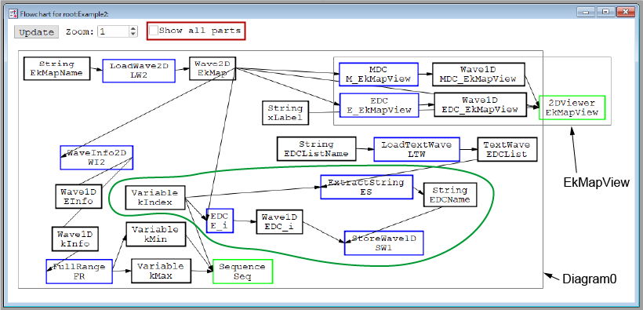

# Getting Started

In this introduction, we describe how to use the software using a sample 2D wave of a hole band.
The same data is available from **EkMapSample.ibw**.
The following figure is the color map of the sample wave.


We note that the first axis is vertical (energy), the second axis is horizontal (angle).
*Part*s for ARPES analysis assumes that the first axis of multidimensional waves is always **energy** (kinetic energy or binding energy) and the other axes are **angle**, **momentum**, or **position**.

# Example 1: Load a wave
In Example 1, we load a 2D sample wave to the **Data** folder as a practice.

## Prepare the diagram wave
**Table 1** is the **diagram wave** for Example 1.
After setting up the folder on Igor Pro, copy the table without the header row to a **diagram wave**.
There is a wave named ```Diagram0``` in the **Diagrams** folder, so you can paste the table on this wave.

**Table 1**: Diagram wave for Example 1.
| 0: *Kind* | 1: *Type* | 2: *Name* | 3: arguments | 4 | 5 |
| --- | --- | --- | --- | --- | --- |
| Data | String | EkMapName |||
| Data | Wave2D | EkMap	|||
| Function | LoadWave2D | LW2 | EkMapName | EkMap |
| Data | Wave1D | EInfo |||
| Data | Wave1D | kInfo	|||
| Function | WaveInfo2D | WI2 | EkMap | EInfo | kInfo |

When you select **ConfigureDependency** and **CreateData** in this order, the global string **EkMapName** will appear in the **Data** folder (green rectangle in **Figure 1**).
You may need to check **Waves**, **Variables**, and **Strings** checkboxes in the left column of Data Browser (blue circles in **Figure 1**) to display all variables.


**Figure 1:** Example 1, after **CreateData**.

## See the flowchart
If you want to see the flowchart of the diagram, you select **ConfigureChart** and **CallChart**.
Another window will appear, showing the flowchart (**Figure 2**).
Although all *Part*s are put at the same position when you first call the chart, you can move them by dragging.

In the flowchart **Data** *Part*s are represented by black rectangles, **Function**s are by blue rectangles.


**Figure 2:** Flowchart for Example 1.

In Figure 2, a large gray rectangle is the **frame** corresponding to one **diagram wave**.
When you click the inside of the frame and outside of all *Part*s, you can move all *Part*s in the frame.

## Set parameters
Before selecting **ExecuteAll**, you need to set the appropriate value in **EkMapName**.
Double-click **EkMapName** in Data Browser and specify the **relative path of the target wave from the current data folder**.
In the case of **Figure 1**, the value is ```EkMapSample```.
If the wave is in the folder named **folder1**, the value is ```folder1:EkMapSample```.

## Perform analysis
After setting the parameter, you select **ExecuteAll** to perform the analysis.
Three new waves named **EkMap**, **EInfo**, and **kInfo** will appear in the **Data** folder.

**EkMap** is the output of **LoadWave2D** using **EkMapName** as the input.
**LoadWave2D** is defined in **IAF_LoadWave.ipf**.
The function load a 2D wave from the path; therefore, **EkMap** is identical to **EkMapSample**.

**EInfo** and **kInfo** are the output of **WaveInfo2D** using **EkMap** as the input.
**WaveInfo2D** is also defined in **IAF_LoadWave.ipf**.
The function exports **InfoWave**s (offset, delta, and size) from a 2D wave.
**Table 2** is the values contained in **EInfo** and **kInfo**.

**Table 2**: **InfoWave**s obtained from **EkMapSample**.
| | EInfo | kInfo|
| --- | --- | --- |
| 0: offset | 9.2 | -5 |
| 1: delta | 0.1 | 1 | 
| 2: size | 11 | 11 |

## Why we need to use LoadWave functions
You may think that it is simpler if you put the sample data in the **Data** folder and directly use it as the input of **WaveInfo2D**.
Although it also works, we think using LoadWave functions is better from the following viewpoints.
- Raw data waves may have labels which are inessential for the analysis (such as the incremental data number). If we prepare the **String** or **TextWave** containing the wave paths, such information does not appear in the analysis diagram. Also, we can perform the same analysis using different data only by changing the values in the **String** or **TextWave** *Part*s; we don't need to modify the **digram wave**s.
- Number of raw data waves may become large. We recommend to store raw data and analyzed results in different folders, for example to make **raw_data** folder and use **LoadWave** functions to load necessary data from the **raw_data** folder.

# Example 2: Template and Panel
In Example 2, we extract energy distribution curves (EDCs) from the 2D sample wave and store them in a folder outsider of the **Data** folder.
Also, we use the **2DViewer** template to see the 2D map.

## Preparation
The following **Table 2** is the diagram wave for Example 2.

**Table 2**: Diagram wave for Example 2.
| 0: *Kind* | 1: *Type* | 2: *Name* | 3: arguments | 4 | 5 | 6 |
| --- | --- | --- | --- | --- | --- | --- |
| Data | String | EkMapName	| | | | |
| Data | Wave2D| EkMap | | | | |
| Function | LoadWave2D | LW2 | EkMapName | EkMap | | |
| Data | String | xLabel | | | | |
| Data | Wave1D | EInfo	| | | | |
| Data | Wave1D | kInfo | | | | |
| Function | WaveInfo2D | WI2 | EkMap | EInfo | kInfo | |
| Data | Variable | kIndex | | | | |
| Data | Variable | kMin | | | | |
| Data | Variable | kMax | | | | |
| Function | FullRange | FR | kInfo | kMin | kMax | |
| Panel | Sequence | Seq | kIndex | kMin | kMax | |
| Function | EDC | E_i | EkMap | kIndex | kIndex | EDC_i |
| Data | Wave1D | EDC_i	| | | | | 
| Data | String | EDCListName | | | | |
| Data | TextWave | EDCList | | | | | 
| Function | LoadTextWave | LTW | EDCListName | EDCList | | |
| Data | String | EDCName | | | | |
| Function | ExtractString | ES | EDCList | kIndex | EDCName | |
| Function | StoreWave1D | SW1 | EDC_i | EDCName | | |

In addition to the diagram wave, you need to prepare the following things.
- Prepare the text wave containing the paths of EDCs. **Table 3** is an example of the wave. The wave is loaded as **EDCList** in the diagram.
- Set the appropriate values to **EkMapName**, **xLabel**, and **EDCListName**. **EkMapName** is the path to the target wave (same as Example 1), **xLabel** is the label used in the **2DViewer** template, and **EDCListName** is the path to the text wave containing the paths of EDCs.
- Make a new data folder to store EDCs if necessary. In case of the **EDCList** like **Table 3**, you need to make **EDCs** folder in the current data folder.

**Table 3**: Example of **EDCList**.
| EDCNameList |
| --- |
| EDCs:EDC_0 |
| EDCs:EDC_1 |
| EDCs:EDC_2 |
| EDCs:EDC_3 |
| EDCs:EDC_4 |
| EDCs:EDC_5 |
| EDCs:EDC_6 |
| EDCs:EDC_7 |
| EDCs:EDC_8 |
| EDCs:EDC_9 |
| EDCs:EDC_10 |

## Load the 2DViewer template
After the preparation, you select **LoadTemplate** in the **IAF** menu to load the **2DViewer** template, which can visualize the 2D color map, energy distribution curve (EDC), and momentum distribution curve (MDC) in one panel.
After the popup window appears, enter ```"2DViewer"``` in **Template**, ```"EkMapView;EkMap;xLabel"``` in **List of arguments**; in the list of arguments, two arguments are separated by a semicolon.
The following is the rule of arguments, as described in **IAF_2DViewer.ipf**.
- The 0th argument is the name of the panel. Although the value is ```"EkMapView"``` in the above description, you can change it unless the conflict of names happens.
- The 1st argument is the name of the 2D waves to show. The value should be ```"EkMap"``` from the diagram.
- The 2nd argument is the name of the **String** *Part*s corresponding to the horizontal axis label.

If the template is loaded successfully, the new diagram wave named **EkMapView** is created in the **Diagrams** folder.
The **diagram wave** includes the **2DViewer** *Panel* and necessary *Part*s for the **2DViewer** *Panel*.

## Flowchart
**Figure 3** shows the flowchart for Example 2.
Since there are two **diagram wave**s (```Diagram0``` and ```EkMapView```), two gray frames appear.
We note that some *Part*s in ```EkMapView``` are not displayed in the flowchart to avoid a mess.
The *Name*s of such *Part*s start with ```_``` (underscore).
If you want to see all *Part*s, check the **Show all parts** checkbox (red rectangle in **Figure 3**).

In the flowchart, **Panel** *Part*s are represented by green rectangles.



**Figure 3**: Flowchart for Example 2.

## Analysis via Panels
After the analysis by selecting **ExecuteAll** you will notice that only one EDC wave is exported.
That is because **kIndex** is zero and the EDC for the index 0 is created.
**Sequence** *Panel* is useful to perform sequential analysis.

When you call the **Sequence** *Panel* named **Seq** from the **CallPanel** in the **IAF** menu, a new panel like **Figure 4** will appear.
You can change the value of **kIndex** by entering the value or clicking small triangle buttons in the top row.
Immediately after the value is changed, ```IAFc_Update("kIndex")``` is automatically executed.
The function executes **Function** *Part*s which are affectedby **kIndex**; they are in the green loop in **Figure 3**.

The large triangle buttons in the bottom row of the **Sequence** *Panel* change the **kIndex** value sequentially until the value becomes the minimum or maximum.
The minimum and maximum values are determined by **kMin** and **kMax**, which are inputs of the **Sequence** *Panel*.
These buttons behave like the ```for ~ endfor``` loop.


**Figure 4**: **Sequence** *Panel*.

There is another panel named **EkMapView**, which is created from the template **2DViewer**.
**Figure 5** shows the typical image of **EkMapView**.
You can choose EDC and MDC cut positions by changing **Center** and **Width** values, plus and minus buttons, and arrow keys if the focus is on the panel.


**Figure 5**: **2DViewer** *Panel*.